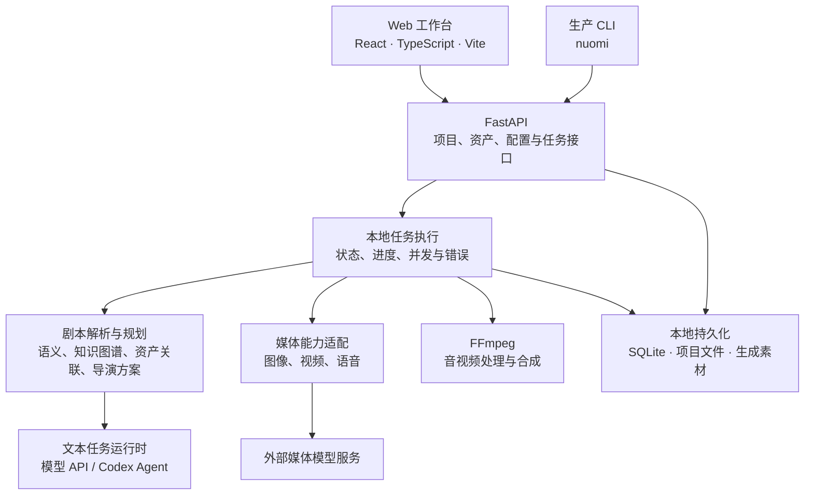

# NuomiDrama

本地运行的 AI 短剧制作工作台：将小说或剧本组织为剧集，管理角色、场景和道具，规划镜头，调用图像与视频模型，最后合成成片。

项目提供 React Web 界面、Python API、任务执行模块和生产 CLI。项目数据与生成素材保存在本地；使用外部模型时，相关文本和参考素材会发送给所选服务商，并可能产生费用。它不是无需配置即可离线生成视频的工具。

## 快速开始

### 环境要求

| 依赖 | 要求 / 用途 |
| --- | --- |
| Python | 3.11 或 3.12（项目要求 `>=3.11,<3.13`） |
| uv | 安装 Python 依赖、运行后端命令 |
| Node.js | 推荐 22 LTS |
| pnpm | 项目固定版本为 11.21.0，见 `package.json` |
| FFmpeg / FFprobe | 音视频处理与合成，需在 PATH 中可用 |
| 模型访问 | 按需配置文本 Agent、图像、视频及语音服务 |

普通远程模型调用不要求本机 GPU；可选的本地模型能力另有依赖和硬件要求。首次安装需要下载依赖。

### 1. 安装依赖

以下命令适用于 macOS / Linux：

```bash
git clone https://github.com/YuRui-Liu/Nuomi-drama-factory.git
cd Nuomi-drama-factory

uv sync --python 3.12 --group dev
corepack enable
corepack prepare pnpm@11.21.0 --activate
pnpm install --frozen-lockfile

# 仅在首次配置时创建；不要覆盖已有配置
test -f .env || cp .env.example .env

ffmpeg -version
ffprobe -version
```

环境变量说明见 [.env.example](.env.example)。不要把 API Key、登录凭据或本地 `.env` 提交到 Git。

### 2. 启动前后端

```bash
# uv sync 默认在仓库内创建 .venv
export NOVELVIDEO_BIN="$PWD/.venv/bin/novelvideo"

# 检查可执行文件与前端依赖，然后启动
bash scripts/start-local.sh --check
bash scripts/start-local.sh
```

| 服务 | 默认地址 |
| --- | --- |
| Web 界面 | http://127.0.0.1:5173 |
| 后端 API | http://127.0.0.1:8780 |
| API 文档 | http://127.0.0.1:8780/docs |

启动脚本默认寻找**仓库上一级**的 `.venv/bin/novelvideo`。如果采用上面的仓库内安装方式，必须设置 `NOVELVIDEO_BIN`；已有上一级虚拟环境的用户可直接运行脚本。

`--check` 只检查启动依赖，不代表模型已配置，也不会验证端口是否空闲。脚本会同时启动前后端；任一服务退出时停止另一服务。按 **Ctrl+C** 停止，再执行启动命令即可重启。

### 3. 配置模型

在页面顶部的设置入口中，按实际工作流配置：

- **文本任务**：配置模型服务，或为支持的任务选择 Codex Agent 路由。选择 Codex 时，后端运行环境必须能执行 Codex，且完成相应认证；普通文本 API Key 与 Codex 登录不是同一配置。
- **图像服务**：配置所选渠道的凭据及其支持的模型，例如 RunningHub、GRSAI。模型名称必须与服务商实际支持的名称一致。
- **视频服务**：配置视频渠道和工作流。H3 与 H3 Ref 对应不同能力，不能仅凭名称判断已经可用。
- **语音服务**：需要配音时再配置。
- **任务并发**：全局统一并发上限修改后，重启后端生效。应结合本机资源和服务商限流设置，不宜盲目调高。

本地服务成功启动不等于模型调用成功。先完成一次小规模生成，再批量提交任务。

## 制作流程

1. **导入剧本**：创建项目、导入小说或剧本，检查剧集划分和结构化结果。
2. **整理资产**：维护角色身份、场景及关键道具，生成或上传参考图。
3. **规划资产关联**：为剧集关联身份、场景及对应变体；道具规划只链接资产库中的现有道具，不要求提取每一个普通物件。
4. **规划镜头**：检查镜头方案、叙事组、画幅和镜头衔接。
5. **生成图像与视频**：确认参考图、模型和参数后提交，持续查看任务状态。
6. **审核与合成**：检查人物一致性、构图、时长和音轨，完成片段合成与导出。

自动规划、生成成功和质量审核通过是不同状态。模型输出仍需人工检查；遇到缺失引用应先核对资产关联和可用图片，不要反复提交同一个失败任务。

## 技术架构



- **前端**：React 19、TypeScript、Vite、Tailwind CSS；TanStack Router / Query 处理路由和服务端状态，Zustand 管理部分界面状态。
- **API 与数据校验**：FastAPI、Pydantic；接口层连接项目服务、规划逻辑与任务执行。
- **规划与知识处理**：剧本结构化、语义分析、Cognee 知识处理、导演方案与叙事组编排。
- **任务运行**：本地任务后端管理任务生命周期、进度和并发；默认本地部署不要求额外运行 Redis。
- **模型适配**：文本运行时与媒体渠道分离，依据任务路由和能力配置调用模型。
- **数据与输出**：SQLite 和本地文件持久化；FFmpeg 处理音视频合成。开发时 Vite 将 API 请求代理到后端，Docker Web 使用 Nginx 代理。

### 代码目录

| 路径 | 职责 |
| --- | --- |
| `frontend/` | Web 界面、路由、资产与制作交互 |
| `src/novelvideo/api/` | HTTP API |
| `src/novelvideo/task_backend/` | 任务执行后端 |
| `src/novelvideo/text_task_runtime/` | 文本任务运行时与路由 |
| `src/novelvideo/screenplay_semantics/` | 剧本语义处理 |
| `src/novelvideo/director_plan/` | 导演与镜头方案 |
| `src/novelvideo/narrative_groups/` | 叙事组生产逻辑 |
| `src/novelvideo/media_capabilities/` | 媒体模型、渠道与工作流能力 |
| `src/novelvideo/production_cli.py` | 生产 CLI 入口 |
| `desktop/` | Electron 桌面封装与打包 |
| `scripts/` | 本地启动、构建及验证脚本 |
| `tests/` | 后端单元、接口和契约测试 |
| `docs/` | 使用说明、技术设计与开发资料 |

## 数据目录与备份

使用 `scripts/start-local.sh` 时，默认数据目录为仓库上一级的 `nuomi-drama-data/`，**不在 Git 仓库内**。

| 环境变量 | 作用 / 默认值 |
| --- | --- |
| `NOVELVIDEO_BIN` | 后端可执行文件；脚本默认使用上一级虚拟环境 |
| `NOVELVIDEO_DATA_ROOT` | 数据根目录；启动脚本默认 `../nuomi-drama-data` |
| `NOVELVIDEO_STATE_DIR` | 状态目录；默认数据根目录下的 `state/` |
| `NOVELVIDEO_OUTPUT_DIR` | 输出目录；默认数据根目录下的 `output/` |
| `NOVELVIDEO_RUNTIME_DIR` | 运行时目录；默认数据根目录下的 `runtime/` |

直接执行后端 CLI 时，数据根目录默认可能是当前工作目录；手动启动必须显式设置相同的数据目录，否则可能看到不同的项目列表。

备份前先等待任务结束并停止服务，再备份数据目录和需要保留的本地配置。系统凭据存储中的密钥需要单独管理；备份项目文件不代表备份了所有凭据。不要提交生成视频、图片、数据库或运行日志。

## 其他启动方式

<details>
<summary>Docker Compose</summary>

准备好 Docker Engine / Docker Desktop 和 Compose 后，在仓库根目录执行：

```bash
test -f .env || cp .env.example .env
docker compose up -d --build
docker compose logs -f
```

Web 默认访问 **http://127.0.0.1:8080**，API 仍为 **8780**。数据保存到 `ce-data` 命名卷；可通过 `ST_WEB_PORT`、`ST_API_PORT` 调整宿主机端口。

```bash
# 停止容器，保留数据卷
docker compose down
```

不要使用 `down -v`，除非明确要删除数据卷。本机的 Codex 可执行文件与认证不会自动进入容器；选用 Agent 路由前需确认容器运行环境具备相应能力。

</details>

<details>
<summary>手动启动 / Windows 开发</summary>

在两个终端分别运行后端和前端。先安装 Python、uv、Node.js、pnpm、FFmpeg，并完成 `uv sync --group dev` 和 `pnpm install --frozen-lockfile`。

Windows PowerShell 后端示例（在仓库根目录）：

```powershell
$env:ST_EDITION = "ce"
$env:NOVELVIDEO_DATA_ROOT = Join-Path (Split-Path $PWD.Path -Parent) "nuomi-drama-data"
$env:NOVELVIDEO_STATE_DIR = Join-Path $env:NOVELVIDEO_DATA_ROOT "state"
uv run novelvideo api --host 127.0.0.1 --port 8780
```

另一个 PowerShell 终端：

```powershell
$env:VITE_API_URL = "http://127.0.0.1:8780"
pnpm --dir frontend dev --host 127.0.0.1 --port 5173 --strictPort
```

桌面安装包与开发服务器是不同部署方式。Windows x64 桌面打包步骤见[技术设计文档](docs/zh/technical-design.md)，不要把 macOS 虚拟环境直接打进 Windows 安装包。

</details>

## 生产 CLI

CLI 通过运行中的 API 操作项目，不单独持有媒体服务商密钥。以下示例使用占位项目 ID：

```bash
uv run nuomi --help
uv run nuomi --project PROJECT_ID groups --episode 1
uv run nuomi --project PROJECT_ID --dry-run batch --episodes 1-3
```

先用 `--dry-run` 检查计划，再决定是否实际生成。完整命令见[生产 CLI 文档](docs/production-cli.md)，自动化使用方式见[生产技能快速开始](docs/production-skill-quickstart.md)。

## 常见问题

| 现象 | 优先检查 |
| --- | --- |
| `Port 5173 is already in use` | 已有前端占用端口，停止旧实例后再启动；脚本不会自动换端口 |
| `ECONNREFUSED 127.0.0.1:8780` | 后端尚未就绪或已退出，查看同一终端的后端日志 |
| 启动后项目不见了 | 当前进程是否使用原来的数据根目录和状态目录 |
| 模型选项不可用 | 渠道凭据、模型名称、工作流与能力配置是否齐全 |
| H3 Ref 无法使用 | Ref 工作流及参考图输入条件是否满足，而非仅检查 H3 普通模式 |
| 任务达到并发上限 | 查看运行中任务；修改全局并发设置后重启后端 |
| 图片存在但引用缺失 | 核对规划绑定、身份 / 场景变体与当前可用图片 |

macOS / Linux 可使用以下只读命令定位端口占用，再决定停止哪个服务：

```bash
lsof -nP -iTCP:5173 -sTCP:LISTEN
lsof -nP -iTCP:8780 -sTCP:LISTEN
```

排查时保留任务 ID、失败阶段和错误信息；分享日志前移除 API Key、签名链接及私人剧本内容。

## 开发与验证

```bash
# 后端测试
uv run pytest

# 前端测试与生产构建
pnpm --dir frontend test
pnpm --dir frontend build

# 桌面封装测试
pnpm desktop:test
```

默认 pytest 配置不包含 `ee` 和 `e2e` 标记测试。真实服务商调用需要独立配置并可能计费，不应把普通单元测试通过视为端到端生成已验证。

## 许可

本项目采用 [Elastic License 2.0](LICENSES/Elastic-2.0.txt)，属于源码可用项目，不应将其表述为 OSI 意义上的开源软件。使用、修改与分发须遵守许可证条款。

第三方归属和许可信息见 [NOTICE](NOTICE)。页面介绍的精简不改变许可证和必要的法律声明。
