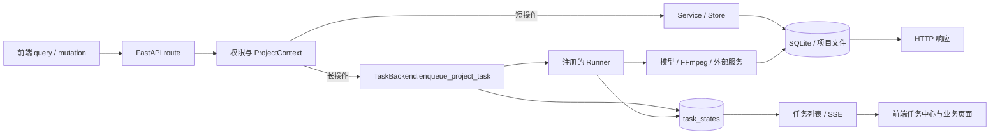
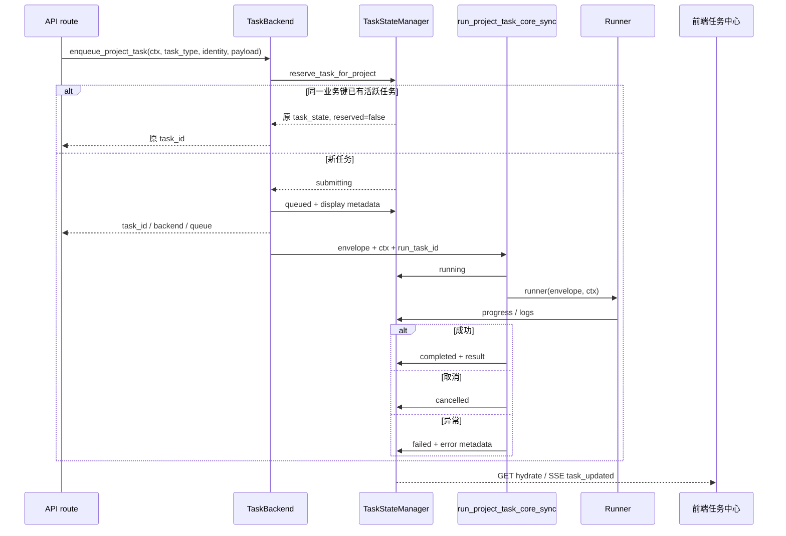

# 新增 API 与长任务

> **所属**：[开发与验证](../README.md#开发与验证)<br>
> **相关手册**：[共享系统地图](../system-map.md) · [功能反查](trace-a-feature.md) · [测试策略](testing-strategy.md)<br>
> **代码核对基线**：`55504a0`<br>
> **返回**：[DramaClaw 开发者 Cookbook](../README.md)

本页说明怎样在现有边界内增加一个项目 API，或者把耗时操作接入统一任务系统。这里关注的是跨层契约；具体业务数据写到哪里，继续查对应的[生产管线专题](../README.md#核心生产管线)和[存储与项目文件](storage-and-files.md)。

## 先选择同步请求还是长任务

判断依据是操作的运行特征，而不是接口名字。能够在一次 HTTP 请求内稳定完成、无需持续进度、没有长时间模型或媒体调用的操作，走 `route -> service / store`。涉及模型、FFmpeg、批量文件处理、第三方轮询，或者需要排队、取消、进度和任务中心展示的操作，走 `route -> TaskBackend -> Runner`。



路由不能自行创建 `threading.Thread`、`ThreadPoolExecutor` 或裸 `asyncio.create_task` 来执行长业务。这样会绕过任务预留、lane 限流、取消、超时、终态写入、计量和进程退出后的中断清扫。CE 的 `InlineTaskBackend` 内部确实使用线程池，但那是 Adapter 的调度实现，不是业务路由可以复制的模式。

## 一次长任务实际经过什么

`src/novelvideo/ports/tasks.py:TaskBackend` 定义稳定 Port；CE 实现是 `src/novelvideo/ports/local/tasks.py:InlineTaskBackend`。企业部署可以替换 Adapter，因此 route 和 Runner 不应依赖 inline 的线程、lane 内部对象或内存取消存储。



### 入队 envelope 与任务身份

调用 `enqueue_project_task` 时要明确以下字段：

| 字段 | 作用 | 约束 |
| --- | --- | --- |
| `ctx` | 项目身份、请求者、角色和三类项目目录 | 必须来自服务端项目解析；不能相信请求体里的用户名、owner 或绝对目录 |
| `task_type` | Runner 注册键，也是任务展示、取消和前端分流的主标识 | 字符串必须在后端与前端保持完全一致 |
| `queue_kind` | 选择调度 lane | 使用 `src/novelvideo/task_backend/queues.py` 已定义的种类，不自造队列名 |
| `episode`、`beat_num`、`scope` | 组成业务任务键和取消身份 | 能并行的业务实例必须有稳定且无歧义的 scope |
| `payload` | Runner 的业务输入 | 只放可序列化数据；Runner 重新从 `ctx` 取得目录和权限边界 |

Inline Adapter 形成的 envelope 包含 `project_id`、`requester_user_id`、`task_type`、`episode`、`beat_num`、`scope`、`queue_kind` 和 `payload`。公共执行核心还会注入 `__run_task_id`、超时 deadline；这些双下划线字段属于运行时内部协议，route 不应构造。带文本任务路由的任务还会携带入队时冻结的 `agent_route_snapshot`。

`TaskStateManager.reserve_task_for_project` 以 `task_type + project_id + episode + beat_num + scope` 原子预留。相同业务键已有 `submitting`、`queued` 或 `running` 任务时，后一次请求拿到原任务，不会再次执行。这只解决活跃任务的重复投递；它不替 Runner 提供数据库幂等，也不承诺失败后的自动重试。

### ProjectContext 与权限

route 先用认证依赖声明 API scope，再解析项目角色。需要提交任务的接口通常同时具备类似 `require_scope("tasks:submit")` 和 `resolve_project_scope(..., required_role="editor")` 的两层检查；只读接口使用相应的 viewer 权限。`InlineTaskBackend.enqueue_project_task` 还会调用 `require_project_home_node`，避免 share-nothing 项目文件在错误节点执行。

Runner 接收的是已经解析的 `ProjectContext`。文件与 SQLite 应从 `ctx.output_dir`、`ctx.state_dir`、`ctx.runtime_dir` 或接收 `ctx` 的 Store 构造器取得；不要根据 payload 中的 project 名重新拼路径。外部输入若包含文件名或资源 ID，route 仍需在入队前完成格式、路径穿越和资源归属检查。

### 状态、展示与错误

统一生命周期是 `submitting -> queued -> running -> completed|failed|cancelled`。Runner 可以通过 `TaskStateManager.update_progress_for_project` 写 `progress`、`current_task` 和 `logs`；每次更新都要沿用相同的 `task_type`、`episode`、`beat_num`、`scope`，需要防止旧 run 覆盖新 run 时还应传 `expected_task_id`。成功态的真实字符串是 `completed`。

`src/novelvideo/ports/tasks.py:display_metadata_for_task` 只从 payload 提取白名单展示字段，例如 `display_name`、`task_label`、`task_family`、`source_label`、`target_label`、`canvas_id`、`node_id` 和 `skill_id`。通用标题还由 `src/novelvideo/api/routes/tasks.py:_TASK_TYPE_LABELS` 生成。新增面向任务中心的类型时，至少决定：是否要后端中文 label、是否要 payload 中的 `display_name`、完成后哪些 Query 需要失效、点击任务时跳到哪里。

异常不要在 Runner 中吞掉后伪造成功结果。`run_project_task_core_sync` 会把已知的超时、余额不足、内容审核和带合法 `error_code` 的领域异常转换为结构化失败；未知异常经 `safe_exception_message` 脱敏后写入 failed，并继续抛出。注册导入失败也会先写 failed，`tests/test_task_run_core_registration_failure.py` 固定了这项契约。任务结果中的本地绝对路径在 tasks route 序列化时会转换为受项目权限保护的 URL 或被移除，前端不应依赖本机路径。

### 取消、超时、幂等与重试

取消是协作式协议。异步长调用用 `src/novelvideo/task_backend/cancel.py:await_envelope_with_cancel_watch` 包裹；长同步循环在批次边界调用 `raise_if_envelope_cancel_requested`；外部调用的 timeout 可用 `remaining_timeout_seconds` 收紧。`ingest_fast` 用前一种方式包住整个异步导入，并在两种 Store 分支都用 `finally` 关闭连接。

取消身份必须与入队身份相同，包括 `beat_num` 和 `scope`。CE 会移除尚未开始的 lane job、写 `cancelled`，并终止通过任务子进程上下文登记的进程；无法撤回的第三方请求可能仍在服务端继续，所以写回也必须检查当前 task id 或业务 revision，避免迟到结果覆盖新结果。

当前公共核心没有替任意 Runner 自动重试。需要重试时应先定义副作用边界：

- 以稳定资源键或 revision 做 upsert，避免重复追加记录。
- 临时文件先写 staging，成功后再原子发布；失败时清理本次 run 的中间产物。
- 外部 provider 若支持幂等键，使用稳定业务键；若只返回 provider task id，把它保存在结果或 metadata，便于诊断和续查。
- 不要把「活跃任务去重」当成「执行幂等」；终态后重新提交会产生新的 `task_id`。

### 文本模型路由、计量与外部异常

只有需要统一文本 Agent 路由的任务才在 `register_project_task_runner(..., text_task_role=...)` 指定角色。TaskBackend 在入队时根据角色和可选 `agent_route_override` 解析并冻结 snapshot；执行核心要求 snapshot 的 `task_role` 与注册项一致，再进入 `text_task_runtime_scope`。非文本任务不要为了选择普通 provider 滥用 `text_task_role`。

公共核心按照 `task_type` 建立 usage context、记录资源尝试，并在成功后确认 feature credit reservation、失败或取消时退款。新增可计量资源时需检查 `src/novelvideo/task_backend/run_core.py:_PROJECT_TASK_RESOURCE_KINDS` 与 `_emit_project_task_metrics`，以及入队 Adapter 是否传递 `billing_metadata` / reservation metadata。计量上报、积分确认和退款自身异常当前只记录日志，不会把已经完成的业务结果改成失败；真正的模型、媒体或 provider 调用异常则应抛给公共核心。要暴露稳定错误给前端，优先使用合法 `error_code` 的领域异常，并确保消息不包含密钥、请求头或本地绝对路径。

## 真实扩展顺序

按下面顺序修改，可以尽早发现跨层字符串或身份不一致：

1. **Schema**：在 `src/novelvideo/api/schemas.py` 增加或修改 Pydantic 请求模型，先固定必填字段、枚举和边界验证。
2. **Route**：在现有 `src/novelvideo/api/routes/*.py` router 增加端点；完成 API scope、项目角色、资源归属和路径安全检查。新增 router 模块时再到 `src/novelvideo/api/__init__.py` 导入并 `include_router`。
3. **任务类型与 payload**：确定唯一 `task_type`，定义 `episode` / `beat_num` / `scope` 身份以及可序列化 payload。需要稳定 actor 命名时同步检查 `src/novelvideo/task_identity.py:TASK_IDENTITY_SPECS`。
4. **Runner**：在 `src/novelvideo/task_backend/runners/` 编写 `runner(envelope, ctx)`，负责业务编排、进度、取消检查点、Store 生命周期和副作用清理。
5. **注册**：在模块底部调用 `register_project_task_runner`，并确保该模块能从 `run_core.py:_ensure_builtin_runners_registered` 的导入图到达。需要文本路由时同时声明 `text_task_role`。
6. **前端 task scope 与展示**：同步 `frontend/src/lib/task-types.ts`、发起 mutation、任务选择条件、深链或 stage registry、任务中心 label 和完成后的 Query invalidation。scope 的构造和取消请求必须复用后端同一值。
7. **测试**：先覆盖 route 校验与响应，再覆盖 Runner 的成功/失败/取消，最后用注册表和前端任务状态测试固定跨层契约。

### `ingest_fast` 小型对照例

`ingest_fast` 展示了上述顺序，但不需要复制它的实现：

- `src/novelvideo/api/schemas.py:IngestStart` 定义文件名、重建、知识管线和 spine template 输入。
- `src/novelvideo/api/routes/ingest.py:start_ingest` 要求 `tasks:submit`，解析 editor 项目作用域，校验文件名、扩展名、文件存在性、知识管线选择和可计费字符；随后入队 `task_type="ingest_fast"`，返回 `task_id`、`task_key`、backend 和 queue。
- `src/novelvideo/task_backend/runners/ingest.py:run_ingest_fast` 从 payload 读取 `novel_path` 与 config，用取消 watcher 包住 `_run_ingest_fast`；内部按项目知识管线选择 Store，回传进度并在 `finally` 关闭 Store。
- 同一模块调用 `register_project_task_runner("ingest_fast", run_ingest_fast, text_task_role="knowledge_extraction")`，因此模型路由在入队时冻结。
- 前端 `frontend/src/lib/queries/ingest.ts:useStartIngest` 发起 mutation；`frontend/src/lib/task-types.ts:TASK_TYPES.INGEST_FAST`、导入页面的活跃任务筛选和任务中心共同识别该字符串。
- `src/novelvideo/task_backend/run_core.py` 还把 `ingest_fast` 映射为 `ingest` 资源类型，并在成功时增加 `ingests_completed`、在成功或失败时记录资源尝试。

这个例子也说明 route 与 Runner 的分工：文件和权限校验发生在入队前，耗时导入和 Store 生命周期发生在 Runner；任务框架统一管理排队、终态与计量。

## 常见修改落点

| 想改什么 | 常见落点 |
| --- | --- |
| 请求/响应字段 | `src/novelvideo/api/schemas.py`、业务 route、`frontend/src/types/` 或对应 query |
| 新增业务 router | `src/novelvideo/api/routes/<domain>.py`、`src/novelvideo/api/__init__.py` |
| 权限与项目解析 | `src/novelvideo/api/auth.py`、`src/novelvideo/api/deps.py`、`src/novelvideo/project_context.py` |
| 入队、lane、项目并发 | `src/novelvideo/ports/tasks.py`、具体 Adapter、`src/novelvideo/task_backend/queues.py`、`limits.py` |
| Runner 与文本路由 | `src/novelvideo/task_backend/runners/`、`registry.py`、`run_core.py:_ensure_builtin_runners_registered` |
| 进度、终态、结果 | Runner、`src/novelvideo/task_state.py`、`src/novelvideo/api/routes/tasks.py` |
| 取消与超时 | `src/novelvideo/task_backend/cancel.py`、Runner 检查点、`subprocesses.py` |
| 展示、深链、缓存刷新 | `frontend/src/lib/task-types.ts`、`frontend/src/task-center/`、业务页面或 feature、query keys |
| 计量、积分和 provider task id | `run_core.py`、UsageMeter Port、入队 Adapter、Runner 结果 |

## 容易漏改的契约

- route 使用的 `task_type` 已注册，而且注册模块能被内置 Runner 导入图加载。
- 后端 `task_type`、前端常量、任务筛选、取消 URL、stage/deep-link 映射完全同名。
- `episode`、`beat_num`、`scope` 在入队、进度、查询和取消四处一致；scope 不含随机值或不稳定序列化。
- 新 router 已加入 `api_router`；已有 router 内新增端点不需要重复注册模块。
- route 同时检查 API scope、项目角色和具体资源归属；Runner 不接受客户端提供的 owner 或项目目录。
- payload 可序列化，且只包含 Runner 必需输入；敏感凭据从运行时配置或 credential store 取得。
- Runner 有取消检查点、外部调用 timeout、Store / 文件句柄 `finally` 清理，以及迟到写回保护。
- `progress` 的取值约定和 `current_task` 文案可被前端消费；成功状态使用 `completed`。
- 展示 label、`display_name` 和 metadata 白名单已核对；新增 metadata 不会自动出现在客户端。
- 结果里的文件路径可转换为项目静态 URL；不向客户端泄露绝对路径。
- 新的计量资源已加入 resource kind / counter 逻辑；计费预留的确认、退款在重试时是否幂等已经核对。
- 终态后再次提交是否安全已经验证；不能只依赖 active-task reservation。

## 验证矩阵

| 改动面 | 最小测试 | 何时扩大 |
| --- | --- | --- |
| 注册与公共执行核心 | `uv run pytest tests/test_task_backend_registry.py tests/test_task_run_core_registration_failure.py -q` | 改注册、导入图、异常映射、计量或终态时，再选 `tests/test_task_run_core_*.py` 和 backend 测试 |
| API schema / route | 业务对应的 `tests/test_api_<domain>.py` 或 contract 测试 | 改权限、文件上传、错误码时，加未登录、角色不足、非法路径和异常响应用例 |
| Runner | 对应 `tests/test_task_<name>_runner.py` 或 Runner 单测 | 有外部调用、取消或重试时，分别覆盖成功、provider 失败、超时、取消和重复执行 |
| 前端 mutation | `frontend/src/__tests__/lib/queries/<domain>.test.tsx` | 请求体、错误映射或 cache invalidation 改动时运行 |
| 前端任务展示 | `frontend/src/__tests__/task-center/provider.test.tsx`、`store.test.ts` 和对应 route / feature 测试 | 改 task type、scope、SSE 字段、deep link 或终态处理时运行 |

选择测试时从改动的符号向两侧各走一层：改 route 就覆盖 schema 输入和 TaskBackend 调用；改 Runner 就覆盖 payload 输入和状态/产物输出；改 task type 或 scope 就同时覆盖 API 返回、注册表、SSE/任务中心和业务页面。完整测试策略见[测试策略](testing-strategy.md)。

提交前再做两类静态核对：

```bash
rg -n 'new_task_type' src/novelvideo frontend/src tests
rg -n 'enqueue_project_task|register_project_task_runner|taskType|scope' \
  src/novelvideo/api/routes src/novelvideo/task_backend frontend/src tests
git diff --check -- docs/cookbook/development/add-api-and-task.md
```

第一条确认字符串契约的所有消费者，第二条用于发现遗漏的入队、注册、前端 scope 或测试落点。不要用这两条静态搜索替代相应层的可执行测试。
