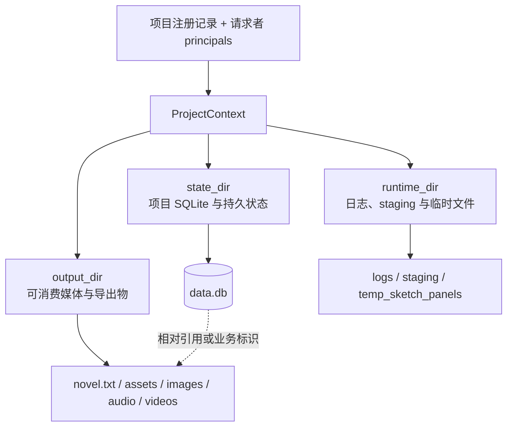

# Nuomi Drama Factory 存储与项目文件

- **所属**：[开发与验证](../README.md#开发与验证)
- **上游**：[共享系统地图](../system-map.md)
- **下游**：[小说导入](../pipelines/01-ingest.md) · [生产资产](../pipelines/03-production-assets.md) · [合成与导出](../pipelines/08-compose-export.md)
- **代码基线**：`55504a0`
- **返回首页**：[Nuomi Drama Factory 开发者 Cookbook](../README.md)
- **相关手册**：[功能反查](trace-a-feature.md) · [新增 API 与长任务](add-api-and-task.md) · [测试策略](testing-strategy.md)

本页说明项目身份如何确定三类目录、SQLite 与媒体文件各自保存什么，以及新增写入或迁移时要守住的边界。具体产物由哪条业务管线生成，继续查对应的[生产管线专题](../README.md#核心生产管线)。

## 先区分身份、目录和内容

`src/novelvideo/project_context.py:ProjectContext` 是新代码使用的项目身份对象。它同时携带稳定的 `project_id`、owner、requester、有效角色、home node，以及 `output_dir`、`state_dir`、`runtime_dir`。这三条路径来自项目注册记录；API 不应根据请求体中的用户名、项目名或绝对路径重新计算它们。



`src/novelvideo/config.py` 先从 `NOVELVIDEO_DATA_ROOT` 得到默认数据根，再分别读取 `NOVELVIDEO_OUTPUT_DIR`、`NOVELVIDEO_STATE_DIR`、`NOVELVIDEO_RUNTIME_DIR`。三个覆盖值相互独立，因此不能假定三个目录互为兄弟目录，也不能用 `output_dir.parent` 推导 `state_dir` 或 `runtime_dir`。

| 边界 | 当前典型内容 | 写入后的预期 |
| --- | --- | --- |
| `ctx.output_dir` | `novel.txt`、`assets/`、`scripts/`、`images/`、`frames/`、`audio/`、`videos/`、Freezone 文件 | 页面、下载或后续媒体步骤需要长期读取；通过受保护媒体 URL 暴露，不把本机绝对路径返回前端 |
| `ctx.state_dir` | `data.db`、`cognee_system/`、`project_config.json`、迁移标记 | 重启后仍需恢复的结构化项目状态；备份时要按数据库语义处理 WAL |
| `ctx.runtime_dir` | `logs/`、`staging/`、`temp_sketch_panels/` | 运行中可观察或可重建；失败、取消和重试要考虑清理本次运行的中间文件 |

这张表只描述项目级目录。`src/novelvideo/api/deps.py` 还会在安装级 `STATE_DIR/local/` 保存 `settings.db` 和 `production.db`；`src/novelvideo/utils/project_paths.py:ProjectPaths` 还定义了 `STATE_DIR/_shared/verification.db`、`director_training.db` 和共享 artifacts。它们不是某个 `ctx.state_dir` 的内容。排查数据时要先确认作用域是项目级、安装级还是全局共享。

媒体提供商凭据由 `get_media_credential_store` 调用 `create_credential_store` 交给操作系统支持的 Store，不能统一归入 `STATE_DIR/local/`：

- macOS 使用当前用户的 login Keychain；工厂会忽略传入的 fallback path，不在 `STATE_DIR/local/` 写凭据文件。
- Windows 优先写 Credential Manager。只有 Credential Manager 写入不可用且 DPAPI 可用时，才把密文 fallback 写到 `STATE_DIR/local/media-credentials.dpapi.json`；文件内容不是明文。
- 其他非 macOS 平台当前也会构造 `WindowsCredentialStore`，但没有 Win32 Credential Manager 和 DPAPI 后端时无法保存凭据，读取也不会返回 fallback 值。

因此备份 `STATE_DIR/local/` 可以覆盖这两个安装级数据库，以及 Windows 上可能存在的 DPAPI fallback 文件；它不包含 macOS Keychain 凭据，也不包含保存在 Windows Credential Manager 中的凭据。DPAPI 文件虽然不是明文，仍应作为敏感备份限制访问。凭据恢复与迁移必须按对应操作系统的安全存储单独处理，不能把复制 `local/` 当成完整凭据备份。

## ProjectContext 的解析和 home node 门禁

`resolve_project_context` 按 `project_id` 或 owner 下的项目名读取 `ProjectRecord`，通过 ProjectAccess 计算 requester 的有效角色，再由 `_ctx_from_record` 构造不可变 `ProjectContext`。`require_role_value` 在上下文生成前完成最低角色检查。

本地文件系统采用 share-nothing 约束。`is_record_home_node` 把 CE 的 `home_node_id="local"` 视为本机；其他值必须与 `resolve_worker_id()` 一致。任何需要打开项目 SQLite 或文件的路径都应调用 `require_project_home_node`。不在 home node 时返回带 `project_not_on_this_node` 的 HTTP 409，而不是尝试从同名本地目录读取。

API 中优先使用以下入口：

- `src/novelvideo/api/deps.py:resolve_project_scope`：返回 `ProjectResolution`，并在暴露本地路径前执行 home node 门禁。
- `src/novelvideo/api/deps.py:make_sqlite_store_for_context`：从 owner label、`ctx.output_dir` 和 `ctx.state_dir` 创建项目 Store。
- `src/novelvideo/api/deps.py:get_sqlite_store`：FastAPI yield dependency；请求结束时在 `finally` 中关闭 Store。
- `src/novelvideo/api/deps.py:get_project_paths_for_context`：需要标准子目录时，用 `ProjectPaths.from_context` 保留注册记录中的三条路径覆盖。

`make_sqlite_store(username, project)` 和 `get_output_dir` 等名称型入口仍供兼容路径使用。新增 project-id API 或 Runner 已经持有 `ctx` 时，不要退回名称拼接入口。

## SQLite 与媒体文件的边界

`src/novelvideo/sqlite_store.py:SQLiteStore` 把项目数据库固定为 `state_dir/data.db`，而 `project_dir` 指向 `output_dir`。角色、剧集、Beat、场景、道具、导入 revision、任务相关结构等关系型状态进入 SQLite；图片、音频、视频、导出包和部分 JSON manifest 仍是文件。Store 中保存媒体字段时，应保存业务标识、项目相对路径或可迁移的引用，不应把数据库当作大媒体文件容器。

读取链路也要保留这一区分：SQLite 记录存在不代表目标媒体可读；媒体文件存在也不代表它已经被采用或与当前 revision 一致。API 返回媒体时用 `make_project_static_url` / `make_static_url_for_context` 构造受项目权限保护的 URL。任务完成后，前端通常还要重新读取 Store 或媒体接口，而不是只相信 `completed` 状态。

`SQLiteStore.save_novel_content` 当前直接把文本写到 `output_dir/novel.txt`，其他文件 Store 则可能使用临时文件加 `os.replace`。不能从某一个 writer 推断所有文件写入都具备原子发布；修改现有产物时先检查它自己的 writer 和消费者。

## Store 是一次性生命周期对象

`SQLiteStore` 延迟打开 `aiosqlite.Connection`。`initialize()` 进入 `_ensure_db` 后执行 schema、补列迁移和连接 PRAGMA，再提交；`load_graph_state()` 负责把数据库内容恢复到 Store 的内存索引。`make_sqlite_store_for_context` 已按这个顺序执行两步。

公共异步方法由 `_auto_lease_public_async_methods` 包装。lease 会统计进行中的操作，也允许同一 asyncio task 嵌套调用；`close()` 先阻止新 lease，最多等待进行中调用 10 秒，再关闭连接。关闭后调用公共方法会抛 `StoreClosedError`，不能再次 `initialize()` 复用同一个实例。

直接创建 Store 的代码使用下面的生命周期：

```python
store = await make_sqlite_store_for_context(ctx)
try:
    beats = await store.get_beats_as_dicts(episode)
finally:
    await store.close()
```

FastAPI 路由能注入 `get_sqlite_store` 时让 yield dependency 管理关闭；Runner 或 service 手动创建时必须保留 `try/finally`。不要把请求级 Store 放入模块全局变量，也不要让后台任务继续使用已经随请求关闭的 Store。

## 路径安全和越界防护

路径检查要在输入进入 writer 之前完成，并以解析后的目录边界为准：

1. 项目身份和三类根目录从 `ProjectContext` 取得；先验证角色和 home node。
2. `src/novelvideo/api/deps.py:validate_project_name` 只接受字母、数字和下划线，并拒绝下划线开头的保留名。它用于名称型兼容入口，不能替代 project-id 路由的注册表解析。
3. Freezone 的 `safe_upload_filename` 会剥离正反斜杠前缀并对白名单外字符做替换；`CANVAS_ID_RE` 单独限制 canvas id。
4. `src/novelvideo/freezone/paths.py:resolve_static_url_to_path` 先去掉 query/fragment、URL decode，再对候选路径和项目根调用 `resolve()`，最后以 `relative_to()` 拒绝 `..`、编码后的穿越路径和解析到目录外的符号链接。

新增 resolver 时不要用字符串 `startswith` 判断目录归属，也不要只在 URL decode 前检查 `..`。输入是文件名时做 basename 和字符白名单；输入是相对路径时做 `resolve()` 后的祖先关系检查；输入是已有媒体 URL 时还要确认其中的 project id 属于当前上下文。

## 原子写和迁移

SQLite 连接由 `src/novelvideo/sqlite_pragmas.py` 统一配置为 WAL、`synchronous=NORMAL`、10 秒 busy timeout 和外键检查。普通多表变更应放在一个明确事务中，异常时 rollback；不要在需要整体一致的循环里逐行 commit。`SQLiteStore.publish_character_analysis_atomic`、`add_characters_atomic` 和 `add_scenes_atomic` 可作为现有事务边界的参考。

schema bootstrap 使用 `CREATE TABLE IF NOT EXISTS` 和 `_add_column_if_missing`。后者处理两个进程在 `PRAGMA table_info` 后同时 `ALTER TABLE` 的竞态：仅在再次确认列确实存在时吞掉 duplicate-column 错误。新增补列逻辑应保持可重复执行，并用旧库、第二次初始化和并发初始化场景验证。

`ProjectPaths.bootstrap_from_legacy_output` 负责从旧的单目录布局首次复制状态和运行时内容：

- `data.db`、`cognee_system/`、`project_config.json` 复制到 state；`logs/`、`temp_sketch_panels/` 复制到 runtime。
- SQLite 主库用 `VACUUM INTO` 生成一致快照，`-wal`、`-shm`、`-journal` sidecar 不直接复制。
- 只补目标中缺失的文件，完成后写 `state/.migrated`；它不会删除旧目录内容。

迁移代码不能假定 source 和 target 在同一文件系统。普通文件原子发布应在目标文件的同一目录创建唯一临时文件，flush/close 成功后再 `os.replace`，并在异常时删除临时文件。若一次操作同时更新 SQLite 和媒体文件，先明确 staging、数据库 commit、最终 rename 的顺序以及失败补偿；SQLite 事务和文件 rename 不能组成天然的跨介质事务。

## 关键路径和符号表

| 路径 | 关键符号 | 用途 |
| --- | --- | --- |
| `src/novelvideo/project_context.py` | `ProjectContext`、`resolve_project_context`、`require_project_home_node` | 项目身份、权限、home node 和目录边界 |
| `src/novelvideo/config.py` | `OUTPUT_DIR`、`STATE_DIR`、`RUNTIME_DIR`、`ensure_project_dirs_at_paths` | 进程级根目录和标准 output 子目录 |
| `src/novelvideo/shared/project_dirs.py` | `default_project_dirs` | 注册项目时生成三条默认绝对路径 |
| `src/novelvideo/utils/project_paths.py` | `ProjectPaths`、`bootstrap_from_legacy_output` | 三类项目路径、共享 state 和旧布局迁移 |
| `src/novelvideo/api/deps.py` | `resolve_project_scope`、`make_sqlite_store_for_context`、`get_sqlite_store` | API 路径解析和 Store 生命周期 |
| `src/novelvideo/media_capabilities/runtime/credential_store.py` | `create_credential_store`、`MacOSCredentialStore`、`WindowsCredentialStore` | 操作系统凭据存储与 Windows DPAPI fallback |
| `src/novelvideo/sqlite_store.py` | `SQLiteStore`、`_ensure_db`、`_add_column_if_missing` | 项目 SQLite schema、缓存和读写 |
| `src/novelvideo/sqlite_pragmas.py` | `configure_sqlite_connection_async` | WAL、同步级别、busy timeout 和外键 |
| `src/novelvideo/freezone/paths.py` | `safe_upload_filename`、`resolve_static_url_to_path` | 上传名清洗和项目路径越界防护 |
| `src/novelvideo/project_config.py` | `_write_project_config_atomic` | 项目配置的临时文件与原子替换 |

## 常见修改落点

| 修改目标 | 首先修改 | 同时检查 |
| --- | --- | --- |
| 新增项目级结构化字段 | `SQLITE_SCHEMA_SQL` 和对应 Store 映射 | 旧库补列、默认值、内存缓存、API schema、迁移测试 |
| 新增媒体类型或目录 | 对应领域 writer / `ProjectPaths` 属性 | static URL、下载接口、清理、备份、任务失败后的 staging |
| 新增项目 API | route 的 `resolve_project_scope` / `get_sqlite_store` | required role、home node、Store 关闭、返回值是否泄露绝对路径 |
| 修改项目配置 | `src/novelvideo/project_config.py` | state 根、锁和原子 read-modify-write、并发测试 |
| 修改旧布局迁移 | `ProjectPaths.bootstrap_from_legacy_output` | WAL 一致性、幂等、已有目标、跨根目录和 `.migrated` |
| 新增全局共享状态 | 明确的 `STATE_DIR/_shared` Store | 不与项目事实混写、权限、备份范围和多项目并发 |

## 诊断与验证

先确认正在看的不是另一个根或另一个作用域：记录 `project_id`、`home_node_id` 以及上下文中的三条路径，再检查 Store 的 `db_path`。看到 `Project not found` 查注册表解析；看到 `project_not_on_this_node` 查 home node 路由；看到 `database is locked` 查未关闭 Store、长事务和并发 writer；看到数据库记录存在但页面媒体 404，查记录中的相对引用、目标文件和 protected media URL 的 project id。

针对本页边界的最小验证：

```bash
uv run pytest tests/test_project_context.py tests/test_freezone_paths.py
uv run pytest tests/test_sqlite_store_indextts2_migration.py
uv run pytest tests/test_task_script_runner_store_lifecycle.py
uv run pytest tests/test_episode_source_migration.py
```

预期分别覆盖 home node 拒绝与允许、编码路径穿越、旧库补列和重复初始化、Runner 关闭 Store、已有项目来源迁移。改动具体 Store 或 writer 后，再从[测试策略](testing-strategy.md)补同层领域测试、API 契约和受影响的前端读取测试。
