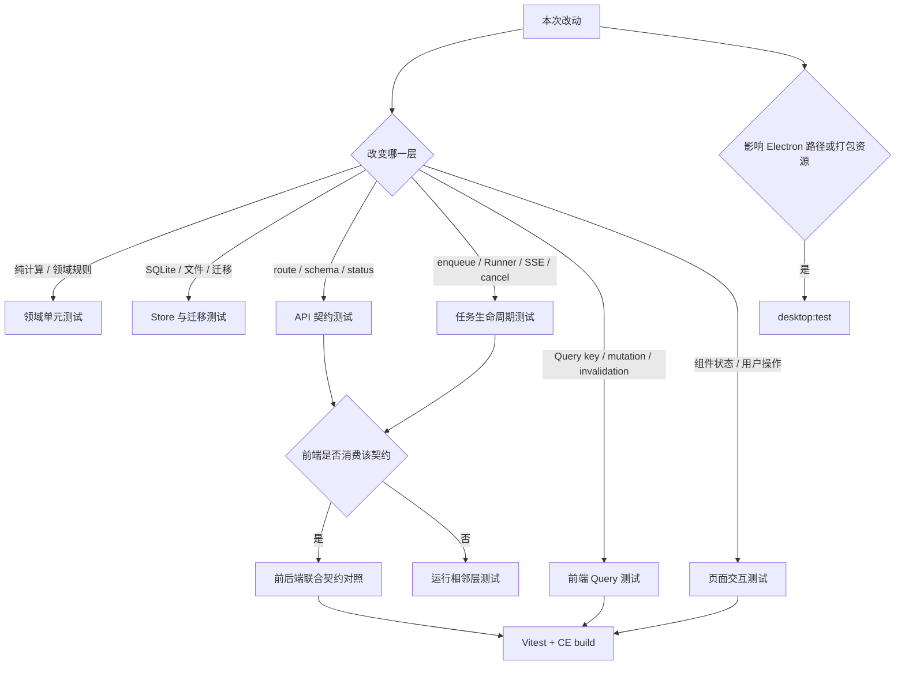

# Nuomi Drama Factory 测试策略

- **所属**：[开发与验证](/#开发与验证)
- **上游**：[共享系统地图](../system-map.md)
- **下游**：[核心生产管线](/#核心生产管线)
- **代码基线**：`55504a0`
- **返回首页**：[Nuomi Drama Factory 开发者 Cookbook](/)
- **相关手册**：[功能反查](trace-a-feature.md) · [新增 API 与长任务](add-api-and-task.md) · [存储与项目文件](storage-and-files.md)
- **业务入口**：[阶段质量门禁](../creation/07-quality-gates.md) · [创作复盘模板](../creation/08-retrospective-template.md)
- **技术调用链**：改动层 → 最小回归测试 → 相邻契约 → 静态构建与产物检查

本页按改动层选择验证集合。目标是先用最小测试固定改动点，再补它上下游的真实契约；测试文件名和命令均对应当前仓库。

## 先按改动影响面选测试



修改路径跨过一条边界，就为边界两侧各选一项。例如新增长任务至少覆盖 API 入队、TaskBackend/Runner 终态、前端任务订阅或 Query invalidation；只跑 Runner 单测不能证明页面使用的 `task_type` 和响应字段仍一致。

## 按层测试矩阵

以下命令从仓库根目录执行。

| 改动层 | 真实测试位置 | 命令 | 通过时说明什么 |
| --- | --- | --- | --- |
| 领域函数 | `tests/test_narrative_group_service.py` | `uv run pytest tests/test_narrative_group_service.py` | 分组、布局、revision 冲突和 stage 状态规则满足当前领域断言；不证明 API 序列化正确 |
| Store / schema 迁移 | `tests/test_sqlite_store_indextts2_migration.py` | `uv run pytest tests/test_sqlite_store_indextts2_migration.py` | schema bootstrap、重复初始化及 duplicate-column 竞态通过；新增迁移仍需加入相应旧库 fixture |
| Store / 文件原子性 | `tests/test_structured_ingest_atomic.py`、`tests/test_episode_source_migration.py` | `uv run pytest tests/test_structured_ingest_atomic.py tests/test_episode_source_migration.py` | 当前结构化导入与 episode source 的事务/迁移契约保持；不代表其他 writer 自动具备同样保证 |
| API 契约 | `tests/contract/test_m04_route_contracts.py` | `uv run pytest tests/contract/test_m04_route_contracts.py` | 资产相关 route 的请求、响应、文件和任务提交在代表性 CE 场景可用；任务中心契约则选 `tests/contract/test_m07_tasks.py` |
| Task 生命周期 | `tests/contract/test_m07_tasks.py`、`tests/test_task_state_restart_reconcile.py`、`tests/test_task_cancel_keys.py` | `uv run pytest tests/contract/test_m07_tasks.py tests/test_task_state_restart_reconcile.py tests/test_task_cancel_keys.py` | 列表/SSE 字段、终态、协作取消、重启清扫和取消键隔离满足断言 |
| 前端 Query / mutation | `frontend/src/__tests__/lib/queries/episodes.test.tsx` | `corepack pnpm --dir frontend exec vitest run src/__tests__/lib/queries/episodes.test.tsx` | MSW 下的 URL、payload、类型化错误、abort 和 Query cache 行为满足当前 hook 契约 |
| 前端任务失效 | `frontend/src/__tests__/hooks/use-episode-image-task-invalidation.test.tsx` | `corepack pnpm --dir frontend exec vitest run src/__tests__/hooks/use-episode-image-task-invalidation.test.tsx` | 完成事件只失效匹配项目、剧集和任务 scope 的数据 |
| 页面交互 | `frontend/src/__tests__/components/episode-source-editor.test.tsx` | `corepack pnpm --dir frontend exec vitest run src/__tests__/components/episode-source-editor.test.tsx` | jsdom 中打开对话框、编辑、粘贴拆行、blur 保存等用户操作满足断言 |
| 前后端联合契约 | `tests/test_api_compose_export_contract.py` 与 `frontend/src/__tests__/routes/compose-export-contract.test.ts` | 见下节两条命令 | 后端导出端点的状态、文件内容与前端使用的 method/path 同时受保护 |
| 桌面壳 | `desktop/test/runtime-paths.test.cjs`、`desktop/test/stage-runtime.test.cjs` | `corepack pnpm desktop:test` | Windows 打包路径、CE 后端环境和 staging 输入校验满足 Node 测试 |

测试通过只支持对应行的结论。路径处理改动还要跑实际 resolver 测试，任务 payload 改动还要检查 Runner 消费端，CSS 或浏览器布局变化仍需要人工或浏览器验证。

## Pytest 配置和 markers

`pyproject.toml:[tool.pytest.ini_options]` 是后端测试入口：

- `testpaths = ["tests"]`，直接运行 `uv run pytest` 只收集 `tests/`。
- `asyncio_mode = "auto"`，async fixture 和 async test 由 pytest-asyncio 自动管理；现有显式 `@pytest.mark.asyncio` 仍可保留。
- 默认 `addopts = "-m 'not ee and not e2e'"`，所以 `uv run pytest` 排除 `ee` 与 `e2e`，适合作为 CE 默认回归。
- `quarantine` marker 已注册，但默认 addopts 没有排除它；标为 quarantine 不等于默认不执行。
- `m01` 到 `m10` 是 OSS 拆分模块标签，用于选择一组契约测试，不改变测试自身依赖。
- `norecursedirs` 排除 `archive`、`external`、`.venv` 和 `node_modules`。

显式运行被默认过滤的集合时，可先清空配置中的全部 addopts，再传入目标 marker：

```bash
uv run pytest -o addopts='' -m ee
uv run pytest -o addopts='' -m e2e
```

这两类测试可能需要企业模块、外部服务或完整运行环境。失败前先读测试 fixture 和 marker，不要把环境缺失直接归类为产品回归。命令行 `-m` 会覆盖 addopts 中配置的 `-m` 表达式，不会与它自动取交集；因此 `uv run pytest -m m07` 的最终表达式只有 `m07`，也可能收集同时标有 `ee` 或 `e2e` 的用例。若模块回归需要保留 CE 的默认排除条件，应显式运行 `uv run pytest -m 'm07 and not ee and not e2e'`。

## Vitest、Query 和页面测试

`frontend/package.json` 的 `test` 脚本是 `vitest run`，`test:watch` 是交互式 `vitest`。`frontend/vitest.config.ts` 使用 jsdom、加载 `src/__tests__/setup.ts`、启用 globals，并把 `@` 映射到 `frontend/src`；它还排除 dist、node_modules 和嵌套 worktree，避免重复收集测试。

前端测试按职责选择：

- `frontend/src/__tests__/lib/queries/`：用 QueryClient、renderHook 和 MSW 固定 HTTP method/path、payload、响应解析、错误类型、cache 更新与 invalidation。
- `frontend/src/__tests__/hooks/` 和 `frontend/src/__tests__/task-center/`：固定 SSE/事件总线、任务匹配、完成回调和 Query 失效。
- `frontend/src/__tests__/components/`：用 Testing Library 从 role、label 和用户事件观察组件行为。
- `frontend/src/__tests__/routes/`：既有渲染测试，也有读取源码的静态契约测试。后者能防止字符串或 wiring 漂移，但不能替代浏览器行为测试。

运行全部前端测试：

```bash
corepack pnpm --dir frontend test
```

预期 Vitest 完成一次非 watch 运行且没有 failed test。定位单文件时使用矩阵中完整的 `corepack pnpm --dir frontend exec vitest run` 命令和已有测试文件，避免在开发循环中反复执行全部 UI 测试。

## 前后端联合契约怎样验证

仓库没有要求每项契约都通过一个进程同时启动前后端。更常见的做法是对同一个 HTTP 契约运行后端 route 测试和前端消费测试。例如合成导出：

```bash
uv run pytest tests/test_api_compose_export_contract.py
corepack pnpm --dir frontend exec vitest run src/__tests__/routes/compose-export-contract.test.ts
```

第一条验证后端 `GET /projects/demo/episodes/3/export/video`、`POST /projects/demo/episodes/3/export/zip` 的响应和实际归档内容；第二条验证 compose 页面使用 `/export/video` 和 `/export/zip`，并保留提交 payload 和本地化约束。两条都通过才说明这组静态前后端契约没有漂移；它们仍不覆盖真实服务器、浏览器下载和 FFmpeg 环境。

对于新契约，先列出 method、path 参数、请求 schema、响应字段、错误状态、`task_type` 和完成后的 Query key，再分别在 `tests/contract/` 或 route 测试、`frontend/src/__tests__/lib/queries/`、页面/任务测试中固定。字段只在 TypeScript type 中出现不算运行时验证。

## CE build 是前端交付门禁

`frontend/package.json:build:ce` 执行 `tsc -b && vite build --mode ce`：

```bash
corepack pnpm --dir frontend build:ce
```

预期 TypeScript project build 和 Vite CE production bundle 都以 0 退出。Vitest 能通过而 build 失败的常见原因包括未被测试 import 的类型错误、Vite mode 下环境分支、动态 import 或构建期资源问题，因此涉及前端生产代码时应在 focused Vitest 后补 CE build。

普通 `build` 还会执行 `node scripts/check-freezone-bundle-budget.mjs`，`build:ce` 当前不包含这一步。修改 Freezone chunk 或性能预算时需额外运行 `corepack pnpm --dir frontend build`，不能把 CE build 通过等同于 bundle budget 通过。

## 桌面测试何时适用

根 `package.json` 只负责 Electron CE 桌面打包链：`desktop:test` 用 Node test runner 执行 `desktop/test/*.test.cjs`；`desktop:prepare` 依次执行桌面测试、前端 CE build 和 runtime staging。以下改动必须补桌面测试：

- `desktop/main.cjs`、`desktop/runtime-paths.cjs` 的进程、端口、用户数据或环境变量。
- `desktop/scripts/stage-runtime.cjs` 的 Python、前端、backend、FFmpeg/ffprobe staging 布局。
- 根 `package.json` 的 `build.files`、`extraResources` 或安装包路径。

日常验证运行 `corepack pnpm desktop:test`。只有准备真实 Windows 安装包时才运行 `desktop:build`；它需要平台资源和 electron-builder，不能作为普通后端或 Web 改动的默认测试。

## 推荐执行顺序

1. 在改动层运行一个最小测试文件；失败输出要能直接指向这次行为。
2. 补同层的边界测试，例如旧库、重复调用、取消、错误响应或 Query invalidation。
3. 如果契约跨 API、任务和前端，运行边界两侧的测试，不用一个大型用例代替所有层。
4. 前端生产代码补 `build:ce`；桌面路径和资源改动补 `desktop:test`。
5. 合并前运行 CE 默认后端回归 `uv run pytest` 和全部前端测试 `corepack pnpm --dir frontend test`；根据改动范围再加 acceptance、e2e 或企业集合。

诊断失败时先区分断言失败、收集失败、环境缺失和超时。单测通过但整套失败，检查共享 port 注册、环境变量、全局 QueryClient、未关闭 Store、后台任务和测试顺序；只增加重试或等待时间会掩盖资源生命周期和隔离问题。
