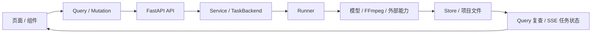

# Nuomi Drama Factory 功能反查手册

> **所属**：开发手册<br>
> **相关系统地图**：[Nuomi Drama Factory 共享系统地图](../system-map.md)<br>
> **管线首页**：[核心生产管线](../README.md#核心生产管线) · [合成与导出](../pipelines/08-compose-export.md)<br>
> **代码核对基线**：`55504a0`<br>
> **返回**：[Nuomi Drama Factory 开发者 Cookbook](../README.md)

这份手册回答一类具体问题：「我要改某个功能，它从页面到产物是怎么走的？」做法是从手头已有的稳定线索开始搜索，再沿调用者、契约、执行者和数据落点逐层核对。不要只凭相似的目录名判断调用关系；路由、HTTP 路径、`task_type` 和输出文件名通常是更可靠的锚点。

## 先画出标准纵向链

大多数生产功能都能放进下面这条链。短操作可能跳过 TaskBackend 和 Runner，读取接口也可能直接从 Store 或文件返回；遇到这类岔路时保留实际经过的层，不必强行补齐。



实际追踪时，给每一层各记一个可以用 `rg` 找到的符号：

1. **页面 / 组件**：路由文件、按钮事件或 Feature 组件。
2. **Query**：`useQuery`、`useMutation`、HTTP 路径、响应类型和 Query key。
3. **API**：FastAPI decorator、请求 schema、权限和 `ProjectContext`。
4. **Service / TaskBackend**：同步领域服务，或 `enqueue_project_task` 的 `task_type`、队列和 payload。
5. **Runner**：注册语句、envelope 解包、取消点和进度更新。
6. **外部能力**：模型 gateway、FFmpeg、媒体探测器或第三方 SDK。
7. **Store / 文件**：SQLite 表、Store 方法、`output/`、`state/` 或 `runtime/` 下的相对路径。
8. **状态刷新**：任务列表 / SSE、Query invalidation、重新读取和最终展示。

## 完整样例：追踪「合成剧集」

样例从合成页的按钮开始，一直追到 `epNNN_final.mp4` 和三个导出接口。下面的符号均已在基线代码中核对。

### 1. 页面提交合成并监听任务

页面路由是 `frontend/src/routes/_app/projects.$project/episodes.$episode/compose.lazy.tsx`。`ComposeTabContent` 调用 `useComposeEpisode(project, epNum)`；`handleCompose` 提交 `add_subtitles`、`add_bgm` 和 `resolution`，随后调用 `task.start()` 开始观察任务。

同一页面用 `useTaskController` 绑定后端真实任务类型 `compose_episode`。任务完成后，它会失效 `pipelineStatus`、`videoPool`、`beats` 和 `finalVideo` 等 Query。页面初次打开或 Query 重新读取时，`useFinalVideo` 会恢复已有成片预览，因此刷新浏览器不要求重新合成。

这里要分别看「启动任务」和「读取结果」：

- `frontend/src/lib/queries/video.ts:useComposeEpisode` 向 `POST /api/v1/projects/{project}/episodes/{episode}/videos/compose` 发送 mutation，响应是 `TaskResponse`。
- `frontend/src/lib/queries/video.ts:useFinalVideo` 以 `queryKeys.finalVideo(project, episode)` 请求 `GET /api/v1/projects/{project}/episodes/{episode}/final`。
- `run_compose_episode` 当前返回 `video_path`，而页面的 `onComplete` 只直接识别 `video_url` 或 `url`；成片能稳定显示主要依靠 `finalVideo` Query 在完成后重新读取。

### 2. API 校验输入并排入 FFmpeg 队列

`src/novelvideo/api/schemas.py:VideoComposeRequest` 定义三个请求字段。`src/novelvideo/api/routes/generation.py:compose_video` 要求 editor 权限，从项目 SQLite Store 读取本集 beats；没有 beats 时直接返回错误。

有 `ProjectContext` 时，API 调用 `get_task_backend().enqueue_project_task(...)`：

- `task_type="compose_episode"`
- `queue_kind="ffmpeg"`
- `episode=episode_num`
- payload 包含 `beats`、`add_subtitles`、`add_bgm`、`episode`、`output_dir` 和 `resolution`

API 返回 `task_id`、`task_key`、backend 和 queue，前端随后通过任务控制器追踪 `compose_episode`。如果修改请求选项，不仅要确认 schema 和 payload 中出现了字段，还要继续确认 Runner 是否真正消费它；例如当前 Runner 会读取 `add_subtitles` 并把请求值写入结果，但合成命令本身没有使用这个值生成字幕，`add_bgm` 也没有在 `run_compose_episode` 中读取。

### 3. TaskBackend 按任务类型找到 Runner

CE 中，`src/novelvideo/ports/local/tasks.py:InlineTaskBackend.enqueue_project_task` 先调用 `src/novelvideo/task_backend/run_core.py:_ensure_builtin_runners_registered`。这个函数导入 `novelvideo.task_backend.runners.video`，模块加载时执行：

```python
register_project_task_runner("compose_episode", run_compose_episode)
```

注册表位于 `src/novelvideo/task_backend/registry.py`。因此，追任务时要同时找到入队处和注册处；只找到 `task_type` 字面量还不能说明实际执行函数。

`compose_episode` 还出现在 `src/novelvideo/task_identity.py` 的任务身份规范、`src/novelvideo/api/routes/tasks.py` 的中文标签、`frontend/src/lib/task-types.ts:TASK_TYPES.COMPOSE_EPISODE` 和 `frontend/src/lib/episode-stage-registry.ts` 的 compose 阶段配置中。这些位置共同影响任务去重、任务中心展示和页面归属。

### 4. Runner 调 FFmpeg 并写成片

`src/novelvideo/task_backend/runners/video.py:run_compose_episode` 从 envelope 读取 episode、beats、resolution、output 目录和字幕请求。它通过 `resolve_episode_composition_sources` 选择本集的普通 Beat 或导演组视频来源，并用 `PathResolver.audio` 查找配套音频。

Runner 的媒体处理分两段：

1. 每个来源先经 FFmpeg 生成临时标准片段。普通 Beat 优先使用独立音频，没有独立音频时检查视频内置音轨，再没有则补静音；导演组按 manifest 中的时间段保留 H3 原生对白，或把外部 TTS 与 ambience stem 混合。
2. 所有临时片段按目标分辨率缩放、补边并统一音频采样率，再由 FFmpeg concat 为一条成片。

最终文件固定写到项目 output 目录下的 `videos/episodes/ep{episode:03d}_final.mp4`。Runner 通过任务管理器更新 `compose_episode` 的进度、当前步骤和日志，并在 FFmpeg 前后检查取消或超时。

### 5. 成片读取、状态刷新与导出

`src/novelvideo/api/routes/generation.py:get_final_video` 检查同一固定文件是否存在，存在时用 `make_static_url_for_context` 返回受项目权限保护的 `video_url`。`useFinalVideo` 读取该结果并把 URL 交给页面 `<video>` 预览。

任务状态来自项目任务列表和 SSE；compose 页的 `useTaskController` 用 `compose_episode + project + episode` 对齐当前任务，并在终态失效相关 Query。任务中心依靠 `src/novelvideo/api/routes/tasks.py` 的标签把它显示为「合成剧集」。任务状态和媒体文件是两类数据：看到 `completed` 后仍应通过 `/final` 或文件检查确认成片可读。

页面提供三种导出：

| 操作 | API | 读取或生成的内容 |
| --- | --- | --- |
| 下载成片 | `GET .../export/video` | 读取 `videos/episodes/epNNN_final.mp4`，以 `video/mp4` 返回 |
| 导出字幕 | `GET .../export/srt` | 从 Store 读取 beats，由 `build_srt_content` 生成 SRT |
| 导出素材包 | `POST .../export/zip` | `build_episode_zip_file` 收集音频、合成来源、manifest / stem、成片和 SRT，写入 `videos/episodes/<项目名>_第N集.zip` |

`src/novelvideo/utils/path_resolver.py:PathResolver.final_video` 与上述 API 使用同一成片命名约定。修改文件名或目录时，要一起检查读取、预览、pipeline 门禁、ZIP 收集和契约测试，不能只改 Runner 的写入位置。

## 四种可复制的反查方法

四种方法的终点相同，起点取决于手头已有的线索。每次搜索后都记录「谁调用它、它调用谁、读写什么」。

### 从页面路由反查

适用于已知页面 URL、标签页或按钮位置。先找 TanStack Router 文件，再查该文件导入的 Query hook、事件处理函数、任务类型和 Query key。

```bash
rg --files frontend/src/routes | rg '/compose(\.lazy)?\.tsx$'
rg -n 'useComposeEpisode|useFinalVideo|handleCompose|taskType|invalidateKeys' \
  'frontend/src/routes/_app/projects.$project/episodes.$episode/compose.lazy.tsx'
rg -n 'export function useComposeEpisode|export function useFinalVideo' \
  frontend/src/lib/queries/video.ts
```

找到后继续看：hook 中的 HTTP method / path 和响应类型；页面是否调用 `task.start()`；完成后失效哪些 Query；下载按钮是否绕过 Query 直接访问另一个 API。

### 从 HTTP 路径反查

适用于浏览器 Network、日志或契约测试中已经看到接口路径。路径参数名字可能不同，先搜稳定尾段，再定位 decorator 和 schema。

```bash
rg -n 'videos/compose|episodes/\{episode_num\}/final|export/(video|srt|zip)' \
  frontend/src src/novelvideo tests
rg -n 'class VideoComposeRequest|def compose_video|def get_final_video|def export_final_video' \
  src/novelvideo
rg -n 'include_router|prefix="/api/v1"' src/novelvideo/api
```

找到后继续看：API 所需角色、`ProjectContext` 的解析、同步返回还是 `enqueue_project_task`、payload 字段、读取的 Store 方法和返回 schema。不要因为 URL 叫 `final` 就假定它会启动合成；这里的 `/final` 只是同步读取文件状态。

### 从任务类型反查

适用于任务中心、SSE、SQLite `task_states` 或错误日志中已经看到 `task_type`。同一个值会跨前后端出现，先找生产者、消费者和注册表。

```bash
rg -n '"compose_episode"|COMPOSE_EPISODE' frontend/src src/novelvideo tests
rg -n 'enqueue_project_task|register_project_task_runner|useTaskController' \
  frontend/src src/novelvideo
rg -n '_ensure_builtin_runners_registered|get_project_task_runner_registration' \
  src/novelvideo/task_backend src/novelvideo/ports
```

找到后继续看：谁入队、任务身份是否带 episode / beat / scope、使用哪条 queue lane、payload 怎样组成、Runner 在哪里注册、任务标签与阶段映射是否齐全、完成后哪些页面数据会失效。

### 从输出文件名反查

适用于磁盘上已有异常文件、缺失产物或导出包内容不对。先搜完整后缀或命名片段，再区分 writer、reader、门禁和测试。

```bash
rg -n 'ep.*_final\.mp4|final_video\(' src/novelvideo frontend/src tests
rg -n 'videos/episodes|build_episode_zip_file|FileResponse' \
  src/novelvideo/api src/novelvideo/export src/novelvideo/task_backend
rg -n 'ep003_final\.mp4|export/video|export/zip' tests frontend/src/__tests__
```

找到后继续看：哪一处真正写文件、路径根来自 `ctx.output_dir` 还是临时目录、哪些接口读取它、是否被 ZIP 或 pipeline 状态消费、文件存在与任务成功是否分别校验。

## 常见岔路

### 同步 API，没有任务

并非每个 mutation 或 API 都进入 TaskBackend。`get_final_video` 和 `export_final_video` 直接检查或返回文件，`export_srt` 直接读 Store 并构造内容。判断方法是继续搜索函数体中有没有 `enqueue_project_task`、领域 Service 调用或直接文件 I/O，不从 HTTP method 猜执行方式。

### 任务类型可能是变量，也可能是常量

前端优先通过 `TASK_TYPES.COMPOSE_EPISODE` 集中维护，但具体页面目前仍可出现 `taskType: "compose_episode"` 字面量；后端入队与注册通常使用字符串，某些通用方法则把 `task_type` 当变量传递。搜索时同时查字面量、常量名、`enqueue_project_task` 和注册函数，避免只命中一半。

```bash
rg -n 'TASK_TYPES\.|task_type=|taskType:|register_project_task_runner' \
  frontend/src src/novelvideo
```

### 多个入口可能汇入同一 Runner

一个 Runner 不一定只由一个 endpoint 触发。合成页 API 通过注册表执行 `run_compose_episode`；`src/novelvideo/task_backend/runners/narrative_group_video_compose.py` 也会构造 `task_type="compose_episode"` 的 envelope 并直接调用同一个函数。反查到 Runner 后，要继续搜索函数名的全部调用者，区分直接调用、注册调用和测试调用。

```bash
rg -n 'run_compose_episode|task_type.?[:=].?"compose_episode"' \
  src/novelvideo frontend/src tests
```

### 当前采用项之外还有历史或候选池

页面展示的文件可能只是当前采用版本，不能代表所有生成历史。视频生成会把候选写入视频池；`GET .../video-pool` 读取索引，`POST .../video-pool-select` 改变 Beat 采用项，合成 Runner 再通过 `resolve_episode_composition_sources` 解析当前来源。追媒体问题时应同时检查候选文件、池索引、采用关系和最终固定文件。

```bash
rg -n 'useVideoPool|video-pool-select|select_video_pool|video_pool_index|resolve_episode_composition_sources' \
  frontend/src/lib/queries/video.ts \
  src/novelvideo/api/routes/generation.py \
  src/novelvideo/task_backend/runners/video.py
```

## 修改影响面清单

沿链路改完功能后，按实际经过的层逐项核对：

- [ ] **前端类型与 Query key**：请求 / 响应类型、`queryKeys`、enabled 条件、成功后的 invalidation。
- [ ] **API schema**：Pydantic 请求字段、默认值、响应结构、权限和错误分支。
- [ ] **任务 payload**：API 写入的键与 Runner 读取的键一致；episode、beat、scope 和目录来源明确。
- [ ] **Runner 注册**：`task_type` 有唯一预期注册，内置 Runner 会被导入，queue kind 与资源消耗匹配。
- [ ] **Store 与文件**：SQLite 读写、项目 `output/state/runtime` 边界、命名规则、覆盖或保留历史的语义。
- [ ] **任务中心**：任务身份、中文标签、阶段映射、取消定位、完成后的 Query 刷新。
- [ ] **契约测试**：路由 method / path、schema / payload、Runner 注册、产物路径和导出内容。
- [ ] **中英文文案**：按钮、错误、任务标题、toast 和 i18n key 同步更新，不把后端内部错误当最终用户文案。

如果一次修改跨越多层，先写出旧链和新链，再决定测试范围。只改字段名时也要从页面发送端追到 Runner 读取端；只改文件名时要从 writer 追到所有 reader 和导出测试。

## 最小核对命令

下面的命令用于确认本页样例中的五个关键符号仍能在预期目录找到：

```bash
rg -n 'useComposeEpisode|compose_video|compose_episode|run_compose_episode|useFinalVideo' frontend/src src/novelvideo
```

文档改动提交前再运行：

```bash
git diff --check HEAD -- docs/cookbook/development/trace-a-feature.md
git diff HEAD -- docs/cookbook/development/trace-a-feature.md
```
