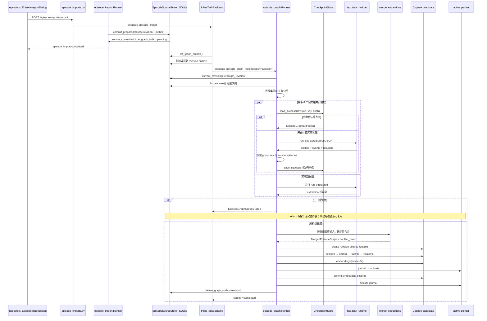

# Nuomi Drama Factory 剧集图谱管线

> **所属阶段**：核心生产管线 · 02 剧集图谱<br>
> **上游**：[小说导入](01-ingest.md)<br>
> **下游**：[生产资产](03-production-assets.md)<br>
> **相关横向手册**：[共享系统地图](../system-map.md) · [功能反查](../development/trace-a-feature.md) · [新增 API 与长任务](../development/add-api-and-task.md) · [存储与项目文件](../development/storage-and-files.md) · [测试策略](../development/testing-strategy.md)<br>
> **代码核对基线**：`55504a0`<br>
> **返回**：[Nuomi Drama Factory 开发者 Cookbook](../README.md)

本页追踪版本化 `episode_sources` 怎样经过固定分组、结构化抽取、确定性合并和候选图写入，最终切换为项目的活动 Cognee runtime。图谱中的角色、身份、场景、道具、事件与关系怎样进入角色和视觉资产生产，在下游[生产资产](03-production-assets.md)继续追踪。

## 功能边界

当前剧集图谱没有独立的 HTTP 启动接口或前端「建图」按钮。用户在导入页提交已有分集剧本，前端启动并观察的是 `episode_import`；来源提交成功后，后端通过持久 outbox 派生 `episode_graph_index`。顶层 Task Center 可以展示这个后台任务，导入页的完成提示也明确说明来源已经持久化、图谱仍在后台索引。

| 能力 | 入口 | 成功的含义 | 不负责什么 |
| --- | --- | --- | --- |
| 分集来源提交 | `EpisodeImportDialog` → `useCommitEpisodeImport` → `commit_episode_imports` | `episode_import` 已把来源 revision 写入 SQLite，并留下 `episode_graph_outbox` | 不表示新图已经激活 |
| outbox 调度 | `InlineTaskBackend._drain_episode_graph_outbox` | 最新待处理 revision 已排入 `episode_graph_index` | 不抽取内容；旧 revision 会被合并掉 |
| 图谱构建 | `run_episode_graph_index` → `EpisodeGraphBuildService.build` | 全部组抽取成功，合并图已写入隔离 candidate | 不直接改活动图指针 |
| 图谱激活 | `CogneeShadowGraph.activate_shadow` / `finalize_activation` | `cognee_active.json` 原子指向新 runtime，embedding 绑定已提交，outbox 已删除 | 不删除旧 build；它们保留在 revision-scoped 目录中 |

`changed_episode_numbers` 会随 outbox 进入任务 payload，但当前 Runner 会读取 `list_sources()` 的完整来源快照，把每个来源都标记为目标 revision，并为该 revision 构建一个全新的 candidate。不要据字段名推断当前是局部重算；Writer 的 provider-neutral 接口支持「移除受影响集贡献」，而实际 `CogneeGraphCandidate` 是 revision 唯一且初始为空，写入的是完整快照。

## 核心原理

### 来源 revision 是任务的快照边界

`episode_import` 的 `commit_prepared` 在同一个来源提交事务中更新 `episode_sources`、`episode_source_state.project_revision` 和 `episode_graph_outbox`。Inline backend 每次项目任务结束后检查 outbox：若存在多条，只保留最大 `target_revision`，删除更旧项，并用稳定作用域 `revision:<revision>` 排入 `episode_graph_index`。

Runner 开始时再次读取 `current_revision()`。它与 payload 的 `target_revision` 不一致就抛出 `EPISODE_GRAPH_REVISION_STALE`，不会抽取或写图。通过校验后，Runner 从 `episode_sources` 读取按集号排序的标题和正文，构造同一 revision 的 `EpisodeGraphSource` 列表。这个二次校验使过期任务不能覆盖更新后的项目图谱。

### 固定分组同时决定并行单元和检查点身份

`group_episode_sources` 先按集号排序，再把连续集号切成最多 5 集一组；集号间出现空洞会立即开始新组。组大小固定为 5，传入其他 `max_size` 会失败，重复集号也会被拒绝。

每组键为 `e<首集>-e<末集>`。`content_hash` 对组内每集的集号、source revision、标题和正文 SHA-256 做稳定序列化后再次计算 SHA-256，因此输入顺序不影响哈希，正文、标题或 revision 变化会让检查点失效。

### 抽取并行，模型输出仍受来源约束

`build_group_prompt` 把组内分集作为 JSON 数据包裹在明确的数据边界中，并声明正文字符串不具有指令权威。默认 `_invoke_deepseek` 并不直接绑定某个 SDK；它从当前 text task runtime 调用 `run_structured`，输出类型固定为 `EpisodeGraphExtraction`，Runner 注册的文本任务角色是 `knowledge_extraction`。

服务层为每个缺失检查点的组创建任务，最多并行 6 组；每个组内部调用 extractor 时使用 `concurrency=1`。抽取结束后还会执行三类校验：

1. 返回的 `group_key` 必须等于当前组键；默认 runtime 即使返回自造键，也会由 `_invoke_deepseek` 覆盖成当前组键。
2. entity、event 和 relation 的 `source_episodes` 只能引用当前组内集号。
3. event 与 relation 的 `episode` 必须在当前组内，同时必须包含在自身 `source_episodes` 中。

任一组失败时，其他成功组仍会立即写检查点。服务等待本轮组任务收齐后抛出 `EpisodeGraphGroupsFailed`，错误包含排序后的失败组键、异常类型和截断后的尾部消息；此时不会创建 candidate，也不会删除 outbox。

### 合并是确定性的，并显式保留冲突

`merge_extractions` 按稳定键合并所有成功组：

| 类型 | 合并键 | 合并行为 |
| --- | --- | --- |
| entity | `(kind, NFKC + 空白规整 + casefold(name))` | 合并 `source_episodes`，显示名做 NFKC 与空白规整 |
| event | `(episode, ordinal)` | 合并来源；描述冲突时按稳定 JSON 排序选择一个，并增加冲突计数 |
| relation | `(规范化 source_key, relation_type, target_key, episode)` | 合并来源与属性 |

同一属性出现不同值时，不覆盖旧值，也不把原生 list 误认为冲突集合；结果使用 `ConflictValues(values=[...])` 按稳定顺序保留候选值，并增加 `conflict_count`。当前属性词表是 `description`、`tags`、`aliases`、`state`、`role`、`location`、`time_of_day`、`purpose`、`outcome`、`evidence`。实体 kind 只允许 `character`、`identity`、`scene`、`prop`。

### 写入先完成隔离 candidate，再切换活动指针

`CogneeCandidateManager.create_candidate` 在 `state/cognee_builds/<revision>-<uuid>/runtime/` 建立独立 Cognee runtime，并以 `knowledge_rebuild_requested=True` 初始化。`EpisodeGraphWriter` 不调用 `cognify`，而是严格按以下顺序写 provider-neutral backend：

1. 移除受影响集贡献；当前 candidate 初始为空，若异常发现非空图则直接删除该 candidate 图。
2. upsert entities。
3. upsert events。
4. upsert relations。
5. 以 64 条为一批建立 `EpisodeGraphPoint` embedding。

实体节点 UUID 来自 `entity:<kind>:<name>`，事件节点来自 `event:<episode>:<ordinal>` 的 UUIDv5。节点把属性与来源集序列化到 `attributes_json`、`source_episodes_json`；关系边保留 relation type、episode、属性与来源集。只有所有写入成功，Service 才把 candidate 返回给 Runner；写入或 embedding 失败会关闭 candidate，并保持活动 runtime 不变。

Runner 随后用 `CogneeShadowGraph` 原子激活 candidate。激活前先写 `cognee_pointer_pending_commit.json` journal，再替换 `cognee_active.json`；接着提交 Ollama embedding binding（若存在），最后删除 pointer journal。binding 或 finalize 失败会恢复旧指针。全部成功后才关闭 candidate、删除对应 outbox，并返回 group/entity/event/relation 数量。

## 端到端调用链



图中的并行只覆盖缺失组抽取。合并需要全部组成功后按 group 顺序组装输入；candidate 创建、四类图写入、embedding、指针激活和 outbox 删除依次执行。`on_group_event` 在 `started`、`completed`、`checkpoint`、`failed` 时写任务日志；只有 `completed` 和 `checkpoint` 增加已完成计数，Runner 将分组阶段映射到约 0.10–0.85 的 progress，最终终态仍由通用 task core 记录。

## 数据与产物

| 数据或产物 | 写入方 | 位置 | 读取方与语义 |
| --- | --- | --- | --- |
| 正式分集来源 | `EpisodeSourceStore.commit_prepared` | 项目 SQLite `episode_sources` | Runner 的完整输入；每行保留自身 `source_revision`，Runner 构图时统一绑定目标 revision |
| 项目来源 revision | 同上 | `episode_source_state` | Runner 的 stale guard |
| 待建图项 | 同上 | `episode_graph_outbox` | revision 与 changed episode numbers；成功激活后删除 |
| 分组检查点 | `EpisodeGraphCheckpointStore` | `state/episode_graph/checkpoints/rev_<revision>/<group>.json` | schema version、revision、group key、content hash 全匹配才复用 |
| candidate runtime | `CogneeCandidateManager` | `state/cognee_builds/<revision>-<uuid>/runtime/` | 隔离的 Cognee graph 与 vector 数据 |
| 活动图指针 | `CogneeShadowGraph` | `state/cognee_active.json` | `CogneeStore` 解析当前活动 runtime；缺失或无效时回退 canonical state 路径 |
| 指针 journal | 同上 | `state/cognee_pointer_pending_commit.json` | 指针替换的恢复依据；激活完成后删除 |
| embedding 绑定 | `commit_embedding_binding` | 项目 state 中的 Cognee embedding 配置 | 仅 Ollama binding 在 candidate ready 后提交 |
| 任务状态 | TaskBackend / `TaskStateManager` | 项目 SQLite `task_states` | Task Center、任务列表与 stream 展示后台状态 |

检查点 JSON 用同目录临时文件写入、`fsync` 后 `os.replace`，进程中断不会把半截 JSON 当成成功结果。损坏 JSON、未知 schema、revision/key/hash 不匹配或无法通过 `EpisodeGraphExtraction` 校验都会被视为 miss 并重新抽取。

候选 build 当前会保留用于诊断，失败时也不会清理活动图。`discard_candidate` 负责关闭 candidate store，不承诺删除 build 目录；运维清理前必须先解析 `cognee_active.json`，不能按 revision 名猜测哪个目录仍在使用。

## 关键代码索引

| 关注点 | 路径 | 关键符号 |
| --- | --- | --- |
| 真实前端入口 | `frontend/src/routes/_app/projects.$project/ingest.tsx` | `EpisodeImportDialog`、`episodeImportTask`、`onCommitted` |
| 分集导入对话框 | `frontend/src/components/ingest/EpisodeImportDialog.tsx` | `handleFiles`、`handleSubmit` |
| 前端请求契约 | `frontend/src/lib/queries/ingest.ts` | `usePreviewEpisodeImports`、`useCommitEpisodeImport`、`useEpisodeImports` |
| 导入 API | `src/novelvideo/api/routes/episode_imports.py` | `preview_episode_imports`、`commit_episode_imports` |
| 来源提交 Runner | `src/novelvideo/task_backend/runners/episode_import.py` | `_run_episode_import`、`graph_index="pending"` |
| 来源与 outbox Store | `src/novelvideo/episode_source_store.py` | `EpisodeSourceStore`、`list_sources`、`list_graph_outbox`、`delete_graph_outbox` |
| outbox 调度 | `src/novelvideo/ports/local/tasks.py` | `InlineTaskBackend._run_inline`、`_drain_episode_graph_outbox` |
| 建图 Runner 与 Cognee backend | `src/novelvideo/task_backend/runners/episode_graph.py` | `EpisodeGraphPoint`、`CogneeGraphCandidate`、`CogneeCandidateManager`、`_run_episode_graph_index` |
| 图谱 schema | `src/novelvideo/episode_graph/models.py` | `GraphAttributes`、`GraphEntity`、`GraphEvent`、`GraphRelation`、`ConflictValues` |
| 固定分组 | `src/novelvideo/episode_graph/grouping.py` | `group_episode_sources`、`_content_hash` |
| 结构化抽取 | `src/novelvideo/episode_graph/extractor.py` | `build_group_prompt`、`extract_groups`、`_validate_sources` |
| 确定性合并 | `src/novelvideo/episode_graph/merge.py` | `_normalize`、`_merge_items`、`merge_extractions` |
| provider-neutral 写入 | `src/novelvideo/episode_graph/writer.py` | `GraphWriteBackend`、`EpisodeGraphWriter.replace_sources` |
| 检查点 | `src/novelvideo/episode_graph/checkpoints.py` | `EpisodeGraphCheckpointStore` |
| 管线编排 | `src/novelvideo/episode_graph/service.py` | `EpisodeGraphBuildService`、`EpisodeGraphGroupsFailed` |
| 活动指针与恢复 | `src/novelvideo/episode_import_service.py` | `CogneeShadowGraph`、`activate_shadow`、`restore_active`、`resolve_active_cognee_runtime` |
| Runner 注册与终态 | `src/novelvideo/task_backend/run_core.py`、`src/novelvideo/task_backend/registry.py` | `_ensure_builtin_runners_registered`、`get_project_task_runner_registration` |

## 常见修改

### 修改分组策略

1. **模型与身份**：先决定组键是否仍能仅由首末集表达。若允许非连续集或可变窗口，`EpisodeGraphGroup.key` 与 checkpoint 文件名必须避免碰撞。
2. **分组实现**：修改 `group_episode_sources` 时同步内容哈希输入；影响抽取语义的策略版本也应进入检查点身份，否则旧 checkpoint 可能被错误复用。
3. **进度**：Runner 当前用 `(len(sources) + 4) // 5` 估计总组数，这不考虑集号空洞。改变规则时应让 progress 直接使用实际 groups 数量，避免显示计数与执行组数不一致。
4. **测试**：更新 `tests/episode_graph/test_grouping.py` 的连续集、空洞、顺序稳定、重复集和固定大小用例；在 `test_service.py` 覆盖并发峰值、检查点命中与取消。

### 新增实体、关系或属性

1. **schema**：实体 kind 变更在 `GraphEntity.kind`；属性必须进入有限 `GraphAttributes` 词表，保持严格 structured output 可生成闭合 schema。关系类型当前是非空字符串，不是枚举。
2. **提示与来源校验**：需要更具体抽取规则时更新 `build_group_prompt` 和 system prompt，但不能削弱 `source_episodes` / episode 校验。
3. **合并键**：判断新字段是 identity 的一部分还是可冲突属性。改键会影响去重和 UUID；仅加属性通常由 `ConflictValues` 处理。
4. **写入与检索**：`CogneeGraphCandidate` 目前把属性序列化为 JSON，节点 embedding 文本只用 entity name 或 event description。需要属性参与检索时，必须显式调整 `EpisodeGraphPoint.text` 和重建策略。
5. **测试**：补 `test_extractor.py` 的 schema/来源约束，`test_merge.py` 的去重、原生 list 和冲突候选，`test_task_episode_graph_runner.py` 的 DataPoint 序列化；严格 schema 还应跑 `tests/test_knowledge_runtime_codex.py`。

### 修改冲突合并规则

1. **稳定性**：保持输入顺序不影响结果。字符串规范化、值排序、event description 选择和最终列表排序需要一起核对。
2. **冲突表达**：不要用普通 list 同时表示业务数组与多个冲突值；`ConflictValues` 正是为这一区分存在。
3. **下游兼容**：冲突属性会进入 `attributes_json`。若改成另一种结构，要同步读取图属性的消费者与迁移/重建说明。
4. **测试**：在 `tests/episode_graph/test_merge.py` 覆盖跨组同实体、Unicode/空白/大小写、event 和 relation 稳定键、重复值与多次冲突；正反输入顺序结果必须相等。

### 更换写图后端

1. **端口**：实现 `GraphWriteBackend` 的 remove、三类 upsert 和 embedding 方法；让 `CandidateManager` 返回隔离 candidate，不在构建期间改活动图。
2. **标识**：明确实体、事件和关系端点的稳定 ID 规则。当前 relation 的 `source_key` / `target_key` 必须能映射到 `_node_id` 使用的 key。
3. **事务边界**：写入失败必须可 discard；写入成功后才激活。若新后端没有文件指针，需要提供等价的原子切换和回滚 token。
4. **Runner runtime**：同步 `_build_graph_service`、`_build_activation_graph` 与知识 runtime 解析；确认下游 Store 读取的是新活动 candidate。
5. **测试**：保留 `test_writer.py` 的调用顺序、受影响集和 batch 语义；在 `test_service.py` 覆盖写入失败 discard，在 `test_task_episode_graph_runner.py` 覆盖激活、binding、finalize、outbox 删除顺序。

### 修改断点与恢复

1. **检查点身份**：若 extraction schema、prompt、模型约束或分组算法改变，提升 `schema_version` 或把管线版本纳入 hash。只改变文件路径不能防止旧结果误用。
2. **原子性**：继续使用同目录临时文件、flush、`fsync` 和 `os.replace`；读取端把损坏或不兼容内容当 miss。
3. **部分失败**：成功组先保存，失败组聚合后抛错；不要在首个失败时丢弃已完成结果。重试应只调用 miss / failed 组。
4. **指针恢复**：活动切换与分组 checkpoint 是两套恢复机制。修改 `CogneeShadowGraph` 时还要覆盖 journal 中 old/new revision 与数据库 revision 的对账。
5. **测试**：`test_checkpoints.py` 覆盖 revision/hash/schema/损坏文件，`test_service.py` 覆盖部分失败重试与取消后已完成组保留；指针行为继续追踪 `tests/test_episode_import_service.py` 中的 activation/recovery 用例。

## 失败诊断

| 现象 | 先查什么 | 代码事实与处理 |
| --- | --- | --- |
| 来源导入完成但没有图谱任务 | `episode_import` result、`episode_graph_outbox`、当前 TaskBackend | result 应有 `source_committed=true` 与 `graph_index=pending`。当前自动 drain 在 CE `InlineTaskBackend._run_inline` 收尾执行；先确认 outbox 是否存在以及后续项目任务是否触发过稳定循环 |
| 多个 revision 只看到一个图谱任务 | outbox revision 列表、任务 scope | drain 只调度最大 revision，并删除更旧 outbox；这是按完整最新来源快照合并，不是漏任务 |
| `EPISODE_GRAPH_REVISION_STALE` | payload target revision 与 `episode_source_state.project_revision` | 来源在任务排队后又更新；旧任务会主动失败。最新 revision 的 outbox 应再次调度，不要手工改 task payload |
| 日志停在某个 `eN-eM: started` | task logs、对应组 checkpoint、text task runtime | started 不增加 completed 计数。检查模型配置、structured output 校验和取消状态；失败消息会带组键及异常类型 |
| 报 `extraction sources outside group` | 该组模型输出的 `source_episodes` | 模型引用了组外集号；不能跳过校验，应调整 prompt/runtime 或重试该组 |
| 一组失败后重试仍处理所有组 | checkpoint 的 revision、group key、content hash、schema 与 result 结构 | 任一不匹配都会 miss。正文、标题、revision 或分组规则变化本就应重算；损坏 JSON 会被安全忽略 |
| 失败后活动图仍是旧内容 | task error、candidate build、`cognee_active.json` | 这是隔离 candidate 的预期语义。抽取失败甚至不会创建 candidate；写入失败会 discard candidate，活动指针不变 |
| embedding 失败 | candidate runtime 日志、collection schema、provider binding | embedding 在节点和边写完后执行，但 candidate 尚未激活；修复配置后可复用 extraction checkpoints 重建 candidate |
| 激活后又恢复旧图 | pointer journal、binding/finalize 错误 | Runner 在 embedding binding 或 finalize 失败时调用 `restore_active`。不要只看 build 目录是否存在，应以活动指针为准 |
| 成功任务后 outbox 仍存在 | task result、激活/binding/finalize 顺序、outbox revision | outbox 只在完整激活且 candidate close 后删除。保留通常表示终态前失败，可用同 revision 重试 |
| 图谱里出现属性数组 | `attributes_json` 的具体结构 | 原生 `tags` / `aliases` 是 list；冲突值是 `{ "values": [...] }`。消费者需要按 `ConflictValues` 结构区分 |
| 进度总数与日志组数不一致 | 来源是否有集号空洞 | Runner 的 total 用每 5 条来源估算，实际 grouping 遇空洞会增加组数；以具体组日志和终态为准 |

## 验证

从仓库根目录运行：

```bash
rg -n "episode_graph_index|episode_graph_outbox|_drain_episode_graph_outbox" \
  src/novelvideo/task_backend src/novelvideo/ports/local/tasks.py \
  src/novelvideo/episode_source_store.py frontend/src

rg -n "class (EpisodeGraph|Graph|Conflict)|group_episode_sources|extract_groups|merge_extractions|replace_sources" \
  src/novelvideo/episode_graph tests/episode_graph tests/test_task_episode_graph_runner.py

uv run pytest -q tests/episode_graph tests/test_task_episode_graph_runner.py
git diff --check -- docs/cookbook/pipelines/02-episode-graph.md
git diff -- docs/cookbook/pipelines/02-episode-graph.md
```

相关测试的责任边界如下：

| 测试 | 覆盖内容 |
| --- | --- |
| `tests/episode_graph/test_grouping.py` | 五集固定窗口、空洞、稳定 hash、重复集拒绝 |
| `tests/episode_graph/test_extractor.py` | 六路并发、prompt 数据边界、来源约束、runtime structured call |
| `tests/episode_graph/test_merge.py` | 稳定键、来源并集、属性冲突、原生 list、输入顺序无关 |
| `tests/episode_graph/test_writer.py` | 写入端口顺序、受影响集、64 条 embedding batch、不调用 cognify |
| `tests/episode_graph/test_checkpoints.py` | revision/hash 命中与损坏 checkpoint 忽略 |
| `tests/episode_graph/test_service.py` | 部分失败、仅失败组重试、并发峰值、取消检查点、candidate discard |
| `tests/test_task_episode_graph_runner.py` | revision stale guard、进度事件、Cognee DataPoint、激活顺序、outbox 合并与失败保留 |

## 继续追踪

- 上游来源怎样由上传、预检和 CAS 提交产生，见[小说导入](01-ingest.md)。
- 图谱激活后，角色、身份、场景和道具怎样进入规划与素材生产，见[生产资产](03-production-assets.md)。
- 要从一个页面动作反查 API、任务、Store 和测试，见[功能反查](../development/trace-a-feature.md)。
- 要新增任务类型或改变 task scope、取消与终态语义，见[新增 API 与长任务](../development/add-api-and-task.md)。
- 要判断 SQLite、项目 output、state 和 Cognee runtime 的边界，见[存储与项目文件](../development/storage-and-files.md)。
- 要选择契约、单元、集成与前端测试层级，见[测试策略](../development/testing-strategy.md)。
