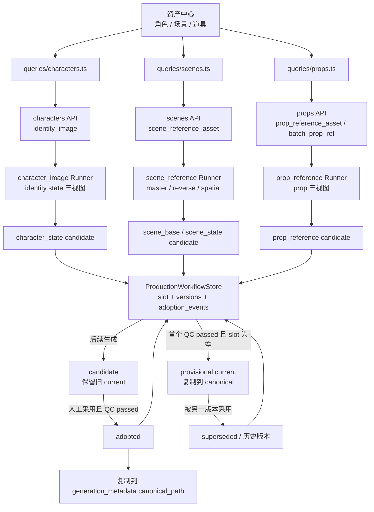
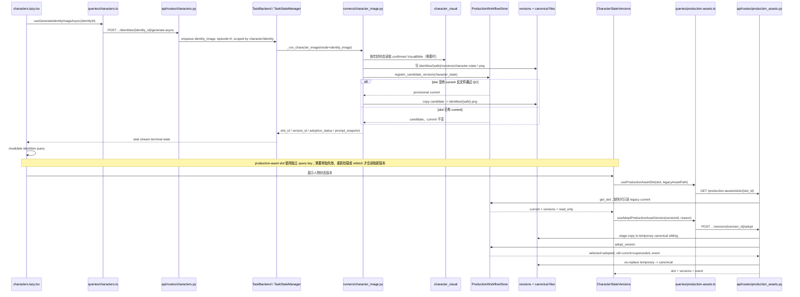

# Nuomi Drama Factory 生产资产管线

> **所属阶段**：核心生产管线 · 03 生产资产<br>
> **上游**：[剧集图谱](02-episode-graph.md)<br>
> **下游**：[剧本与语义](04-screenplay.md)<br>
> **相关横向手册**：[共享系统地图](../system-map.md) · [功能反查](../development/trace-a-feature.md) · [新增 API 与长任务](../development/add-api-and-task.md) · [存储与项目文件](../development/storage-and-files.md) · [测试策略](../development/testing-strategy.md)<br>
> **代码核对基线**：`55504a0`<br>
> **返回**：[Nuomi Drama Factory 开发者 Cookbook](../README.md)

本页追踪剧集图谱中的角色、场景和道具怎样进入资产中心，怎样生成可比较的图片候选，以及候选怎样成为下游读取的 canonical 资产。这里有两组需要分别理解的状态：角色的叙事身份与 `VisualBible` 决定「允许生成什么」，`production_workflow.json` 中的 slot、version 和 adoption event 决定「当前采用哪一个文件」。剧本文本和 Beat 怎样引用这些资产，进入下游[剧本与语义](04-screenplay.md)继续追踪。

## 功能边界

资产中心的同一张卡片可能同时操作实体字段、生成输入、canonical 文件和版本记录。它们并不共享一种持久化语义。

| 对象 | 编辑事实 | 生成资产 | 版本化覆盖 | 当前边界 |
| --- | --- | --- | --- | --- |
| 角色 | `characters` 中的姓名、别名、性别、年龄组、体型、剧情描述、身份列表 | 角色 Portrait、身份 Portrait、服装参考、身份三视图 | 只有异步 `identity_image` 把身份三视图注册为 `character_state` 版本 | 角色 Portrait 与身份 Portrait 仍直接替换 canonical 文件并保留文件备份，不进入 production workflow slot |
| 角色视觉设定 | `CharacterVisualWorkspace` 中的叙事事实、三套设计提案、选中提案和 `VisualBible` | confirmed `VisualBible` 编译为 Portrait 或跨年龄身份的提示词 | 不属于图片版本；它是生成输入的可追溯 revision | legacy `face_prompt` 被隔离为 `legacy_untrusted`，不能自动变成生成约束 |
| 场景 | `scenes` 中的 base、variant、time-of-day、环境提示词和变体提示词 | master、reverse master、spatial layout；另有 pano/3GS 管线 | 三种 `scene_reference_asset` 输出进入 `scene_base` 或 `scene_state` slot | pano 上传/生成和 3GS 属于导演世界资产路径，不由这三个版本组件统一管理 |
| 道具 | 全局 `props`；以及从每集 `prop_menu` 投影出的 local 道具 | 单个或批量三视图 reference | `prop_reference_asset` 与 `batch_prop_ref` 输出进入 `prop_reference` slot | local 道具只有 episode-specific 展示字段，没有 global Store 记录和 canonical reference，不能直接走全局生成接口 |

页面入口是 `frontend/src/routes/_app/projects.$project/characters.lazy.tsx`。路由内部用 `characters / scenes / props / voices` 四个 tab 组织资产；角色卡片直接编排角色和身份操作，场景与道具分别委托给 `ScenesPanel` 和 `PropsPanel`。三类版本 UI 则由 `CharacterStateVersions`、`SceneReferenceVersions`、`PropReferenceVersions` 读取统一的 production-assets API。

## 核心原理

### 角色身份与 `VisualBible` 回答不同问题

角色记录是叙事实体。`CharacterIdentity` 表示同一人物的年龄、职业或服装状态，`identity_id` 也成为人物状态 slot 的稳定键。`CharacterVisualWorkspace` 则把以下内容分开保存：

1. `CharacterNarrativeProfile`：人物生平、职业、关系、性格，以及带原文行号、证据、置信度和 explicit/inferred 标记的事实。
2. `CharacterDesignProposal`：创作性设计方向。当前质量门禁要求一组三套方案、恰好一套 recommended，并检查面部结构、至少三个身份锚点、个体结构、泛化审美词和名人参照。
3. `CharacterVisualBible`：从选中提案形成的草稿。人工确认时必须有 `confirmed_by`、face shape、至少两个 facial features 和至少三个 identity anchors。
4. `LegacyVisualField`：来源无法证明的旧视觉文本，固定为 `legacy_untrusted` 且 `allowed_for_generation=false`。

`update_character_visual_workspace` 选中 proposal 时会重建 draft bible；直接更新 bible 也会把状态退回 draft 并清空确认人。只有 `confirm_character_visual_bible` 成功以后，`compile_visual_prompt_snapshot` 才会把 confirmed bible、项目 style 和显式 reference paths 编译成提示词。`character_portrait` Runner 在调用媒体传输前检查这个门禁；缺失时返回 `CHARACTER_VISUAL_BIBLE_REQUIRED`。因此 `characters.face_prompt` 即使仍在兼容 schema 和页面字段中，也不能被当成可信的视觉身份设定。

身份图再增加一层状态约束：

- 常规年龄身份要求角色 canonical `portrait.png`；有 costume image 时以它作为服装参考，否则使用 `appearance_details`。
- 身份年龄与角色年龄不同时，优先使用身份 Portrait；若没有，则要求 confirmed `VisualBible` 来产生 face override。
- `build_character_state_sheet_prompt` 固定生成 front / side / back 三视图，并禁止身份漂移和服装不一致。

### 场景把稳定空间与状态覆盖分开

`NovelScene` 的资产字段由 `SceneCreate` / `SceneUpdate` 覆盖：`name`、`aliases`、`scene_type`、`base_scene_id`、`variant_id`、`time_of_day`、`environment_prompt`、`variant_prompt`、`description`、`spatial_layout_image` 和 `notes`。其中 `base_scene_id` 为空的是基础场景；非空时，场景名由 base、variant 和 time-of-day 组合，版本 slot 也从 base slot 切换为 state slot。

`_scene_context` 生成提示词时保留这组层次：

- 基础场景使用自己的 `environment_prompt`，没有时回退 `description`。
- 派生场景带 `variant_prompt` 或 `time_of_day` 时，以 base 的环境提示词为稳定空间描述，`variant_prompt` 单独写入 `VARIANT DELTA PROMPT`，不混回基础描述。
- `time_of_day` 是烘焙进 plate 的状态；提示词要求保留建筑、布局、固定装置、材质身份和镜头覆盖，只改变光照、时间氛围与显式状态。
- 派生 master 如果能找到 base `master.png`，会把它作为参考；spatial layout 只参考同场景 master，reverse master 也只参考同场景 master，避免线稿布局污染视觉风格。

领域层 `plan_scene_state` 给出了同一边界的可测试表达：结构或家具变化会物化 state；只有光照变化时可以复用 base 并 relight；连续至少三个镜头或叙事关键状态也可以物化。当前资产页面实际落盘仍以 `NovelScene.base_scene_id / variant_id / time_of_day` 和 scene reference Runner 为准，这个 planner 不是 API 创建场景时自动执行的步骤。

### 道具把外观连续性与可读内容分开

全局 `NovelProp` 保存 `prop_type`、`visual_prompt`、`description`、`owner` 等字段。`_prop_reference_prompt` 生成严格的 front / side / back 三视图，要求几何、材质、损坏状态、颜色和比例一致，并明确禁止把模型生成的文字、数字、UI 或屏幕像素当作权威内容。

`production_workflow.prop_assets` 将规则写得更具体：剧情关键、特写、跨多个镜头、重复使用或需要精确内容，任一条件都要求 formal asset；可读内容由 `PropContentLayer` 在图片生成后确定性合成，且 `exact_text` 与 `rendered_content_path` 必须二选一。当前 `prop_reference` Runner 只生成并记录外观三视图，`content_policy=deterministic_post_composite` 是元数据约束，不表示 Runner 已经执行文字合成。

`GET /props` 默认只返回 global 道具。`scope=local` 或 `all` 才会从每集 `prop_menu` 投影 local 记录，并附 `scope=local`、`source_episode`，同时令 `reference_path` 和 `reference_url` 为空。若 episode-specific 道具需要跨集复用或生成 canonical reference，应先把它提升为全局 `NovelProp`；不能把 local 投影名称直接当成已经存在的 canonical slot。

### 生成候选与 canonical 文件是两层

三个 Runner 都先把输出写到不可变的 `versions/` 路径，再调用 `ProductionWorkflowStore.register_candidate_version`：



三类 slot 和路径如下：

| 资产 | slot | candidate 路径 | canonical 路径 |
| --- | --- | --- | --- |
| 人物身份状态 | `character:{character_name}:state:{identity_id}` | `assets/characters/{character_name}/identities/{safe_identity}/versions/character-state-*.png` | `assets/characters/{character_name}/identities/{safe_identity}.png` |
| 基础场景锚点 | `scene:{scene_name}:base:{kind}` | `assets/scenes/{scene_name}/versions/{kind}-*.png` | `assets/scenes/{scene_name}/master.png`、`reverse_master.png` 或 `spatial_layout.png` |
| 派生场景状态锚点 | `scene:{base_scene_id}:state:{scene_name}:{kind}` | 与该派生场景的基础锚点候选目录相同 | 与该派生场景的基础锚点 canonical 文件名相同 |
| 道具参考图 | `prop:{prop_name}:reference` | `assets/props/{prop_name}/versions/prop-reference-*.png` | `assets/props/{prop_name}/reference_3view.png` |

Runner 用「文件存在且大小大于零」作为当前 QC passed 条件。slot 还没有 current 时，第一个通过 QC 的版本自动成为 `provisional` 并复制到 canonical；后续版本保持 `candidate`，不会覆盖 current。人工采用时，API 再检查版本属于该 slot、没有 `technical_error`、`qc_passed=true`；有 soft issues 时 reason 不能为空。采用成功后 selected 变为 `adopted`，之前的 current 变为 `superseded`，版本组件把后者显示为「历史版本」。

`AdoptionStatus.REJECTED` 已定义，但当前 `production_assets.py` 没有 reject endpoint，Store 也没有 candidate-to-rejected 转换方法；页面只能采用合格候选，不能把候选正式标记为 rejected。`strict_delivery_issues` 还要求 critical slot 的 current 必须是人工 `adopted`，但当前三类 Runner 创建的 slot 默认 `critical=false`，资产页面也没有 strict delivery 操作入口。

### generated、uploaded 与 legacy_import 的可达路径

`AssetOrigin` 定义了 `generated`、`uploaded`、`legacy_import`，但当前写入路径并不对称：

| 来源 | 当前怎样写入 | production workflow 中的结果 |
| --- | --- | --- |
| `generated` | 三个 Runner 调用 `register_candidate_version` | Store 固定写为 `origin=generated`，附 task id、prompt/recipe/reference/canonical path 等 generation metadata |
| `uploaded` | 角色、场景上传接口直接备份并替换 canonical；道具上传经 `/freezone/upload` 后 `/freezone/push` 到 `prop_ref` | 模型虽有 `UPLOADED`，但 `CandidateVersionRequest` 不接受 origin，Store 也没有 uploaded 注册入口；因此上传本身不会产生 `origin=uploaded` version |
| `legacy_import` | slot 查询携带 `legacy_asset_path`；显式迁移时调用 `/legacy-import` | 只读预览会构造 deterministic `legacy-*` provisional version，但不写文件；materialize 才把目标 slot 写入 sidecar |

这里的 `legacy_import` 表示「canonical 文件先于版本 sidecar 存在」，不只表示旧版本软件导入。直接上传的新文件如果没有同步注册版本，版本组件首次读取它时也会按 delayed legacy migration 展示。修改来源类型时，需要同时改变 request schema、Store 注册方法、前端 union、上传调用和迁移测试；只在 `AssetOrigin` 增加枚举不会形成可用链路。

## 端到端调用链

以人物身份三视图为例，完整路径如下；场景与道具复用相同的 TaskBackend、任务状态和采用层，只替换 query、API、Runner 与 slot 规则。



场景采用多一步约束：`_scene_slot_canonical_relative_path` 会从 slot id、`scene_id` 和 `anchor_kind` 重新计算允许的 canonical 路径，元数据不匹配或试图覆盖别的场景时返回 409。master、reverse master 或 pano 采用成功后，还会清除对应的 `stale_reference_kinds`。人物状态与道具依赖候选元数据中的 project-relative `canonical_path`，API 仍会拒绝绝对路径、越出项目根的路径和不存在的候选文件。

## 关键代码索引

| 关注点 | 路径 | 关键符号 |
| --- | --- | --- |
| 资产中心路由与任务恢复 | `frontend/src/routes/_app/projects.$project/characters.lazy.tsx` | `ASSET_TABS`、`PortraitBlock`、`IdentityCard`、`CharactersPageContent`、`useTaskController`、`useTaskStream` |
| 角色 Query | `frontend/src/lib/queries/characters.ts` | `useCharacterVisualWorkspace`、`useConfirmCharacterVisualBible`、`useGeneratePortraitAsync`、`useGenerateIdentityImageAsync`、`useUploadIdentityImage`、`useCharacterAssetHistory` |
| 场景 Query | `frontend/src/lib/queries/scenes.ts` | `ScenePayload`、`useScenes`、`useGenerateSceneMasterAsync`、`useGenerateSceneReverseAsync`、`useUploadSceneMaster` |
| 道具 Query | `frontend/src/lib/queries/props.ts` | `PropPayload`、`useProps`、`useGeneratePropReferenceAsync`、`useUploadPropReference`、`useBatchGeneratePropReferences` |
| 版本 Query 与前端契约 | `frontend/src/lib/queries/production-assets.ts` | `ProductionAssetVersion`、`useProductionAssetSlot`、`useAdoptProductionAssetVersion` |
| 三类版本组件 | `frontend/src/components/assets/character-state-versions.tsx`、`scene-reference-versions.tsx`、`prop-reference-versions.tsx` | `CharacterStateVersions`、`SceneReferenceVersions`、`PropReferenceVersions` |
| 角色 API | `src/novelvideo/api/routes/characters.py` | `get_character_visual_workspace`、`update_character_visual_workspace`、`confirm_character_visual_bible`、`generate_single_portrait_async`、`generate_identity_image_async`、`list_character_asset_history`、`restore_character_asset_history` |
| 场景 API | `src/novelvideo/api/routes/scenes.py` | `_scene_payload`、`create_scene`、`update_scene`、`_start_scene_reference_task`、`upload_scene_master`、`upload_scene_pano` |
| 道具 API | `src/novelvideo/api/routes/props.py` | `list_props`、`_local_episode_prop_payloads`、`generate_prop_reference`、`batch_generate_prop_references` |
| 版本 API | `src/novelvideo/api/routes/production_assets.py` | `get_production_asset_slot`、`materialize_legacy_asset`、`register_production_asset_candidate`、`adopt_production_asset_version`、`_scene_slot_canonical_relative_path` |
| 角色视觉领域 | `src/novelvideo/character_visual/models.py`、`proposals.py`、`compiler.py`、`store.py` | `CharacterVisualWorkspace`、`validate_design_proposals`、`compile_visual_prompt_snapshot`、`CharacterVisualWorkspaceStore` |
| 版本与采用领域 | `src/novelvideo/production_workflow/models.py`、`adoption.py`、`store.py` | `AssetSlot`、`AssetVersion`、`register_candidate`、`adopt_version`、`ProductionWorkflowStore` |
| 场景与道具领域规则 | `src/novelvideo/production_workflow/scene_assets.py`、`prop_assets.py` | `plan_scene_state`、`SceneAnchorPack`、`plan_prop_asset`、`PropContentLayer` |
| 三类生成 Runner | `src/novelvideo/task_backend/runners/character_image.py`、`scene_reference.py`、`prop_reference.py` | `_register_character_state_candidate`、`_register_scene_reference_candidate`、`_register_prop_candidate` |
| 场景提示词生成 | `src/novelvideo/generators/scene_reference_images.py` | `_scene_context`、`build_scene_reference_prompt`、`generate_scene_reference_image` |

## 数据与产物

| 数据或产物 | 写入方 | 位置 | 读取方与语义 |
| --- | --- | --- | --- |
| 角色、身份、场景、全局道具记录 | structured publication、SQLite Store、资产 CRUD API | 项目 SQLite | 列表页和 Runner 的实体事实；不等同于某个图片版本 |
| episode-specific 道具投影 | `list_props(scope=local/all)` | `episodes.prop_menu` 的读取结果 | 页面识别本集道具；不创建 canonical reference |
| 角色视觉 workspace | `CharacterVisualWorkspaceStore` | 项目目录 `state/character_visual_workspaces.json` | 草稿、提案选择、confirmed bible 和 legacy quarantine |
| 角色旧式历史 | 角色上传、同步/异步 canonical 替换和 restore API | 角色资产目录的时间戳文件或 `_history/` | `asset-history` 列表与恢复；不是 slot adoption event |
| 生成候选图片 | 三类 Runner | 对应资产目录的 `versions/` 子目录 | 版本组件预览；采用前不会替换已有 current |
| production workflow sidecar | `ProductionWorkflowStore` | 项目 state 根的 `production_workflow.json` | slot、version、current version 和 adoption events；原子临时文件替换写入 |
| canonical 图片 | 首个 provisional candidate、adopt API、旧上传接口 | `assets/characters/`、`assets/scenes/`、`assets/props/`；pano 位于 `director_worlds/` | 下游 path resolver 和媒体 URL 的兼容读取位置 |
| 场景 stale 标志 | `AssetCompiler` 修复历史 prompt，以及场景上传/采用路径 | SQLite `scenes.stale_reference_kinds` | 页面提示 reference 需要重建；匹配的 master/reverse/pano 更新会清除标志 |
| 任务状态 | TaskBackend / `TaskStateManager` | 项目 task state | `useTaskController`、`useTaskStream` 和 Task Center 恢复进度、终态与错误 |

`production_workflow.json` 损坏时，Store 清空内存状态并设置 `read_only_reason`。此时已有 canonical 文件仍可通过 legacy 只读视图展示，但注册、迁移和采用都会被拒绝；不要为了恢复写入而直接覆盖损坏 sidecar，先保留文件并确认可重建的 slot 与候选路径。

## 常见修改

### 修改场景覆盖字段

1. **前端类型与表单**：更新 `ScenePayload`、`SceneAsset`、`ScenesPanel` 的 create/edit draft 与展示。区分 base 字段和状态 delta；`effective_environment_prompt` 是 API 计算字段，不应从前端回写。
2. **API schema 与命名**：同步 `SceneCreate`、`SceneUpdate`、`_scene_payload` 和 `_compose_scene_asset_name`。改变 `base_scene_id / variant_id / time_of_day` 会改变派生场景名称和 slot 身份，不能只更新 SQLite 字段。
3. **提示词与 Runner**：检查 `build_scene_effective_prompt`、`_scene_context`、base reference 选择，以及 `generation_metadata` 是否需要冻结新字段。状态字段如果影响画面，还应决定它触发 relight 还是物化新 state。
4. **Store / 产物**：更新场景后哪些 `stale_reference_kinds` 需要标记必须明确；重新生成只在首个 provisional 或人工采用后更新 canonical。已存在的旧 slot 不会随字段改名自动迁移。
5. **测试**：覆盖 base、variant、time plate、缺少 base master、stale 标记、slot id 和采用路径校验。

### 修改角色、场景或道具提示词

1. **输入来源**：角色先确认是 narrative fact、creative proposal、confirmed bible、identity appearance 还是 explicit reference；场景保持 base description 与 variant delta 分离；道具把外观和权威可读内容分离。
2. **编译位置**：角色改 `compile_visual_prompt_snapshot` 或 `build_character_state_sheet_prompt`，场景改 `_scene_context` / `build_scene_reference_prompt`，道具改 `_prop_reference_prompt`。不要只改页面预览文案。
3. **快照**：身份图把完整 prompt 放进 task result，prop 把 `prompt_snapshot` 放进 generation metadata；scene metadata 当前保存 scene/variant/time/recipe 和 anchor kind，但不保存完整 prompt。若补齐快照，需要同步 Runner 返回、版本类型和旧记录兼容。
4. **门禁**：角色不得重新信任 legacy `face_prompt`；道具提示词不得允许模型输出成为权威文字；scene reference 仍固定走 persisted GRSAI runtime。
5. **测试**：优先补纯 prompt/compiler 测试，再补 Runner 的 reference、metadata 和传输调用断言。

### 新增来源类型或让上传进入版本历史

1. **前端契约**：更新 `ProductionAssetOrigin`、上传 mutation 的响应和版本组件来源标签。
2. **API**：不要允许客户端无约束伪造 origin；为上传完成后的服务器文件建立专用注册入口，继续使用 `_safe_project_asset` 校验 project-relative 文件。
3. **Store**：把 `register_candidate_version` 当前硬编码的 `AssetOrigin.GENERATED` 拆成受控方法，并定义 uploaded 首次写入是 provisional、candidate 还是立即 adopted。
4. **canonical 与备份**：决定上传先落 candidate 再采用，还是先替换 canonical 再 materialize；两种顺序的失败恢复不同。角色 `_history`、场景时间戳备份和 production adoption event 不能互相冒充。
5. **测试**：覆盖 origin round-trip、上传文件校验、已有 current 不被覆盖、失败时 canonical 与 sidecar 一致，以及 legacy 文件仍可延迟迁移。

### 修改采用策略或增加 reject

1. **领域规则**：先改 `register_candidate` / `adopt_version`，明确 provisional、candidate、adopted、rejected、superseded 的允许转换、QC 条件和 reason 要求。
2. **Store 与审计**：每次转换都应保存 `AdoptionEvent`；增加 reject 时不能删除 candidate 文件或 version，否则历史和 task `source_attempt_id` 会断开。
3. **API 与文件提交**：canonical 替换与状态写入目前先 stage 文件、写 sidecar、再 `os.replace`。改变顺序时要覆盖任一步失败后的临时文件清理与一致性。
4. **前端**：同步 `ProductionAssetAdoptionStatus`、按钮可用条件、状态标签、错误 detail 和 query invalidation。当前组件只允许 `candidate` 被采用。
5. **下游**：如果启用 strict mode，明确 critical slot 的设置入口，并让交付门禁调用 `strict_delivery_issues`，否则模型字段不会影响实际交付。

### 修改路径或实体重命名

1. **现有行为**：角色、场景、道具 rename API 会移动各自资产目录；场景还移动导演 stage 目录并重写 manifest 的 `scene_id`。这些函数不会重写 `production_workflow.json` 中的 slot id、`asset_path`、`canonical_path` 或 adoption events。
2. **迁移计划**：若重命名需要保留版本历史，应在同一迁移中映射 slot key 和每个 project-relative path，并校验目标目录不存在。场景 state slot 同时含 base id 与派生 scene name，两段都可能需要变化。
3. **兼容读取**：旧 canonical 文件可通过 `legacy_asset_path` 只读呈现，但它不能修复已经指向旧目录的已物化 version。不要用重新 materialize 覆盖仍有 current 的 slot。
4. **安全边界**：API 拒绝绝对路径和越出项目根的路径；scene adoption 还要求 slot、scene metadata 和规范 canonical path 一致。路径迁移不能放宽这些校验。
5. **测试**：覆盖目录移动、sidecar 重写、旧/新 URL、采用后 canonical 内容、失败回滚，以及 character/scene/prop 各自包含非 ASCII 名称的情况。

## 失败诊断

| 现象 | 先查什么 | 代码事实与处理 |
| --- | --- | --- |
| 角色 Portrait 在调用模型前失败 | visual workspace 的 `visual_bible.status`、确认人和身份锚点 | async Portrait 要求 confirmed bible；`CHARACTER_VISUAL_BIBLE_REQUIRED` 带 `transport_called=false`，先补全并确认，不要反复重试模型 |
| 身份三视图提示缺 Portrait 或服装描述 | identity age、identity Portrait、角色 `portrait.png`、costume image、`appearance_details` | 同年龄默认需要角色 Portrait；跨年龄优先身份 Portrait，否则需要 confirmed bible；服装参考和描述至少有一个 |
| 场景生成出来像基础场景，变体不明显 | `base_scene_id`、`variant_prompt`、`time_of_day`、实际 base master | delta 单独进入提示词；没有 base master 时只能靠文本保持空间，先核对 `_scene_context` 和 Runner 的 base lookup |
| 场景图更新后仍显示 stale | `stale_reference_kinds`、本次是否真的更新 canonical | 后续 candidate 不清 stale；只有首个 provisional 更新 canonical，或人工采用匹配的 master/reverse/pano 后清除对应标志 |
| 道具图片中文字不可读 | 是否把模型图当成最终可读内容 | Runner 有意禁止权威文字；应使用 `PropContentLayer` 的确定性后期合成，不能靠增加 prompt 重试解决 |
| 本集 local 道具点击生成后找不到实体 | `/props` 的 `scope` 和 `source_episode` | local 记录来自 episode `prop_menu`，不在全局 props Store；先确认是否需要提升为全局正式资产 |
| 第一次生成覆盖了 canonical，第二次没有 | slot current 与两个版本的 adoption status | 首个 QC-passed candidate 自动 provisional；后续只注册 candidate。这是防止重生成静默替换 current 的预期行为 |
| 版本列表只显示一个 legacy_import | GET 是否带 `legacy_asset_path`、sidecar 是否存在 | 缺 slot 时 API 只读合成 legacy provisional，不写 sidecar；需要首次编辑时调用 materialize，或由新候选写入流程建立 slot |
| 上传文件显示为 legacy_import，不是 uploaded | 上传 API 和 production workflow sidecar | 当前上传直接写 canonical，没有 uploaded version 注册路径；这是实现边界，不是前端解析错误 |
| 无法采用 soft-issue 候选 | adopt reason、`qc_passed`、`technical_error` | soft issues 必须提供非空 reason；QC failed 或 technical error 无法采用。当前 UI 使用固定非空 reason |
| 采用返回 409 | slot/version 是否存在、asset kind、候选文件、scene metadata 与 canonical path | API 会阻止跨 slot、QC 不合格、路径不存在、越界和 scene canonical 不匹配；先看 response detail，不要直接复制文件绕过审计 |
| 页面显示 production workflow 只读 | `read_only_reason` 和 `production_workflow.json` JSON | sidecar 无法解析时 Store 回退为空状态并禁止写；保留损坏文件，依据 canonical 和 versions 目录制定恢复方案 |
| 重命名后旧版本图片 404 | sidecar 中 `asset_path` / `canonical_path` 与新目录 | CRUD rename 只移动目录，不迁移 production workflow 引用；需要显式迁移 sidecar 和 slot id |
| task completed 但页面仍是旧版本 | task result 的 `slot_id/version_id`、版本 query cache、canonical 文件 | 任务成功只说明 candidate 已注册；刷新 production asset slot。若它不是 current，页面和下游继续使用旧 canonical 是预期行为 |

## 验证

先用稳定符号核对页面、四组 Query、API、Runner 和领域状态：

```bash
rg -n 'ASSET_TABS|CharacterStateVersions|ScenesPanel|PropsPanel|useTaskController' \
  'frontend/src/routes/_app/projects.$project/characters.lazy.tsx' \
  frontend/src/components/assets/{character-state,scene-reference,prop-reference}-versions.tsx

rg -n 'useCharacterVisualWorkspace|useGenerateIdentityImageAsync|useGenerateSceneMasterAsync|useGeneratePropReferenceAsync|useProductionAssetSlot|useAdoptProductionAssetVersion' \
  frontend/src/lib/queries/{characters,scenes,props,production-assets}.ts

rg -n 'visual-workspace|generate-async|scene_reference_asset|prop_reference_asset|production-assets/slots|legacy-import|/adopt' \
  src/novelvideo/api/routes/{characters,scenes,props,production_assets}.py

rg -n '_register_character_state_candidate|_register_scene_reference_candidate|_register_prop_candidate|register_candidate_version|canonical_path' \
  src/novelvideo/task_backend/runners/{character_image,scene_reference,prop_reference}.py \
  src/novelvideo/production_workflow/{adoption,store}.py

rg -n 'CharacterVisualBible|legacy_untrusted|compile_visual_prompt_snapshot|plan_scene_state|plan_prop_asset|PropContentLayer' \
  src/novelvideo/character_visual \
  src/novelvideo/production_workflow
```

修改采用、迁移或三类 Runner 时，运行这组小测试：

```bash
uv run pytest tests/production_workflow
```

```bash
uv run pytest tests/character_visual
```

```bash
uv run pytest \
  tests/test_api_production_assets.py \
  tests/test_character_state_assets.py \
  tests/test_scene_reference_runner.py \
  tests/test_prop_reference_runner.py \
  tests/test_scene_reference_prompt.py
```

修改前端版本契约或组件时，再运行：

```bash
cd frontend
npm test -- --run \
  src/__tests__/lib/queries/production-assets.test.tsx \
  src/__tests__/components/assets/character-state-versions.test.tsx \
  src/__tests__/components/assets/scene-reference-versions.test.tsx \
  src/__tests__/components/assets/prop-reference-versions.test.tsx
```

最后检查文档和路径引用：

```bash
git diff --check -- docs/cookbook/pipelines/03-production-assets.md
rg -n 'TO[D]O|TB[D]|/Us[e]rs/|C:[\\]' docs/cookbook/pipelines/03-production-assets.md
```

## 继续追踪

- 实体从原文与分集来源怎样抽取、合并和恢复检查点：回到[剧集图谱](02-episode-graph.md)。
- 这些 canonical 资产怎样进入剧本语义、Beat 和后续引用：进入[剧本与语义](04-screenplay.md)。
- 需要理解 project context、state/output 目录和媒体 URL：查看[共享系统地图](../system-map.md)与[存储和项目文件](../development/storage-and-files.md)。
- 修改异步任务的 scope、取消、状态恢复或返回结构：查看[新增 API 与长任务](../development/add-api-and-task.md)。
- 不确定应该补领域、API、Runner 还是前端测试：查看[测试策略](../development/testing-strategy.md)。
