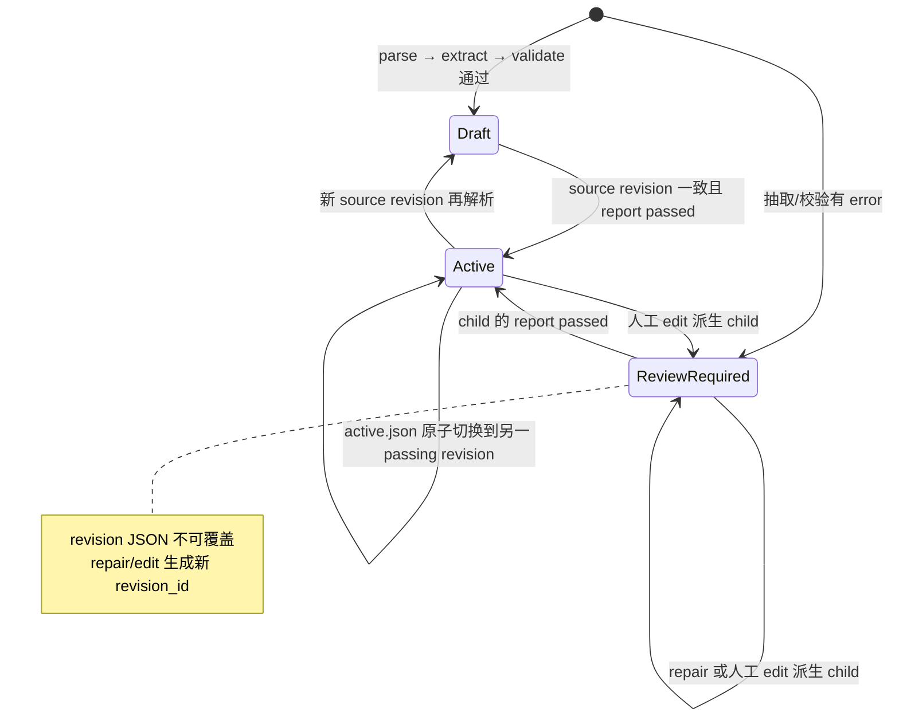
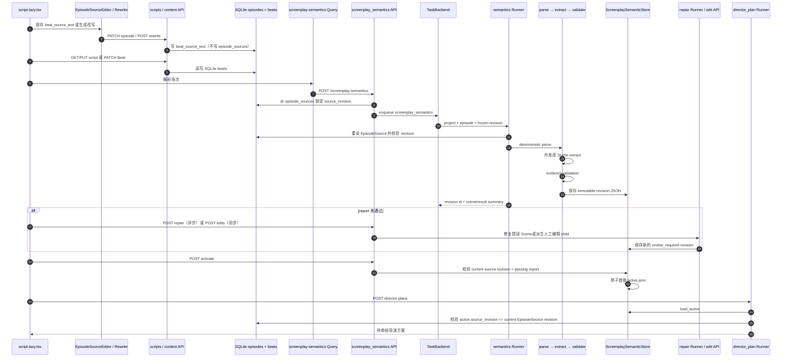

# Nuomi Drama Factory 剧本与语义管线

- **所属**：核心生产管线 · 04 剧本与语义
- **上游**：[生产资产](03-production-assets.md)
- **下游**：[分镜与图像](05-storyboard.md)
- **代码基线**：`55504a0`
- **返回首页**：[Nuomi Drama Factory 开发者 Cookbook](/)
- **相关手册**：[共享系统地图](../system-map.md) · [功能反查](../development/trace-a-feature.md) · [新增 API 与长任务](../development/add-api-and-task.md) · [存储与项目文件](../development/storage-and-files.md) · [测试策略](../development/testing-strategy.md)
- **业务与创作**：[剧本与分镜](../product/04-screenplay-and-storyboard.md) · [拆集与节奏](../creation/03-episode-rhythm.md)
- **技术调用链**：剧集来源 → 剧本 / semantic revision → 校验与激活 → Beat / 导演方案

本页追踪两组容易被「Beat」一词混在一起的状态。生产层的 `VisualBeat` 是可直接生成草图、音频和视频的逐行单元，保存在 SQLite `beats` 表；语义层的 `DramaticBeat` 是带原文行号、事实约束、校验报告和激活指针的导演拆解 revision，保存在项目文件中。两者目前没有自动投影关系。语义 revision 激活后由导演方案读取，再进入下游[分镜与图像](05-storyboard.md)。

## 功能边界

| 对象 | 来源与职责 | 持久化 | 在线入口 | 下游读取 |
| --- | --- | --- | --- | --- |
| 剧本文本 | `episodes.raw_content` 是分集原文兼容镜像；`episodes.beat_source_text` 是逐行生产工作稿；`episode_sources.content` 是语义解析的版本化来源 | SQLite `episodes` 与 `episode_sources` | `EpisodeSourceEditor` PATCH episode；已有剧本导入写 `episode_sources` | literal workflow 读取 `beat_source_text`；semantic API 只读取 `episode_sources.content` |
| 生产 Beat | 一行剧本对应一个 `VisualBeat` / `NovelVisualBeat`，携带朗读、画面、资产引用和媒体参数 | SQLite `beats` | `GET/PUT /script`、`PATCH /beats/{beat_num}` | Beat 预览、草图、音频、普通视频生产 |
| 语义场次 | 确定性解析得到 Scene、SourceBlock 和精确 `SourceRange` | semantic revision JSON | `POST /screenplay-semantics` 长任务 | `DramaticBeat` 抽取、证据检查、导演方案 |
| 语义 Beat | 按场提取的目标、阻碍、行动、反应、转折、结果与证据；不含媒体文件字段 | immutable semantic revision JSON | Runtime 抽取、repair，或同步 edit command | active revision 被 `director_plan` Runner 读取 |
| 激活状态 | 当前允许下游采用的 passing semantic revision | `active.json` 指针 | `POST .../{revision_id}/activate` | 导演方案同时校验当前 source revision 与 active semantic revision |

页面入口是 `frontend/src/routes/_app/projects.$project/episodes.$episode/script.lazy.tsx`。它把 `ScreenplayWorkbench`、资产规划、`EpisodeSourceEditor` 和 `ScriptBeatPreview` 放在同一页，但这些组件背后有不同的数据源：工作台走 `screenplay-semantics.ts`，生产 Beat 走 `episodes` / `scripts.ts`，来源编辑走 episode PATCH。排查「页面明明保存了文本，语义仍解析旧稿」时，应先确认改的是 `beat_source_text` 还是 `episode_sources.content`。

## 我要改什么

- 改文本解析、生产 Beat 或语义 Beat：从[常见修改](#常见修改)选择对应 schema。
- 改 revision 激活、校验或修复：同时核对[失败诊断](#失败诊断)。
- 改异步任务与页面刷新：共享生命周期见[新增 API 与长任务](../development/add-api-and-task.md)。

## 核心原理

### 生产 Beat 与 `DramaticBeat` 不共享 schema

`VisualBeat` 面向媒体生产，核心字段包括：

- `beat_number`、`narration_segment`、`visual_description`。
- `audio_type`、`speaker`、`speaker_kind`，以及 `scene_ref`、`time_of_day`。
- `detected_identities`、`detected_props`；画面描述中的 `{{identity_id}}` 和 `[[prop_id]]` 会参与引用补全。
- `video_mode`、`video_prompt`、`keyframe_prompt` 与每 Beat 的 Seedance 2.0 配置。
- `shot_order`、`duration_seconds`、`is_manual_shot` 等生产排序字段。

`DramaticBeat` 面向证据约束和导演规划，核心字段是 `scene_id`、有序且不重叠的 `source_ranges`、`goal / obstacle / action / reaction / turn / result / emotional_shift`、`dialogue_source_ids`、`must_show`、`script_facts`、`director_interpretation` 和不超过 30 秒的 `estimated_duration_seconds`。它没有 `beat_number`、媒体 URL、视频 prompt 或 canonical 资产路径。

`src/novelvideo/workflows/script_writing.py` 只是 `LiteralScriptWritingWorkflow` 的兼容名称。后者按场次切原稿，再对每个有效内容行调用结构化文本模型补 `LiteralBeatMetaOutput`，最后构造 `NarrationScript` 并通过 `persist_narration_script` 删除该集旧 Beat、写入 SQLite。这个工作流仍是可调用的代码能力，但在线 `POST /script/generate` 已固定返回 410 `LEGACY_SCRIPT_GENERATION_RETIRED`；不能把该兼容类等同于当前页面的生成 API。

旁白项目页面上的「生成改写」走另一条同步路径：`POST /rewrite/generate` 调用 `rewrite_episode_content`，写 `adapted_content` 和 `episodes.beat_source_text`，它不会生成 SQLite Beat，也不会更新 `episode_sources`。完整 Beat 保存 `PUT /script` 调用 `persist_beats_from_script`；单 Beat 编辑 `PATCH /beats/{beat_num}` 只更新白名单字段。两条路径都不创建 semantic revision。

### 语义解析从版本化来源开始

创建语义任务时，API 通过 `EpisodeSourceStore.list_sources()` 找到本集 `source_revision`，将它同时冻结到 scope 和 payload。Runner 再读取同一份 `EpisodeSource` 并复核 project id、集号和 revision；来源不存在或排队后发生变化时，任务分别以 `EPISODE_SOURCE_NOT_FOUND` 或 `SOURCE_REVISION_CONFLICT` 失败。

`parse_screenplay_document` 不调用模型。它逐行完成以下工作：

1. 场次外的 frontmatter、Markdown 章节卡、分隔格式行、HTML 注释和其他非空文本进入 `metadata_blocks`。空行不创建 block，但保留的 block 继续使用原始行号；活动场次内的 Markdown 标题会成为剧情/action block。
2. 场次头生成 Scene；location、time-of-day 和内外景来自 relaxed location parser。
3. 紧跟场次头、位于首个剧情 block 之前的人物行进入 `Scene.characters`，不成为 Beat 候选。
4. 动作、对白、括号说明和转场成为单行 `SourceBlock`，保留原始行号。
5. 场次 id 由 ordinal 与内容 SHA-256 前缀组成，`content_hash` 覆盖场次头和所有剧情 block。

没有合法场次头时，解析器不会发明 Scene；文本只会落到 metadata / unclassified。这个行为与 literal workflow 的逐行 fallback 不同，语义包的测试还明确检查它不导入 literal line fallback。

### extract 与 validate 是两个阶段

`extract_scene_beats` 为每个目标 Scene 构造 evidence-bound prompt，通过 `asyncio.Semaphore` 限制并发，调用当前冻结的 text-task runtime 获取 `SceneBeatDraft`。单场模型异常、structured output 错误或 scene id 不匹配，会被收敛为 `SceneExtractionFailure`，不会立即中止其他场次。

领域校验随后检查：

- Beat 的 source range 必须在所属 Scene 内，多个 Beat 的覆盖不能重叠。
- `characters` 必须出现在场次人物表或场次原文中。
- `dialogue_source_ids` 必须指向本场 dialogue block。
- `script_facts` 必须能从该 Beat 覆盖的原文中获得近似文本支持。
- action、dialogue、parenthetical、transition 等剧情 block 必须被至少一个 Beat 覆盖。

Pydantic 模型另行保证 scene / block / Beat id 唯一、ordinal 连续、range 有序且不交叠、Beat 属于现有 Scene，以及 active revision 不能带 error。当前校验器产生的是 error；`SemanticValidationSeverity` 虽然允许 warning，但代码里没有自动降级规则。

Scene 的 `status="validated"` 只表示抽取返回了结构化 draft，不能单独证明该场校验通过；是否允许激活以 revision 的 `validation_report.passed` 为准。抽取结果有任一 error 时 revision 是 `review_required`，全部通过时是 `draft`，两种状态都仍需人工激活。

### content hash 复用以 active revision 为基准

`ScreenplaySemanticService.build` 只从当前 active semantic revision 建立 `content_hash -> Scene` 的复用表。新来源中内容 hash 相同的场次复用旧 Beat，并把 scene status 标成 `reused`；变化的场次重新抽取。

本场重试 API 会检查传入 revision 和 scene id 存在，但任务真正构建时仍以「当前 `episode_sources` + 当前 active revision」为基准。它传入单个 `selected_scene_ids`：被选择的场次强制重抽，其他能按 active hash 命中的场次复用，未命中的场次标成 `stale`。因此从非 active 历史 revision 点击重试，不表示以该历史 revision 作为父版本修补。

### repair 与人工 edit 都派生新 revision

repair API 只接受未通过校验、且 `source_revision` 仍等于当前来源的 revision。Runner 同时冻结 source revision 和 semantic revision id，默认并发 3、最多两轮，只把当前 error 指向的 Scene 交给 Runtime：

- 每轮结束后把修复结果与未处理 Scene 合并，再对完整 revision 重新校验。
- scene id 越权、range / 人物 / 对白引用 / 剧本事实违反契约时，保留原 Beat 并记录 `repair_contract_violation`。
- 单场调用失败时保留该场原 Beat，并记录 `scene_repair_failed`；如果所有目标场都发生 Runtime transport / structured parse 失败，则抛出 `ScreenplaySemanticRepairRuntimeError`，不保存 child。
- 第二轮只处理仍有 error 的 Scene；即使两轮后仍失败，也会保存 `review_required` child 供人工检查。
- 写 child 前，Runner 再检查来源 revision 未变，并确认磁盘上的 base revision 与开始时完全相同；否则分别报 source 或 semantic revision conflict。

同步 edit 支持四类命令：

| 命令 | 约束 | 派生结果 |
| --- | --- | --- |
| `split` | 当前只支持单个连续 evidence range；切分行必须在 range 内 | 产生 `-a` / `-b` Beat，重新编号，原 Beat id 进入 invalidated |
| `merge` | 两个 Beat 必须在列表中相邻且属于同一 Scene | 合并 ranges、人物、must-show、facts、对白来源；时长最多 30 秒 |
| `reorder` | 必须恰好提交该 Scene 的全部 Beat id | 只改变场内顺序并重新编号 |
| `update` | Beat 必须存在；时长仍受大于 0、最多 30 秒的模型约束 | 更新提交字段，未显式提交的 facts 和 evidence 保持不变 |

每次 edit 都生成新 ULID、记录 `parent_revision_id`，状态设为 `review_required`，不修改父文件。API union 允许更新 `must_show`、`script_facts` 和 `director_interpretation`，但当前 `BeatEditor` 表单只提交七个剧情字段和预计时长。

当前 edit 实现继承父 revision 的 `validation_report`，不会调用 `validate_revision_beats`。这意味着父报告如果是 passing，编辑后的 `review_required` child 也暂时保留 passing；activate 只检查来源 revision 和该报告，尚没有「人工 edit 后强制重新校验」门禁。扩展可编辑事实字段时，不能假设状态名本身已经阻止激活。

### revision 文件不可变，激活只切指针



`ScreenplaySemanticStore` 将文件写到 `screenplay_semantics/epNNN/revisions/{revision_id}.json`。`save` 若发现同 id 文件内容不同会抛 `FileExistsError`；新文件和 `active.json` 都通过同目录临时文件加 `os.replace` 原子替换。损坏的历史 JSON 在 list 时记录 warning 并跳过，不会阻断其他 revision。

激活不会重写 revision JSON，而是写 `active.json` 中的 revision id、source revision 和时间。`load_active` 读取指针后动态把返回模型覆盖为 `status=active`；list API 也只把指针命中的那一项展示为 active。旧 revision 文件不会被改写为 `superseded`，所以磁盘 JSON 的 status 不是活动状态的唯一真值。

## 一张概览图



### 同步、任务与前端刷新

| 操作 | 执行方式 | task identity / scope | 当前刷新行为 |
| --- | --- | --- | --- |
| 来源文本保存 | 同步 HTTP | 无 | episode mutation 返回后刷新 episode detail |
| 旁白改写 | 同步 HTTP，模型调用在请求内 | 无 | `useGenerateRewrite` 失效 episode detail 与 script；路由还会再失效 episode detail |
| 完整/单 Beat 保存 | 同步 HTTP | 无 | 完整保存只失效 script；单 Beat PATCH 合并 beats cache，并失效 script |
| semantic create | 202 长任务 | scope `revision:{source_revision}`；actor identity 对 `screenplay_semantics` 不纳入 scope，同项目同集共用 actor | mutation 入队成功立即失效 semantic collection，但 `ScreenplayWorkbench` 没有 create task controller 在终态再次失效 |
| 单场 retry | 202 长任务 | payload 只含一个 scene id；task type 仍是 `screenplay_semantics` | 同样只在入队成功立即失效，终态不会由该组件主动刷新 |
| repair | 202 长任务 | `revision:{source}:semantic:{base}`；repair actor identity 纳入 raw scope | 入队后立即失效；`useTaskController` 跟随终态并再次失效 semantic collection |
| edit / activate | 同步 HTTP | 无 | 成功后失效 semantic collection |
| director plan | 202 长任务 | `revision:{source_revision}` | 由 director plan Query / task 逻辑管理，输入必须是 active semantic |

工作台选择 revision 的表达式先取 `revisions[0]`，只有列表为空时才查 active id；Store 又按 `created_at` 倒序返回。因此页面默认显示最新 revision，不保证显示 active revision。编辑 active revision 会生成更新的 child，列表刷新后自然切到 child；如果要审核当前 active，应显式按 `active_revision_id` 定位。

`pending` 只覆盖本组件内 mutation、repair task controller 和 director mutation。create / retry 的后台运行状态没有接入 `useTaskController`，入队请求结束后按钮可能重新可用。后端抽取 Runner 会冻结并复核 source revision，但不会像 repair 那样在保存前再次复核；同 source revision 的重复构建可以各自写一个 immutable revision。不要用按钮 disabled 当作服务端互斥保证。

## 关键代码索引

| 关注点 | 路径 | 关键符号 |
| --- | --- | --- |
| 剧本页编排 | `frontend/src/routes/_app/projects.$project/episodes.$episode/script.lazy.tsx` | `ScriptTabContent`、`handleSourceSave`、`handleGenerateRewrite` |
| 语义工作台 | `frontend/src/components/episode/screenplay-workbench/screenplay-workbench.tsx` | `ScreenplayWorkbench`、revision 选择、task controller、activate 门禁 |
| Beat 编辑与证据 UI | `frontend/src/components/episode/screenplay-workbench/beat-editor.tsx`、`evidence-inspector.tsx`、`scene-tree.tsx` | `BeatEditor`、`EvidenceInspector`、`SceneTree` |
| 生产 Beat Query | `frontend/src/lib/queries/scripts.ts` | `useScript`、`useUpdateBeat`、`useSaveScript`、`useGenerateRewrite` |
| 语义 Query | `frontend/src/lib/queries/screenplay-semantics.ts` | `useCreateScreenplaySemantics`、`useRetrySemanticScene`、`useRepairScreenplaySemantics`、`useEditScreenplaySemantics`、`useActivateScreenplaySemantics` |
| 生产 Beat API | `src/novelvideo/api/routes/scripts.py` | `get_script`、`generate_script` tombstone、`update_beat`、`save_script` |
| 改写 API | `src/novelvideo/api/routes/content.py` | `generate_rewrite`、`put_adapted_content` |
| 语义 API | `src/novelvideo/api/routes/screenplay_semantics.py` | create/list/get/repair/retry/edit/activate endpoints |
| 逐行生产 workflow | `src/novelvideo/workflows/script_writing.py`、`literal_script_writing.py` | `ScriptWritingWorkflow`、`LiteralScriptWritingWorkflow.run`、`LiteralBeatMetaOutput` |
| 生产 Beat 模型与 Store | `src/novelvideo/models.py`、`sqlite_store.py`、`cognee/store.py` | `VisualBeat`、`NovelVisualBeat`、`get_script_as_dict`、`persist_narration_script` |
| 语义领域 | `src/novelvideo/screenplay_semantics/` | `parse_screenplay_document`、`extract_scene_beats`、`validate_scene_beats`、`ScreenplaySemanticService`、`apply_semantic_edit` |
| repair 与文件 Store | `src/novelvideo/screenplay_semantics/repair.py`、`store.py` | `ScreenplaySemanticRepairService`、`ScreenplaySemanticStore.activate` |
| 长任务 Runner | `src/novelvideo/task_backend/runners/screenplay_semantics.py`、`screenplay_semantic_repair.py` | `_run_screenplay_semantics`、`_run_screenplay_semantic_repair` |
| 下游消费 | `src/novelvideo/task_backend/runners/director_plan.py` | `_build_director_plan_input`、`_load_active_semantic_revision`、`_semantic_source_spans` |

## 数据与产物

| 状态 | 位置 | 更新语义 |
| --- | --- | --- |
| 原始/工作剧本文本 | SQLite `episodes.raw_content`、`adapted_content`、`beat_source_text` | episode PATCH 或 rewrite 原地更新；不等于 semantic source revision |
| 版本化剧本来源 | SQLite `episode_sources` | import commit 使用 CAS，内容变化提升 `source_revision` |
| 生产 Beat | SQLite `beats` | `(episode_number, beat_number)` 主键；完整 workflow 可删旧插新，PATCH 原地更新单行 |
| semantic revision | `screenplay_semantics/epNNN/revisions/{revision_id}.json` | immutable；相同 id 不允许不同内容 |
| active semantic | `screenplay_semantics/epNNN/active.json` | passing + source revision 一致时原子替换指针 |
| 任务状态 | TaskBackend / TaskStateManager | task id、进度、日志、终态；不是 semantic revision Store |

这里没有 `scripts/epXXX_script.json`。`scripts.py` 的模块说明和 `SQLiteStore.get_script_as_dict` 都以 SQLite 为当前脚本状态源。semantic JSON 也不能写回 `beats` 表；导演方案读取的是 active semantic 的 Scenes、Dramatic Beats 和 SourceBlocks，不是 `GET /script` 的生产 Beat payload。

## 常见修改

### 修改剧本模板或场次语法

1. **先判定作用层**：`nuomi-drama-scripts/templates/screenplay.md` 与导入格式影响版本化来源；literal workflow 的 `split_literal_source_text` / `_build_scene_blocks` 和 semantic parser 是两套解析实现。
2. **行号稳定性**：semantic parser 必须保留 frontmatter、章节卡和 HTML metadata 的真实行号，即使这些块不进入 Scene；不能先删除文本再编号。
3. **场次识别**：同步 `is_scene_start_line`、`parse_location_header_relaxed` 与 parser 测试。没有场次头时继续保持「不发明 Scene」的契约。
4. **来源写入**：如果页面编辑要成为 semantic 真值，需要通过 `EpisodeSourceStore` 的版本化/CAS 入口更新，不能只 PATCH `beat_source_text`。
5. **测试**：覆盖 frontmatter、章节卡、角色行、对白、占位场次头、HTML 注释、无场次头和 CRLF 行号。

### 修改生产 Beat 字段

1. **三层 schema**：同步 `VisualBeat`、`NovelVisualBeat`、SQLite `beats` 列和前端 `Beat` / `BeatUpdate` 类型。
2. **生成与保存**：同步 literal workflow 构造、`CogneeStore.persist_narration_script`、`persist_beats_from_script`、`get_beats_as_dicts` 与 `update_beat_asset` 白名单。
3. **资产引用**：涉及角色、道具或场景时继续调用 `sync_beat_asset_refs` / `complete_detected_refs_from_visual_description`；不要只保存显示字符串。
4. **缓存**：单 Beat PATCH response 不含 GET 时注入的媒体 URL，前端必须 merge 而不是覆盖缓存对象。
5. **下游**：确认草图、TTS、video prompt 和 compose consumer；增加 semantic 字段不会自动进入这些消费者。

### 修改 semantic Beat 字段或校验

1. **严格模型**：同步 `DramaticBeatDraft`、`DramaticBeat`、前端接口和 Runtime structured output。模型为 `extra="forbid"` 且 frozen。
2. **证据规则**：修改 `validate_scene_beats` 时同时核对 repair `_CONTRACT_CODES`；不在集合中的新 error 可能允许 repair proposal 先合入，再由完整 revision 校验留到下一轮。
3. **prompt**：抽取 prompt 与 repair prompt 都要表达新字段的事实/解释边界，避免 `director_interpretation` 混入 `script_facts`。
4. **人工 edit**：扩展 `UpdateBeat` 时同步前端 `SemanticEditCommand` 和表单；决定 edit 后是否重跑校验并更新 report，不能继续无意继承 passing report。
5. **下游**：`DirectorPlanInput` 直接接收 `semantic.beats`；字段重命名或必填变化要覆盖 planner、validation 和 acceptance pipeline。

### 修改激活规则或 revision 生命周期

1. **真值位置**：active 状态来自 `active.json`，不是 revision 文件里的 status。增加 superseded/abandoned 操作时要定义它们是指针投影还是允许改写历史文件。
2. **门禁**：至少保持 revision 存在、source revision 一致、validation passing；若 edit 后必须复验，应在 edit 或 activate 时计算新报告。
3. **原子性**：继续使用同目录 temporary + `os.replace`。如果同时更新其他 sidecar，需要 journal 或明确失败恢复顺序。
4. **并发**：repair 已在 commit 前比较 frozen base；create 尚未二次检查 source。改变并发策略时覆盖排队后来源变化、同 revision 双提交和 pointer 最后写入者。
5. **前端**：按 `active_revision_id` 区分「最新待审」与「当前下游采用」，同步按钮原因、列表状态与 Query invalidation。

### 修改 Runtime 并发、重试或失败边界

1. **create**：API 并发范围是 1–20，默认 5；保持 per-scene failure，不因一个 Scene 失败丢弃其他成功结果。
2. **repair**：默认并发 3，服务端硬上限两轮；只重试仍有 error 的 Scene，并保留通过场次的 Beat 字节语义。
3. **全局故障**：所有目标 Scene 都是 transport/structured parse failure 时不写 child；部分失败时写可审核 child。两者必须有不同测试。
4. **取消**：Runner 外层使用 `await_envelope_with_cancel_watch`；模型并发内部使用 semaphore。调整调用方式时要验证任务取消与已返回 Scene 的处理。
5. **任务身份**：`screenplay_semantics` actor 不含 raw scope，repair actor 包含 base-specific scope。修改 spec 时同步 task stream、取消、恢复和重复提交测试。

## 失败诊断

| 现象 | 先查什么 | 代码事实与处理 |
| --- | --- | --- |
| 页面保存新剧本后解析仍是旧内容 | `episodes.beat_source_text` 与 `episode_sources.content/source_revision` | source editor 和 rewrite 只改前者；semantic API 只读后者。用版本化来源导入/更新路径，不要反复点击解析 |
| `POST /script/generate` 返回 410 | response detail 的 code 与 replacement | 旧 line-Beat 生成入口已退役；semantic endpoint 只拆解已有版本化剧本，也不会生成 SQLite Beat |
| 解析返回 `EPISODE_SOURCE_NOT_FOUND` | 本集是否存在 `episode_sources` 行 | 只有 `episodes` 或 `beat_source_text` 不够；semantic create 在入队前就要求 EpisodeSource |
| 任务报 `SOURCE_REVISION_CONFLICT` | task payload、当前 `episode_sources.source_revision` | 来源在入队后变化。重新加载页面并为最新 revision 提交，不要修改旧任务 payload |
| Scene 标为 validated 但 revision 不能激活 | `validation_report.issues` | validated 代表 structured extraction 返回；range、人物、对白、事实或覆盖错误仍能让 report failed |
| 一个 Scene 模型失败但任务完成 | revision status、Scene status、`scene_extraction_failed` | create 把异常降为 per-scene failure 并保存 reviewable revision；可重试本场或 repair |
| 点击「解析场次」后列表不出现新 revision | Task Center 终态、semantic GET、浏览器 Query cache | create/retry 只在 202 返回时失效一次，当前组件不监听其终态；任务完成后手动刷新可验证后端结果 |
| repair 按钮不可用 | report 是否 passed、是否已有本地 pending | passing revision 返回 `REPAIR_NOT_REQUIRED`；repair 只处理 error revision，不是通用改写按钮 |
| repair 全部场次失败且没有 child | Runtime 配置、transport、structured parse 日志 | 所有 target 都发生全局 Runtime 类故障时有意不保存 child；部分失败才保存带问题的 child |
| repair 末尾报 semantic conflict | base revision 文件是否被替换/损坏 | Runner commit 前要求磁盘 base 与启动快照完全相同；不要覆盖 immutable revision JSON |
| edit 返回 422 | 命令 target、场内相邻性、split 行号、Pydantic range | API 转成 `SCREENPLAY_SEMANTIC_EDIT_INVALID`；按原文 evidence range 修正命令 |
| edit 后状态是 review_required 但仍可激活 | child 的继承 validation report | 当前 edit 不重算 report，activate 只检查 passing 与 source revision；高风险 facts/evidence 修改需先补复验能力 |
| 激活返回 409 | current source revision 与 revision source、report passed | `SCREENPLAY_SEMANTIC_ACTIVATION_CONFLICT` 包含 source changed 或 report did not pass；不要手改 active pointer 绕过门禁 |
| active revision 在列表里不是第一项 | `active_revision_id` 与 `revisions[0]` | 列表按创建时间倒序，页面默认展示最新 revision；active 可能是较旧 revision |
| 生成镜头方案报 semantic required/conflict | `active.json`、active source revision、当前 EpisodeSource revision | director Runner 只读 active semantic，并再次要求 source revision 一致 |
| 历史 revision 从列表消失 | 文件 JSON/Pydantic 校验日志 | Store 会跳过损坏文件。保留原文件用于恢复，不要用新 revision 覆盖同 id |

## 最小验证

最小门禁：从[关键代码索引](#关键代码索引)选择直接受影响的一组测试，并运行 `git diff --check -- docs/cookbook/pipelines/04-screenplay.md`；预期目标测试通过且文档无空白错误。

<details>
<summary>完整验证矩阵</summary>

先用稳定符号核对页面、Query、API、领域包、Runner 和下游：

```bash
rg -n 'ScreenplayWorkbench|EpisodeSourceEditor|ScriptBeatPreview|handleGenerateRewrite|handleSourceSave' \
  'frontend/src/routes/_app/projects.$project/episodes.$episode/script.lazy.tsx' \
  frontend/src/components/episode/screenplay-workbench

rg -n 'useScript|useUpdateBeat|useSaveScript|useCreateScreenplaySemantics|useRepairScreenplaySemantics|useActivateScreenplaySemantics|invalidateQueries' \
  frontend/src/lib/queries/{scripts,screenplay-semantics}.ts

rg -n 'LEGACY_SCRIPT_GENERATION_RETIRED|save_script|update_beat|generate_rewrite|screenplay-semantics|SOURCE_REVISION_CONFLICT' \
  src/novelvideo/api/routes/{scripts,content,screenplay_semantics}.py

rg -n 'parse_screenplay_document|extract_scene_beats|validate_scene_beats|apply_semantic_edit|class ScreenplaySemantic(Store|Service|RepairService)' \
  src/novelvideo/screenplay_semantics

rg -n '_run_screenplay_semantics|_run_screenplay_semantic_repair|_load_active_semantic_revision|SCREENPLAY_SEMANTICS_SOURCE_CONFLICT' \
  src/novelvideo/task_backend/runners/{screenplay_semantics,screenplay_semantic_repair,director_plan}.py
```

修改语义解析、校验、编辑、repair、Store 或 API 时运行：

```bash
uv run pytest -q \
  tests/screenplay_semantics \
  tests/test_api_screenplay_semantics.py \
  tests/test_task_screenplay_semantics_runner.py \
  tests/test_task_screenplay_semantic_repair_runner.py \
  tests/acceptance/test_screenplay_semantic_pipeline.py
```

修改生产 Beat 或 literal workflow 时运行：

```bash
uv run pytest -q \
  tests/test_api_scripts.py \
  tests/test_literal_script_writing_audio_type.py \
  tests/test_task_script_runner_store_lifecycle.py \
  tests/test_sqlite_store.py
```

修改前端工作台时运行：

```bash
cd frontend
npm test -- --run src/__tests__/components/episode/screenplay-workbench.test.tsx
```

最后检查文档和路径引用：

```bash
git diff --check -- docs/cookbook/pipelines/04-screenplay.md
rg -n 'TO[D]O|TB[D]|/Us[e]rs/|C:[\\]' docs/cookbook/pipelines/04-screenplay.md
```

</details>

## 继续追踪

- 角色、场景和道具 canonical 资产怎样形成，回到[生产资产](03-production-assets.md)。
- active semantic 怎样变成 NarrativeGroup、镜头、草图和渲染资产，进入[分镜与图像](05-storyboard.md)。
- 要理解 `episode_sources`、SQLite、project output 和 sidecar 的边界，查看[存储与项目文件](../development/storage-and-files.md)。
- 修改 task scope、取消、状态流或前端终态刷新，查看[新增 API 与长任务](../development/add-api-and-task.md)。
- 不确定应该补领域、API、Runner、acceptance 还是前端测试，查看[测试策略](../development/testing-strategy.md)。
