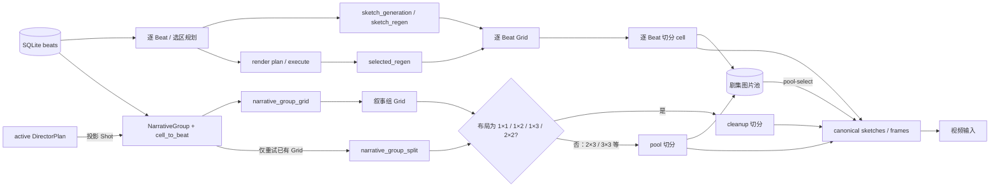
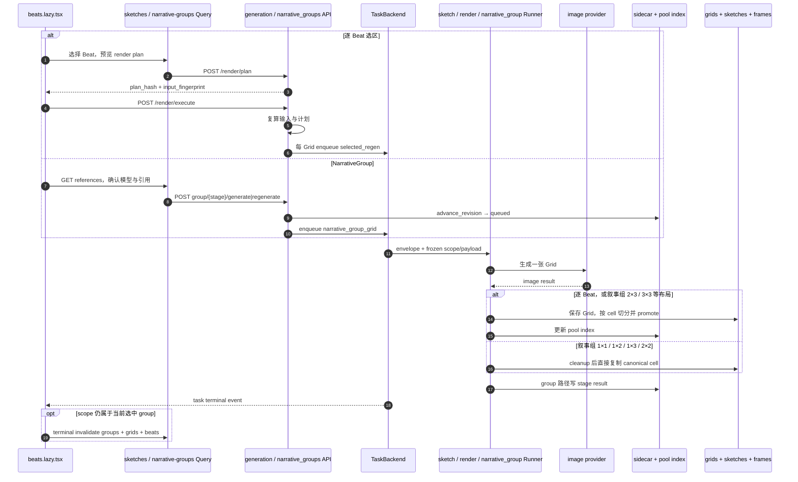

# Nuomi Drama Factory 分镜与图像管线

> **所属阶段**：核心生产管线 · 05 分镜与图像<br>
> **上游**：[剧本与语义](04-screenplay.md)<br>
> **下游**：[声音与音频](06-audio.md)<br>
> **相关横向手册**：[共享系统地图](../system-map.md) · [功能反查](../development/trace-a-feature.md) · [新增 API 与长任务](../development/add-api-and-task.md) · [存储与项目文件](../development/storage-and-files.md) · [测试策略](../development/testing-strategy.md)<br>
> **代码核对基线**：`55504a0`<br>
> **返回**：[Nuomi Drama Factory 开发者 Cookbook](../README.md)

本页追踪从 Beat 到草图、实图首帧的两条生产路径。逐 Beat 路径围绕 SQLite `beats`、剧集图片池和 `sketches/frames` canonical 文件工作；叙事组路径把一组连续 Beat 或导演 Shot 固定到多宫格 cell，另用 stage revision 管理草图与实图。它们共用图像生成能力，也会把切分结果写入相同的 canonical 图片目录；叙事组只有部分布局会再进入剧集图片池，任务 scope、重试语义和版本状态也与逐 Beat 路径不同。

## 功能边界

| 对象 | 作用 | 真值与持久化 | 页面读取 |
| --- | --- | --- | --- |
| `Beat` | 逐行生产单元；`beat_number`、画面描述、场景与身份引用决定图像输入 | SQLite `beats`；媒体 URL 由 canonical 文件动态补出 | `useEpisodeBeats` |
| `NarrativeGroup` | 1–9 个生产单元的有序集合；active DirectorPlan 存在时，生产单元改为 Shot | `.narrative_groups/epNNN.json` sidecar；active plan 会投影并同步 sidecar | `useNarrativeGroups` |
| Grid / cell | Grid 是一次模型调用产出的整张多宫格；cell 是按行优先切出的单镜图片 | 逐 Beat 产物进入 `grids/epNNN/`；叙事组小布局 cell 可只写 canonical 文件和 stage payload | `/grids` 或 group stage payload |
| 草图候选 | 构图参考；携带生成时 Beat 内容 hash，可判定 stale | 图片池 `PoolImage(type="sketch")` | Grid Gallery、单 Beat sketch candidates |
| 渲染候选 | 成品首帧候选；当前实现不做 Beat 内容 stale 判定 | 图片池 `PoolImage(type="render")` | Render Grid Gallery |
| canonical 草图 / 首帧 | 下游默认读取的当前图片，不等于候选历史 | `sketches/epNNN/beat_NN.png`、`frames/epNNN/beat_NN.png` | Beat 的 `sketch_url`、`frame_url` |

前端主入口是 `frontend/src/routes/_app/projects.$project/episodes.$episode/beats.lazy.tsx`。旧的 `sketches.lazy.tsx` 只把书签重定向到 `/beats?sub=sketch`，没有独立数据流。`BeatsTabContent` 同时挂载 `BeatCardGrid`、草图/渲染 Grid Gallery 和 `NarrativeGroupWorkbench`，所以同一页面可看到两套生产状态。

## 核心概念

### Beat 与 NarrativeGroup 的关系取决于导演方案

没有 active DirectorPlan 时，`group_beats` 从 SQLite Beat 读取 id，按场景与时段连续性分组，单组最多 9 个；空的 legacy 场景字段不会人为切组。布局由数量确定：1 个用 `1×1`，2 个用 `1×2`，3–4 个用 `2×2`，5–6 个用 `2×3`，7–9 个用 `3×3`。`cell_to_beat` 从 0 开始、按行优先建立稳定映射，容量大于 Beat 数量时剩余位置只是 padding，不创建虚拟 Beat。

存在 active DirectorPlan 时，`load_effective_groups` 将计划中的 group 投影为 `NarrativeGroup`：`beat_ids` 保存来源 span id，`shot_ids` 成为实际图像/视频生产单元，`cell_to_beat` 指向 Shot id。`generation_beats_for_group` 随后从导演 Shot 的 subject、action、景别、机位、构图和运动信息构造生成输入。上游的语义 `DramaticBeat`、SQLite `VisualBeat` 和这里的 Director Shot 因此不能仅凭都叫 Beat 而混用。

`POST .../narrative-groups/rebuild` 只在没有 active DirectorPlan 时重新按 SQLite Beat 分组。id、Beat 顺序、布局和 cell 映射均未变化的组会保留 stage、错误和视频设置；结构变化的组回到空 stage。active plan 存在时 API 返回 `409 DIRECTOR_PLAN_ACTIVE`，需要在导演方案侧修改并重新激活，而不是强行重建 sidecar。

### stage revision 是组内版本，不是图片池版本

每个 NarrativeGroup 有独立的 `sketch`、`render`、`video` stage。图像 stage 使用 `pending → queued → running → completed / partial_failure / failed`；`generate` 在 revision 为 0 时创建 r1，重复 `generate` 仍指向同一 revision，`regenerate` 才把当前快照放进 `revision_history` 并增加 revision。Runner 的 `record_stage_result(expected_revision=...)` 只允许当前 revision 吸收结果，旧任务晚到时不会覆盖新 revision。

`GET .../{stage}/revisions` 返回历史快照和当前 revision。rollback 并不把指针倒退：`rollback_stage_revision` 将目标快照复制成一个新的 revision，并把回滚前状态继续追加到 history。例如当前 r2 回滚到 r1 后得到 r3。该历史记录属于 `.narrative_groups` sidecar；逐 Beat 图片池仍以候选文件、pool id 和 canonical 文件表达版本。

这里的 snapshot 不是 `GroupStageState` 的完整序列化。当前 `_stage_snapshot` 与 `rollback_stage_revision` 都没有保存或恢复 `requested_image_size`、`requested_pixel_size`、`actual_pixel_size`、`resolution_warning`、`cleanup_reports`。因此回滚会恢复目标 revision 的 Grid/cell、状态、实际 provider/model、workflow/provider 参数等有限字段，但新建的 revision 会把上述分辨率与清理元数据置回默认空值；不能据此断言回滚后的图片曾按什么尺寸请求、是否发生分辨率降级或逐 cell 做过哪些清理。若要把回滚升级为完整 stage 恢复，必须同时扩展快照写入与恢复构造，并覆盖旧 sidecar 缺字段时的兼容读取。

### 候选入池与 pool 选择

`save_grid_and_split` 保存整图、按 `beat_nums` 切 cell、以内容 hash 去重并注册 `PoolImage`。批量草图默认 `force_promote=False`，已有 canonical 草图不会因新一轮抽卡被自动覆盖；`sketch_regen`、`selected_regen` 和 render grid 再生属于明确重生成，通常以 `force_promote=True` 覆盖相应 canonical 文件。

`POST .../beats/{beat_num}/pool-select` 允许把任意 pool cell 分配给目标 Beat，而不是只能回到 `original_beat`。选择草图会复制到 canonical sketch；选择 render 会复制到 canonical frame，并更新 `beat_assignments`。这里的草图 stale 校验仍以候选的 `original_beat` 为准：服务端用 `pool_img.original_beat` 找生成时对应 Beat，比对其 `beat_content_hash`，不会改用 URL 中的目标 `beat_num`。因此把 Beat 1 的候选分配给 Beat 5 时，门禁回答的是「该候选相对 Beat 1 是否过期」，不是「它是否匹配 Beat 5」。校验失败返回 `stale=true`，除非显式 `force=true`；render 候选当前始终视为非 stale。前端 `usePoolSelect` 对草图和 render 的缓存处理也不同：草图更新目标 Beat 的 `sketch_url` 并失效 pose editor，render 更新目标 Beat 的 `beat_assignments` 和 `frame_url`。

## 两条生产路径及交点



逐 Beat render plan 最终派发的 Grid 任务是 `selected_regen`，叙事组分支才使用 `narrative_group_grid`。两条路径稳定的交点是 canonical 草图/首帧。图片池是条件性交点：`_split_existing_grid` 对 `1×1`、`1×2`、`1×3`、`2×2` 走 `split_and_cleanup`，直接把 cell 复制到 `sketches/frames` 并返回 stage `cell_assets`，不创建 `PoolImage`；`2×3`、`3×3` 等未命中该分支的布局才调用 `save_grid_and_split` 更新 pool。group revision 始终只在 sidecar 中维护。

### 逐 Beat 路径

全集草图 `POST .../sketches/generate` 先根据普通或按场景的 grid plan 校验 `grid_index`，要求已经分配草图颜色，然后为每个目标 Grid 派发 `sketch_generation`，scope 为 `grid_{index}`。Runner `run_sketch_generation` 生成草图 Grid 后调用 `save_grid_and_split`；接口在派发前会清理本集 canonical sketches，但保留 `grids` 候选历史。

选中 Beat 草图重生成走 `POST .../sketches/regenerate`，任务类型是 `sketch_regen`；同一次调用只能包含同一场景的 Beat。选中 Beat 实图走 `/render/plan` 与 `/render/execute`：plan 按 location 生成 `PlanEntry`，并返回 `plan_hash` 和包含 Beat、角色参考图、草图颜色、画幅等输入的 `input_fingerprint`。execute 重新计算两者，输入变化返回 `409 input_stale`，服务端计划变化返回 `409 plan_stale`；成功后每个 Grid 各派发一个 `selected_regen`，scope 是 `selection_scope(mode_key, beat_numbers)`，响应的 `location__...` 只是汇总 scope，任务跟踪必须使用 `task_ids`。

`POST .../grids/{grid_index}/regenerate` 是按既有 Grid 索引重新生成 render 的兼容路径，任务类型为 `grid_regenerate`、scope 为 `grid_{index}`。它可按普通、场景或角色分组定位 Beat，但不提供 render plan 的 hash/fingerprint 审核步骤。

### NarrativeGroup 路径

`generate` / `regenerate` 先由 API 从 sidecar 取服务端映射，再解析本组参考图和图像 provider/model，调用 `advance_revision`，最后以 `group_{group_id}_{stage}_r{revision}` 派发 `narrative_group_grid`。Runner 将 stage 置为 running，只调用一次图像模型生成整组 Grid，再切分 cell。抽象编排函数 `retry_split` / `run_group_grid` 能把 splitter 返回的逐 cell errors 表达为 `partial_failure` 并保留成功 cell，`tests/test_task_narrative_group_runners.py::test_partial_split_failure_preserves_successful_cells` 验证的是这一层契约。当前生产 `_split_existing_grid` 的两个分支都固定返回 `errors=[]`，切图、清理或复制任一处抛异常都会由 `_execute` 把整个 stage 写成 `failed`；当前生产链路没有逐 cell 捕获并形成 `partial_failure` 的实现。

`split` 使用相同 scope 和当前 revision，但派发 `narrative_group_split`。它从 sidecar 恢复已有 `grid_asset`，不重新解析参考图，也不调用图像模型，只重复确定性切分。只有 Grid 已生成而切分失败时，这种重试才有意义。

render stage 默认要求当前 sketch stage 已 `completed`、revision 大于 0 且整图仍存在。满足条件时 payload 冻结 `source_sketch_revision` 和 `source_sketch_asset`，结果标记 `constraint_mode=strong_sketch`；只有请求明确 `allow_unconstrained=true` 才能跳过该门禁。后续 sketch 又生成新 revision 不会自动使旧 render 消失，诊断时应比较 render 记录的 `source_sketch_revision`。

## 参考图、模型与分辨率

叙事组参考图的预期范围是本组生产单元，但 active DirectorPlan 下当前有一处 DTO 分叉。独立 reference preview endpoint 先用 `_group_beats`，拿 group 的 `beat_ids`（投影后是 source span id）去匹配 SQLite Beat；实际 `generate` / `regenerate` 在 `_group_beats` 后还会调用 `generation_beats_for_group`，把输入替换为 Director Shot，再从 Shot 解析引用。因此预览列表不保证与入队时重新解析出的引用集合一致，预览提交的 opaque id 可能在生成 API 校验时变成 unknown 并返回 422。修复这一点时应让 preview 和 enqueue 共用同一个 production-unit resolver，不能只调整前端选择状态。

在各自实际解析到的输入内，角色优先使用 identity 图，缺失时回退 portrait；场景使用 scene master；路径必须真实存在且位于项目 `assets` 下。服务端以 opaque id 暴露引用，按来源优先级、覆盖 Beat 数、首次出现位置排序，最多选择 9 张。未知引用 id 不会推进 revision 或入队；`split` 完全不解析引用。

默认草图模型为 `nano-banana-2`，默认实图模型为 `gpt-image-2`，provider 默认 `grsai-main`；项目设置或请求可覆盖。render 的 `image_size` 还要经过 `supported_grid_image_sizes` 校验。Runner 对 GPT Image 模型调用 `resolve_grid_image_resolution`，根据 cell 画幅和 Grid 行列折算 provider 尺寸，并把 requested/actual pixel size、降级原因、upscale 和亮边清理报告写回 stage，不能只根据前端选择框判断最终分辨率。

逐 Beat 路径的模型选择来自 sketch/render project config。render 会把 canonical 草图、角色 identity、场景和道具引用交给生成器；单 Beat render 还会按已有 canonical 草图方向修正请求的 mode key，避免把竖图当成横图约束。

## 任务、scope 与前端刷新

| 操作 | task type | scope | 终态刷新 |
| --- | --- | --- | --- |
| 全集/单 Grid 草图 | `sketch_generation` | `grid_{index}`；Direct Render 转草图另用 beat scope | `useEpisodeImageTaskInvalidation` 刷新 grids、beats、usage、pipeline |
| 选中 Beat 草图 | `sketch_regen` | `selection_scope(mode, beats)` | 批量计划逐 Grid 跟踪返回 scope；成功终态刷新 |
| render plan 执行 | 响应标记 `render_plan`，实际每 Grid 为 `selected_regen` | 响应汇总 `location__hash`；实际任务各有 selection scope | 页面按返回 `task_ids` 跟踪并刷新 |
| 按索引 render 再生 | `grid_regenerate` | `grid_{index}` | episode image task 订阅刷新 |
| 叙事组生成/再生 | `narrative_group_grid` | `group_{id}_{stage}_r{revision}` | 仅当前选中 group 的当前单一 scope 由 `useTaskController` 跟踪 |
| 叙事组仅切分 | `narrative_group_split` | 同一 group/stage/revision scope | 限制同上 |

mutation 入队成功时，`useNarrativeGroupAction` 已立即失效 narrative groups、grids 和 beats。终态刷新并非 episode-wide 保证：`NarrativeGroupWorkbench` 的两个 `useTaskController` 都根据当前选中 group 计算一个 active scope；切换 group 或并行提交其他 group 后，旧 scope 不再被该 controller 跟踪。`useEpisodeImageTaskInvalidation` 的类型集合也不包含 `narrative_group_grid` / `narrative_group_split`。需要保证所有组在终态刷新时，应增加按 project + episode + task type 匹配的全局订阅或等价失效机制。

逐 Beat 的 `useGenerateSketches`、`useRegenerateSketches`、`useRenderExecute` 本身不失效查询，依赖页面 task 订阅。批量草图失败时 `useScopedTaskBatchInvalidation` 会移除跟踪项但不刷新；服务端任务日志和保留下来的 pool/canonical 文件仍是排查部分成功的依据。

## 端到端时序



## 数据与产物

| 数据或产物 | 位置 | 更新语义 |
| --- | --- | --- |
| NarrativeGroup sidecar | `.narrative_groups/epNNN.json` | 带进程内锁和文件锁；当前 stage 保存完整运行结果，但 revision snapshot 只含有限字段；回滚不会恢复 requested/actual pixel size、resolution warning 与 cleanup reports |
| 逐 Beat Grid 与 cell | `grids/epNNN/{custom,sketch,render,...}` | 整图保留，cell 以 Beat/时间戳命名并去重、入池 |
| 叙事组 Grid 与 cell | Grid 在 `grids/epNNN/narrative_groups/`；小布局临时切片后直接复制到 canonical，大布局 cell 进入 `grids/epNNN/{sketch,render}` | 所有布局写 group stage；只有调用 `save_grid_and_split` 的大布局更新 pool |
| pool index | 生产环境映射到 state 树的 `grids/epNNN/pool_index.json` | 逐 Beat 路径和叙事组大布局更新；原子写入，首次读取会迁移旧 output-side index |
| 当前草图 | `sketches/epNNN/beat_NN.png` | 生成、regen、上传或 pool-select 复制覆盖 |
| 当前首帧 | `frames/epNNN/beat_NN.png` | render、上传或 pool-select 复制覆盖 |
| render plan hash cache | `.render_plan_cache` | 参考图 hash 加速 input fingerprint；缺失参考图使 plan 请求失败 |

## 常见修改

### 修改分组或网格布局

1. 逐 Beat 路径分别核对 `sketch_grid_split`、`sketch_scene_grid_split`、`perfect_grid_split`、`build_regen_plan` 与 `REGEN_MODE_CONFIGS`；它们不是 `layout_for_group` 的同一份规则。
2. 叙事组需同步 `layout_for_group`、`cell_to_beat`、前端布局标签和 `_split_existing_grid` 支持的 cleanup layout。新增 cleanup layout 还会改变是否经过 `save_grid_and_split`、是否产生 PoolImage；容量与真实单元数分开，padding 不能注册成候选。
3. 改变 group 映射会让 `rebuild_groups` 清空旧 stage；active DirectorPlan 下应修改导演 group/Shot，而不是开放强制 rebuild。
4. 覆盖 `tests/test_narrative_group_service.py::test_layout_for_group_uses_supported_shapes`、`test_group_beats_respects_scene_and_time_continuity` 和 `tests/test_task_narrative_group_runners.py::test_generation_batch_payload_controls_layout_style_and_panel_tags`。

### 修改图像模型、分辨率或参考图

1. 叙事组同步 `_image_binding`、media defaults、`GroupReferenceDialog`、`resolve_group_reference_preview` 和 Runner 的 `ImageGenerationRequest`；不要把 provider 凭据放进前端 payload。
2. 新模型需定义支持的 image size、Grid 画幅换算与实际像素回写；前端只展示服务端返回的 `actual_*` 才能反映降级。
3. 引用必须限制在本组且在项目 asset root 内；active DirectorPlan 下要先消除 preview 的 source-span DTO 与 enqueue 的 Shot DTO 分叉，再保留 unknown opaque id 的 422 门禁和最多 9 张限制。
4. 覆盖 `tests/test_api_narrative_groups.py` 中 reference preview/selection、render sketch revision、unsupported resolution 用例，以及 `tests/test_narrative_group_image_resolution.py`。

### 增加单 Beat 重生成动作

1. 草图使用 `sketch_regen`，render 使用 render plan/execute；mode key 要与画幅匹配，scope 用 `selection_scope`，不要复用不对应真实任务行的 render plan 汇总 scope。
2. Runner payload 仍要带完整 Beat 上下文、选中编号、角色/场景/道具引用和 image selection；草图重生成保留「同一场景」校验。
3. 明确候选与 canonical 语义。自动抽卡一般只入池，用户明确重生成才覆盖 canonical；若改动 `force_promote`，需要回归用户已手选图片不被后台任务覆盖。
4. 前端成功提交后登记每个 scope 或 task id；逐 Beat 终态至少失效 `grids`、`beats`，render 还应失效 `sketchImageUsage` 与 pipeline status。叙事组若允许切换或并行处理多个 group，需要 episode-wide 订阅，而不是只依赖当前选中 group 的 controller。
5. 覆盖 `tests/test_api_sketch_regenerate.py::test_sketch_selected_regen_returns_scope`、`tests/test_api_render_regenerate.py::test_render_selected_regen_returns_scope_and_passes_render_settings`、`frontend/src/__tests__/lib/queries/sketches.test.tsx` 和 `frontend/src/__tests__/routes/beats-sketch-render-contract.test.ts`。

### 修改重建、回滚或失败恢复

1. group `regenerate` 必须先保存当前 stage snapshot，再以新 revision 入队；Runner 完成写入必须带 `expected_revision`，避免晚到结果覆盖新版本。
2. `split` 只能复用当前 `grid_asset`，不应重新调用 provider 或解析引用。若要支持部分失败恢复，需要先让生产 splitter 逐 cell 捕获错误并返回 errors；目前任一异常会使整个 stage failed。
3. rollback 创建新 revision，不要直接删 history 或覆盖为旧编号；完成后前端需同时刷新 groups、grids 与 beats。新增或依赖 stage 字段时要同步检查 `_stage_snapshot` 和 `rollback_stage_revision`：当前回滚会丢失 `requested_image_size`、`requested_pixel_size`、`actual_pixel_size`、`resolution_warning`、`cleanup_reports`，修复时还要兼容不含这些键的旧快照。
4. pool rebuild 只能重建索引，不能承诺恢复已经删除的 Grid/cell；canonical 文件也不等同于完整候选历史。
5. 覆盖 `tests/test_narrative_group_service.py::test_stale_revision_completion_cannot_overwrite_new_revision`、`tests/test_api_narrative_groups.py::test_stage_history_and_rollback_routes`、`tests/test_task_narrative_group_runners.py::test_split_runner_recovers_grid_from_sidecar_without_generator`。

## 失败诊断

| 现象 | 优先检查 |
| --- | --- |
| task 完成但页面没有新图 | 逐 Beat render execute 不要跟踪 `location__...` 汇总 scope；叙事组检查任务是否属于已切走/并行的非当前 group，当前没有 episode-wide 终态订阅 |
| group render 返回 409 | sketch stage 是否 completed、记录的 grid_asset 是否仍存在；是否确实允许 unconstrained |
| 选择草图提示过期 | 检查候选 `original_beat` 的当前内容/颜色，不是目标 `beat_num`；只有确认跨 Beat 复用旧构图时才传 `force=true` |
| Group Grid 有图但 cell/canonical 为空 | 检查 stage error 与 cleanup；当前生产 splitter 不生成逐 cell partial_failure，可用 `split` 重试整次确定性切分 |
| 重生成后又出现旧结果 | sidecar current revision 与任务 scope 中 rN 是否一致；旧 Runner 写入会被 expected revision 忽略 |
| 回滚后图片仍在，但分辨率或清理信息为空 | 这是当前有限快照的已知缺口：`_stage_snapshot` / `rollback_stage_revision` 未覆盖 requested image/pixel size、actual pixel size、resolution warning 和 cleanup reports；结合目标 revision 的原始任务日志与实际文件复核，不能把空值解释为没有降级或没有清理 |
| render plan 执行 409 | 使用响应中的 new plan/hash/fingerprint 重新确认，不要在客户端自行改旧计划继续提交 |
| 叙事组有 canonical 图但图片池看不到 | 先看布局；`1×1`、`1×2`、`1×3`、`2×2` 分支不建 PoolImage，属于当前预期行为 |
| 图片池丢了 assignment | 检查 state-side `pool_index.json`、cell 是否仍存在、rebuild 时旧 id 是否能映射到新 alias |
| 模型选择与实际输出不一致 | stage 的 `actual_provider`、`actual_model`、requested/actual pixel size、resolution warning，以及任务日志中的 provider/model |

## 关键代码索引

| 关注点 | 路径 | 关键符号 |
| --- | --- | --- |
| 页面编排与批任务刷新 | `frontend/src/routes/_app/projects.$project/episodes.$episode/beats.lazy.tsx` | `BeatsTabContent`、`trackSketchRegen`、`trackRenderTask` |
| 逐 Beat 图像 Query | `frontend/src/lib/queries/sketches.ts`、`render-plan.ts` | `useGenerateSketches`、`useRegenerateSketches`、`usePoolSelect`、`useRenderPlan`、`useRenderExecute` |
| 叙事组 Query/UI | `frontend/src/lib/queries/narrative-groups.ts`、`components/episode/narrative-workbench/` | `useNarrativeGroupAction`、`NarrativeGroupWorkbench`、`GroupGridStage` |
| 逐 Beat API | `src/novelvideo/api/routes/generation.py` | `generate_sketches`、`render_plan`、`render_execute`、`regenerate_beats`、`regenerate_sketches`、`select_pool_image` |
| 叙事组 API | `src/novelvideo/api/routes/narrative_groups.py` | `_resolve_groups`、`_enqueue_group_action`、`rollback_stage`、reference endpoints |
| 分组与 revision | `src/novelvideo/narrative_groups/models.py`、`service.py` | `NarrativeGroup`、`layout_for_group`、`advance_revision`、`record_stage_result`、`rollback_stage_revision` |
| 参考图与分辨率 | `src/novelvideo/narrative_groups/references.py`、`image_resolution.py` | `resolve_group_reference_preview`、`apply_group_reference_selection`、`resolve_grid_image_resolution` |
| 图片池 | `src/novelvideo/generators/pool_indexer.py`、`models.py` | `save_grid_and_split`、`compute_beat_content_hash`、`PoolImage`、`PoolIndex` |
| 长任务 Runner | `src/novelvideo/task_backend/runners/sketch.py`、`render.py`、`narrative_group.py` | `run_sketch_generation`、`run_sketch_regen`、`run_selected_regen`、`run_grid_regenerate`、`run_narrative_group_grid`、`run_narrative_group_split` |

## 验证

后端聚焦分组/revision、参考图、Runner 切分和图片上传；API 只点跑与本链路直接相关的节点，避免把视频生成用例混入图像管线验证：

```bash
.venv/bin/pytest -q \
  tests/test_narrative_group_service.py \
  tests/test_task_narrative_group_runners.py \
  tests/test_narrative_group_runner_references.py \
  tests/test_api_beat_image_upload.py \
  tests/test_api_narrative_groups.py::test_stage_history_and_rollback_routes \
  tests/test_api_narrative_groups.py::test_reference_preview_is_safe_project_scoped_and_group_bounded \
  tests/test_api_narrative_groups.py::test_generate_preserves_explicit_reference_selection_and_empty_list \
  tests/test_api_narrative_groups.py::test_regenerate_validates_and_forwards_reference_selection \
  tests/test_api_narrative_groups.py::test_split_keeps_aspect_but_does_not_resolve_or_include_reference_selection \
  -k 'not video'
```

前端聚焦草图/叙事组 Query、任务终态失效和 group 引用/网格 UI：

```bash
cd frontend
pnpm exec vitest run \
  src/__tests__/lib/queries/sketches.test.tsx \
  src/__tests__/lib/queries/narrative-groups.test.ts \
  src/__tests__/hooks/use-episode-image-task-invalidation.test.tsx \
  src/__tests__/components/episode/narrative-workbench/narrative-group-workbench-references.test.tsx \
  src/__tests__/components/episode/narrative-workbench/group-grid-stage-v2.test.tsx
```

提交前检查本页空白错误、未完成标记与本机绝对路径；最后一条 `rg` 应无输出（退出码 1 表示未命中）：

```bash
git diff --check -- docs/cookbook/pipelines/05-storyboard.md
rg -n 'T[O]DO|T[B]D|待[补]|占[位]|/(U[s]ers|h[o]me|private|tmp|var)/|[A-Za-z]:[\\][\\]' \
  docs/cookbook/pipelines/05-storyboard.md
```

## 继续追踪

- 上游：[剧本与语义](04-screenplay.md)，继续追踪 DramaticBeat、VisualBeat 与 Director Shot 如何形成图像输入。
- 下游：[声音与音频](06-audio.md)，继续追踪 canonical 画面与 Beat 的台词、音效及音乐如何汇合；普通生产顺序随后进入 07 视频与 08 合成。
- 横向入口：[共享系统地图](../system-map.md)、[功能反查](../development/trace-a-feature.md)、[新增 API 与长任务](../development/add-api-and-task.md)、[存储与项目文件](../development/storage-and-files.md)、[测试策略](../development/testing-strategy.md)。
- 返回 [Cookbook 首页](../README.md)。
