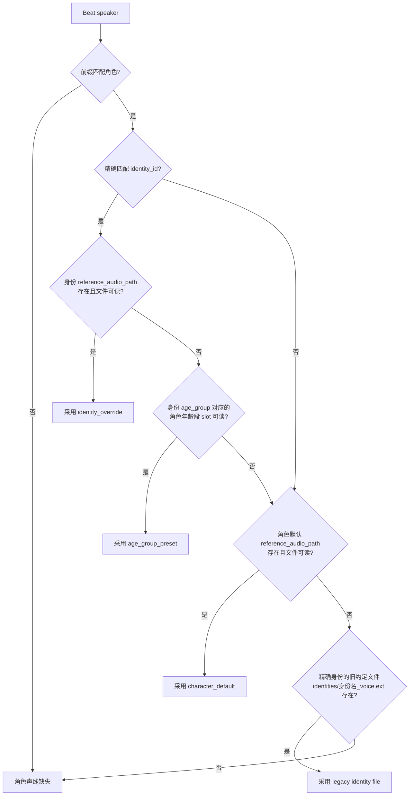
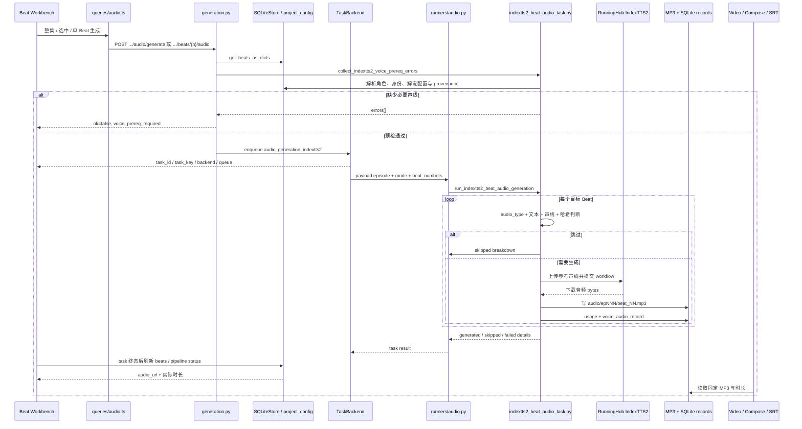

# Nuomi Drama Factory 声音与音频管线

- **所属**：核心生产管线 · 06 声音与音频
- **上游**：[分镜与图像](05-storyboard.md)
- **下游**：[视频生成](07-video.md)
- **代码基线**：`55504a0`
- **返回首页**：[Nuomi Drama Factory 开发者 Cookbook](/)
- **相关手册**：[共享系统地图](../system-map.md) · [功能反查](../development/trace-a-feature.md) · [新增 API 与长任务](../development/add-api-and-task.md) · [存储与项目文件](../development/storage-and-files.md) · [测试策略](../development/testing-strategy.md)
- **业务与创作**：[音频与视频](../product/05-audio-and-video.md) · [视听连续性](../creation/06-audiovisual-continuity.md)
- **技术调用链**：对白 / 旁白与声线 → 音频任务 → provider → canonical 音频与尝试记录

本页追踪生产 Beat 的对白与旁白怎样选择参考声线、通过 RunningHub IndexTTS2 生成音频，并把文件、来源哈希和尝试记录交给视频与字幕环节。角色工作区的声音设计只负责建立可复用的参考样本；它与剧集音频生成是两类任务。

## 功能边界

| 能力 | 当前入口 | 任务或执行方式 | 成功的含义 | 不负责什么 |
| --- | --- | --- | --- | --- |
| 整集音频同步 | Beat 工作台 `BatchBar` → `useGenerateAudio()` | `audio_generation_indextts2`，默认 `sync_changed` | 缺失、未知或声音/文本已变化的目标 Beat 已处理 | 不保证每个 Beat 都生成；静音、空文本和不支持的 `audio_type` 会跳过，普通单项失败也会汇总到 result |
| 选中 Beat 重生成 | `BatchPanel` → `useGenerateAudio({ beatNumbers, mode: "redo_selected" })` | 同一剧集级任务类型 | 选中编号被强制重做 | 不是每个 Beat 一个任务；一次请求只排一个任务 |
| 单 Beat 重生成 | `AudioPane` → `useRegenerateBeatAudio(beatNum)` | 同一任务，payload 固定 `redo_selected` + 单编号 | 指定 Beat 被强制重做 | 不修改 Beat 文本、`audio_type` 或 `speaker` |
| 配置角色参考声线 | 角色页 `CharacterVoicePanel` | 上传、录音、裁剪为同步请求；AI 设计为 `character_voice_design` | default 或年龄段 slot 的文件与哈希已写入角色资产 | 不生成 `audio/epNNN/beat_NN.mp3` |
| 配置解说声线 | 角色页 `NarratorVoicePanel` | 上传、录音、复制、裁剪、删除为同步请求 | 项目解说声线描述写入项目配置 | 第一人称 narrated 项目仍按解说主角解析，不使用项目解说人文件 |

旧地址 `/_app/projects/$project/episodes/$episode/audio` 当前只重定向到 Beat 工作台并设置 `sub=audio`。实际播放与重生成交互在 `frontend/src/components/episode/beat-workbench/audio-pane.tsx`；不要在重定向路由里寻找生成表单。

旧 `/tts/generate`、`/tts/preview` 和 `/tts/voices` 都固定返回 `410 Gone`。活跃前端不再列 provider/voice，也不调用旧 TTS 预览；`TTSGenerateRequest` 中遗留的 `provider`、`voice`、`model`、`rate` 字段不会改变当前 IndexTTS2 执行后端。

## 我要改什么

- 改声线选择、生成范围或产物字段：从[常见修改](#常见修改)进入对应场景。
- 改任务 scope 与页面刷新：共享机制见[新增 API 与长任务](../development/add-api-and-task.md)。
- 只想定位故障：直接看[失败诊断](#失败诊断)与[最小验证](#最小验证)。

## 核心原理

### `audio_type` 决定文本与声音来源

`normalize_seedance2_audio_type` 把 Beat 分成三类：

1. 显式 `action` 兼容为 `silence`，`silence` 不调用 TTS。
2. 显式 `dialogue` 使用角色/身份声线；未设置 `audio_type` 但 `speaker` 非空时也按对白处理。
3. 显式 `narration` 使用解说声线；`audio_type` 与 `speaker` 都为空时默认按旁白处理。

对白文本按 `narration_segment` → `dialogue` → `narration` 回退，旁白文本按 `narration_segment` → `narration` → `dialogue` 回退。对白文本如果含 `“”`、`「」` 或英文双引号，只把引号中的话送给模型；引号外的哭泣、愤怒、耳语等描述会确定性映射成一条自然情绪示例。没有引号时，原文本整体作为对白，情绪模式保持 neutral。旁白直接使用按上述顺序命中的完整文本。

手工插入镜头不因 `is_manual_shot` 被音频 Runner 排除：手工旁白和对白仍可生成，手工静音镜头才跳过。`IndexTTS2BeatAudioTaskResult.skipped_manual` 目前保留在结果结构中，但主循环没有增加它。

### 对白声线按身份、年龄段、角色默认三级解析

对白先用 `speaker.startswith(character.name)` 找角色，再用 `identity.identity_id == speaker` 找精确身份。找到角色后，`resolve_character_voice` 依次检查：



三级优先级是身份覆盖 → 身份年龄段对应的角色 slot → 角色 default。旧 `assets/characters/<角色>/identities/<身份名>_voice.<ext>` 只在精确身份存在、三级解析均未命中时兜底。当前角色声线面板直接维护 default、child、youth、middle、elder 五个 slot；身份级字段仍由模型、Store 与兼容数据支持，不能把年龄段 slot 写成身份文件。

路径存在性参与选择。元数据里有 path、文件却丢失时，该层不会命中，解析继续向下；已有 sha256 为空时现场计算文件哈希。`speaker` 只匹配到角色、没有精确身份时，仍可命中角色 default，但不会凭身份名称猜年龄段。

### 旁白声线由项目类型与解说风格共同决定

旁白有一条额外的 Beat 上传优先级：

- `spine_template="drama"`：先取当前 Beat 的 `seedance2_config_json.reference_audio_paths` 中第一个存在且扩展名受支持的音频；没有时回退到项目解说人。drama 即使遗留 `narration_style="first_person"`，`load_effective_narration_style_for_voice` 也强制按 third person 解析。
- `spine_template="narrated"`：忽略 Beat 上传的旁白参考。`first_person` 取第一个 `is_main=True` 角色的第一个身份，并复用身份 → 年龄段 → 角色 default 三级解析；`third_person` 取项目配置中的解说人文件。

first person 缺少主角或主角声线时，错误会指向角色工作区；third person 缺文件时，错误会指向「资产 > 声线」。这套选择同时被预检与实际生成调用，避免请求入队前后采用不同声线。

### 预检先挡缺声，Runner 再按哈希判断是否重做

API 先读取本集 Beats；为空时直接返回 `ok: false`。随后 `collect_indextts2_voice_prereq_errors` 只检查目标中需要发声且文本非空的 Beat。缺声时返回 `code="voice_prereq_required"`，最多拼接前五项到错误文本，不创建任务。

四种内部 mode 的语义如下：

| mode | 文件已存在时 | 哈希判断 | 当前 UI 入口 |
| --- | --- | --- | --- |
| `sync_changed` | 只有 provenance 记录为 current 才跳过 | 比较声音 sha256 与文本 sha256；缺记录为 unknown，也会重做 | 整集「生成音频」 |
| `missing_only` | 任何非空文件都跳过 | 不检查记录、声音或文本是否已变化 | 兼容/程序化调用 |
| `redo_selected` | 强制覆盖目标 | 不用 current 判定跳过 | 选中 Beat、单 Beat 重生成 |
| `redo_all` | 强制覆盖目标 | 不用 current 判定跳过 | 兼容的整组重做逻辑 |

未知 mode 会规范化为 `sync_changed`。只有 `beat_numbers is None`，也就是字段未传或值为 `null`，才表示本集全部有效编号；显式 `[]` 会规范化为空集合，任务的目标数为零。非空数组会去重、忽略非正数，并只保留本集中存在的 Beat。mode 名本身不改变目标集合，所以调用方仍需让 `redo_selected` 携带选中编号。

预检只验证 Beat、文本与参考声线，不验证 RunningHub provider、credential 或 `tts_indextts2_voice_clone` workflow。后几项要到 Runner 创建 `RunningHubIndexTTS2Generator` 时才暴露。

### 生成文件与记录不是同一个状态

Runner 从 `runninghub-main` 读取启用的 provider、credential 和 `tts_indextts2_voice_clone` workflow。参考声线上传到 RunningHub，任务轮询成功后下载第一个结果，直接写到固定 `.mp3` 路径。`RunningHubIndexTTS2Generator` 返回的 `duration_seconds` 是 `0.0`；真实时长由后续 `ffprobe` 从文件读取。

成功后会写两类 SQLite 记录：

- `audio_request_usage`：稳定 request id、provider/model、Beat + speaker scope、accepted/completed/failed 与错误。
- `seedance2_voice_audio_records`：每个 episode + beat + speaker 的音频路径、声音哈希、文本哈希、mode、provider/model 和生成状态，用于 `sync_changed` 判断 current/stale。

普通单 Beat 异常会进入 `result.failed`，循环继续；因此任务本身可能是 completed，但 `indextts2_detail.failed` 非空。余额不足错误会重新抛出，使任务进入 failed。排错时不能只看 Task Center 终态。

### 角色声音设计只生产参考样本

`character_voice_design` 使用另一项能力 `TTS_VOICE_DESIGN` 和 RunningHub workflow `tts_qwen3_voice_design`。API 根据角色性别、年龄、角色定位与描述编译 voice description，Runner 调用 Qwen3 生成试听音频，再写入角色 default 或年龄段 slot，并更新角色元数据。

它的任务身份是 episode `0`、scope `character:<name>:voice:<slot>`；剧集生成则是 episode number 下无 scope 的 `audio_generation_indextts2`。前者改变后者下一次解析到的参考声线，后者才写 Beat MP3 与生成记录。声音设计成功后不会自动重生成任何历史剧集音频；整集 `sync_changed` 会靠新 sha256 识别 stale。

### 音频路径和时长参与视频与字幕决策

`GET /episodes/{episode}/beats` 按固定路径发现 MP3，附加 `audio_url`，并并发探测 `audio_duration_seconds`。后续影响分三层：

1. **视频时长**：入口先用 `resolve_target_video_duration` 计算基础值：Beat 的正 `duration_seconds` 优先，其次是实际音频时长，最后回退 5 秒。随后各后端分支会改写它：H3 在请求带 `body.duration` 时直接覆盖，不执行音频下限；Seedance 由 `_prepare_seedance2_api_beat` 重新读取实际音频并返回 prepared duration；HappyHorse 与 Grok 使用各自 prepare 结果。只有 `generation.py` 最后的 legacy/其他后端分支会在应用用户 duration 后，再提高到不小于 `ceil(audio_duration)`。因此重生成更长音频后，旧视频不会自动延长，需要按后端规则重新生成视频。
2. **合成音轨**：普通 Beat 合成优先使用独立 MP3；没有 MP3 时保留视频内置音轨，再没有则补静音。Director manifest 中 `external_tts` 段要求独立 MP3，并与 ambience stem 混合；`h3_native` 段使用原视频音轨。
3. **字幕时间与文本**：普通导出按每个 MP3 的实际时长推进时间轴，探测失败或缺文件时用 5 秒，文本只取 Beat `narration_segment`。Director 场景按 manifest 的真实帧边界推进，包含静音镜头；每条字幕先取 `entry.segment.dialogue`，为空才回退到对应 Beat `narration_segment`。音频文件不做语音识别。

前端 compose gate 只对 narrated 项目把缺音频列为阻塞；drama 允许视频内置音轨。文件重生成不会主动删除既有视频、最终成片或 SRT，这些下游产物需要按影响范围重新生成。

## 一张概览图



前端 `useTaskController` 跟踪 episode 级 `audio_generation_indextts2`，并兼容对账旧 `audio_generation`；任务完成后失效 `queryKeys.beats` 与 `queryKeys.pipelineStatus`。`audio_generation` 是前端兼容识别项，不是当前两个生成 API 实际发出的任务名称。

## 关键代码索引

| 关注点 | 路径 | 关键符号 |
| --- | --- | --- |
| 旧音频路由重定向 | `frontend/src/routes/_app/projects.$project/episodes.$episode/audio.lazy.tsx` | `AudioRedirect` |
| 单 Beat 播放与重生成 | `frontend/src/components/episode/beat-workbench/audio-pane.tsx` | `AudioPane`、`useTaskController` |
| 整集与选中操作 | `frontend/src/components/episode/beat-workbench/batch-bar.tsx`、`batch-panel.tsx` | `handleGenAllAudio`、`handleBatchAudio` |
| 前端生成契约 | `frontend/src/lib/queries/audio.ts` | `GenerateAudioParams`、`useGenerateAudio`、`useRegenerateBeatAudio` |
| 音频 API | `src/novelvideo/api/routes/generation.py` | `generate_audio`、`regenerate_beat_audio`、`_collect_audio_prereq_errors` |
| 请求 schema | `src/novelvideo/api/schemas.py` | `TTSGenerateRequest` |
| 项目任务 Runner | `src/novelvideo/task_backend/runners/audio.py` | `INDEXTTS2_AUDIO_TASK_TYPE`、`run_indextts2_audio` |
| 统一 Beat 音频任务 | `src/novelvideo/audio/indextts2_beat_audio_task.py` | `collect_indextts2_voice_prereq_errors`、`run_indextts2_beat_audio_generation` |
| 文本、声音与路径解析 | `src/novelvideo/seedance2_i2v/voice_clone.py` | `normalize_seedance2_audio_type`、`resolve_character_voice`、`resolve_narrator_source`、`beat_audio_path` |
| 声音与文本 provenance | `src/novelvideo/seedance2_i2v/voice_audio_records.py` | `classify_seedance2_voice_audio`、`upsert_seedance2_voice_audio_record` |
| 兼容身份/旁白批任务 | `src/novelvideo/seedance2_i2v/voice_audio_task.py`、`narration_audio_task.py` | `run_seedance2_voice_audio_generation`、`run_seedance2_narration_audio_generation` |
| IndexTTS2 Runtime | `src/novelvideo/media_capabilities/tts/runninghub_indextts2.py` | `compile_indextts2_request`、`generate_indextts2_audio`、`RunningHubIndexTTS2Generator` |
| 角色声线 API 与任务 | `src/novelvideo/api/routes/characters.py`、`src/novelvideo/task_backend/runners/voice_design.py` | `upload_character_voice_sample`、`design_character_voice_sample`、`run_voice_design` |
| 声线文件格式与 slot | `src/novelvideo/seedance2_i2v/character_voice_storage.py` | `VOICE_SAMPLE_EXTENSIONS`、`persist_character_voice_file`、`trim_voice_sample_content` |
| 解说声线 API 与配置 | `src/novelvideo/api/routes/projects.py`、`src/novelvideo/project_config.py` | narrator-voice routes、`load_effective_narration_style_for_voice` |
| 下游媒体发现与时长 | `src/novelvideo/api/routes/episodes.py`、`src/novelvideo/manual_shots.py` | `get_beats`、`resolve_target_video_duration` |
| 合成与字幕 | `src/novelvideo/task_backend/runners/video.py`、`src/novelvideo/export/episode_export.py` | `run_compose_episode`、`build_srt_content` |

## 数据与产物

| 数据或产物 | 写入方 | 位置 | 读取方与语义 |
| --- | --- | --- | --- |
| 角色 default 声线 | 上传/录音/裁剪或 `character_voice_design` | `assets/characters/<角色>/voices/voice_default.<ext>` + character 字段 | 对白和 first-person 解说的第三级回退 |
| 角色年龄段声线 | 同上 | `assets/characters/<角色>/voices/voice_<slot>.<ext>` + `voice_samples_by_age_group` | 身份 `age_group` 命中时的第二级回退 |
| 身份覆盖声线 | Store / 兼容资产 | identity `reference_audio_*`，或旧 `assets/characters/<角色>/identities/<身份名>_voice.<ext>` | 对白与 first-person 解说优先读取 |
| 项目解说声线 | narrator-voice API | `assets/narrator/voice.<ext>`；path/sha256/updated_at 在 `project_config.json` | third-person 解说与 drama 旁白回退 |
| Beat 上传旁白参考 | Seedance2 资产配置 | `seedance2_config_json.reference_audio_paths` 指向的项目内音频 | 只在 drama 旁白中优先于项目解说人 |
| Beat 音频 | 统一 IndexTTS2 任务 | `audio/epNNN/beat_NN.mp3` | Beats API、视频时长、合成、字幕与导出包 |
| 生成尝试 | 统一任务 | state SQLite `audio_request_usage` | 计费/尝试审计；稳定 request id 防止同一输入重复插入 |
| 当前性记录 | 统一任务及兼容任务 | state SQLite `seedance2_voice_audio_records` | `sync_changed` 比较声音与文本哈希 |
| 任务状态 | TaskBackend / `TaskStateManager` | state SQLite `task_states` | Task Center、进度、取消与前端缓存刷新 |

替换声线文件会归档同 slot 的旧扩展文件，再写新文件并更新哈希；删除也会把当前文件重命名为带时间戳的归档文件。它不会清理 Beat MP3。Beat 音频则使用固定文件名原地覆盖，没有 revision 或候选采用层。

## 常见修改

### 更换 TTS 后端或模型

1. **能力配置**：更新 `MediaCapability.TTS_VOICE_CLONE` 的 provider/workflow 绑定和 Runtime loader；不要只改 `TTSGenerateRequest.model`，当前 Runner 不读取该字段。
2. **生成契约**：保持 `RunningHubIndexTTS2Generator.generate(prompt, reference_audio_path, output_path, emotion_prompt)` 或同步修改 `_generate_with_reference_audio` 的能力探测。
3. **错误语义**：区分配置、credential、workflow、provider failed、timeout 与余额不足；确认哪些应继续单 Beat、哪些应让任务失败。
4. **记录字段**：同步 usage 与 provenance 的 provider/model。当前执行路径固定走 RunningHub，而记录值来自 `INDEXTTS2_RECORD_PROVIDER/MODEL` 配置常量，修改后端时要避免审计字段仍写旧名称。
5. **测试**：覆盖 workflow node、上传/轮询/下载、文件写入、部分失败、余额不足和 API task type。

### 修改声音选择规则

1. **speaker 契约**：明确它继续保存 identity id，还是改成角色 id + 身份字段；当前前缀匹配角色、精确匹配 identity id。
2. **优先级**：同步 `resolve_character_voice`、`resolve_dialogue_reference_audio` 与 `_narrator_main_identity_audio`，避免对白和第一人称解说分叉。
3. **项目类型**：同步 `load_effective_narration_style_for_voice` 与 Beat 上传旁白规则；drama/narrated 的选择差异要保留测试。
4. **预检**：使用与 Runner 相同的 resolver。只改错误文案或页面提示不能修复入队后的实际解析。
5. **stale 判断**：确保新来源能提供稳定 sha256；否则 `sync_changed` 可能无法识别声音变化。

### 修改声线或输出格式

1. **输入格式**：角色上传当前接受 mp3、wav、m4a、aac、ogg；浏览器 webm 录音会经 ffmpeg 转为 mp3。同步扩展名校验、MIME 解码、裁剪和 `IDENTITY_VOICE_EXTENSIONS`。
2. **裁剪格式**：当前裁剪输出 mono、16 kHz、64 kbps MP3，最长 15 秒。改变参数时覆盖角色与项目解说两条裁剪路径。
3. **输出格式**：固定消费者按 `beat_NN.mp3` 查找。改变 codec 或扩展名必须同步 `beat_audio_path`、`PathResolver.audio`、Beats API、合成、字幕、导出包和前端媒体发现。
4. **内容校验**：当前 RunningHub 下载结果直接写为 `.mp3`，成功路径没有再做 codec/时长探测。接入可能返回其他容器的后端时，应在提交 provenance 前用 ffprobe 校验。
5. **归档策略**：声线 slot 会保留时间戳旧文件，Beat 输出不会；确认清理策略不会让 source 列表重新选中旧声线。

### 修改重生成粒度或 current 判定

1. **目标选择**：同步前端 `GenerateAudioParams`、API payload、`_normalize_beat_numbers` 与 UI 成本估算。
2. **任务身份**：当前整集、选中和单 Beat 都共用 episode 级无 scope 任务。若改为 per-Beat scope，要同步任务键、取消、并发、Task Center 与 `SCOPED_TASK_TYPES`。
3. **mode**：区分 `missing_only` 的「文件存在即跳过」与 `sync_changed` 的 provenance 判定；新增 mode 要同时修改预检和执行。
4. **哈希输入**：文本哈希使用送给模型的最终文本，不是整个 Beat JSON。情绪规则或生成参数变化当前不会自动使记录 stale；若它们影响声音，应纳入 fingerprint。
5. **下游失效**：更长音频不会自动重做视频/SRT/最终成片。需要自动化时明确失效标记与重建顺序。

## 失败诊断

| 现象 | 先查什么 | 代码事实与处理 |
| --- | --- | --- |
| 点击生成立即报 `voice_prereq_required` | 错误里的 Beat、`audio_type`、`speaker` | API 尚未排任务；按提示配置角色/身份或解说声线，再重新提交 |
| 对白提示角色声线缺失 | `speaker` 是否以前缀匹配角色、是否精确等于 identity id | 先查身份覆盖、对应年龄段 slot、角色 default，最后查旧身份文件；不要只看 UI 是否显示某个角色有任意音频 |
| first-person 旁白仍找项目解说人 | `spine_template` | drama 强制 third person；只有 narrated + first_person 才取 `is_main=True` 主角第一身份 |
| Beat 上传了旁白参考仍报缺声 | 项目是否 narrated、config path 是否存在/扩展名是否受支持 | narrated 有意忽略 Beat 上传；drama 才把它放在项目解说人之前 |
| 任务开始后所有 Beat 都报 RunningHub 配置错误 | `runninghub-main`、credential、`tts_indextts2_voice_clone` | 预检不覆盖模型 Runtime；修复 provider/workflow 后重做 |
| Task Center 显示 completed，但页面少了若干音频 | task result 的 `failed` 与 `indextts2_detail.failed`、logs | 普通单项失败会汇总后正常返回；余额不足才会让整体任务 failed |
| `sync_changed` 没跳过已有文件 | `seedance2_voice_audio_records` 是否存在，speaker/声音哈希/文本哈希是否一致 | 只有 current 才跳过；无记录的旧文件是 unknown，会重做 |
| `missing_only` 没采用新声线 | 目标 MP3 是否非空 | 此 mode 不比较哈希；改用 `sync_changed` 或 `redo_selected` |
| 强制重生成失败后仍能播放旧声音 | 固定 MP3 的 mtime/内容、task result、provenance | provider 失败可能发生在覆盖前，旧文件仍在，Beats API 只按文件存在返回 `audio_url`；不要把可播放当成本次成功 |
| 声线文件 path 有值但不生效 | 文件是否实际存在、sha256 是否对应当前内容 | resolver 会跳过丢失文件并向下回退；修复元数据或重新上传，不要伪造 hash |
| 新音频已生成，视频仍比音频短或仍是旧声音 | 视频文件生成时间、视频后端、Beat 与请求 duration、compose 来源 | 音频不自动重做视频；H3 可由请求 duration 直接覆盖，只有最终 legacy/其他后端分支强制 `ceil(audio_duration)` 下限。按所选后端重生成视频和成片 |
| 字幕时间仍是 5 秒或整体漂移 | MP3 是否可被 ffprobe 读取、是否存在 Director manifest | 普通路径探测失败回退 5 秒；Director 路径按 manifest 边界，不按 MP3 长度 |
| 声音设计完成却没有 Beat MP3 | task type 是否 `character_voice_design` | 该任务只保存参考样本；随后运行 `audio_generation_indextts2` |

## 最小验证

最小门禁：从[关键代码索引](#关键代码索引)选择直接受影响的一组测试，并运行 `git diff --check -- docs/cookbook/pipelines/06-audio.md`；预期目标测试通过且文档无空白错误。

<details>
<summary>完整验证矩阵</summary>

先用稳定符号核对前端入口、API task type、声音优先级、Runtime 与下游：

```bash
rg -n 'useGenerateAudio|useRegenerateBeatAudio|redo_selected|AUDIO_GENERATION_INDEXTTS2' \
  frontend/src/lib/queries/audio.ts \
  frontend/src/components/episode/beat-workbench/{audio-pane,batch-bar,batch-panel}.tsx \
  frontend/src/lib/{task-types,episode-stage-registry}.ts

rg -n 'audio/generate|regenerate_beat_audio|voice_prereq_required|audio_generation_indextts2' \
  src/novelvideo/api/routes/generation.py \
  src/novelvideo/task_backend/runners/audio.py

rg -n 'normalize_seedance2_audio_type|resolve_character_voice|resolve_dialogue_reference_audio|resolve_narrator_source|reference_audio_paths|classify_seedance2_voice_audio' \
  src/novelvideo/audio/indextts2_beat_audio_task.py \
  src/novelvideo/seedance2_i2v/{voice_clone,voice_audio_records,voice_audio_task,narration_audio_task}.py

rg -n 'character_voice_design|tts_qwen3_voice_design|tts_indextts2_voice_clone|VOICE_SAMPLE_EXTENSIONS' \
  src/novelvideo/api/routes/characters.py \
  src/novelvideo/task_backend/runners/voice_design.py \
  src/novelvideo/media_capabilities/runtime/configuration.py \
  src/novelvideo/seedance2_i2v/character_voice_storage.py

rg -n 'useCharacterVoiceSamples|useUploadCharacterVoiceSample|useDesignCharacterVoiceSample|CharacterVoicePanel' \
  frontend/src/lib/queries/characters.ts \
  frontend/src/components/assets/character-voice-panel.tsx

rg -n 'useNarratorVoiceStatus|useNarratorVoiceSources|useUploadNarratorVoice|NarratorVoicePanel' \
  frontend/src/lib/queries/video.ts \
  frontend/src/components/episode/beat-workbench/narrator-voice-panel.tsx

rg -n 'audio_duration_seconds|resolve_target_video_duration|使用独立音频|使用视频内置音轨|build_srt_content' \
  src/novelvideo/api/routes/episodes.py \
  src/novelvideo/manual_shots.py \
  src/novelvideo/task_backend/runners/video.py \
  src/novelvideo/export/episode_export.py
```

### 提交门禁

以下后端命令用 node id 聚焦统一任务的增量重生成、前置检查和余额失败边界，并覆盖声音解析、API dispatch、RunningHub、声音存储与声音设计。它刻意不包含下一节记录的基线差异节点，当前可作为本章文档改动的绿色提交门禁：

```bash
.venv/bin/pytest -q \
  tests/test_indextts2_beat_audio_task.py::test_indextts2_sync_changed_regenerates_when_text_hash_changes \
  tests/test_indextts2_beat_audio_task.py::test_indextts2_voice_prereq_check_reports_missing_dialogue_before_task \
  tests/test_indextts2_beat_audio_task.py::test_indextts2_selected_runner_reraises_insufficient_credit \
  tests/test_seedance2_voice_clone.py \
  tests/test_api_audio_prereq.py \
  tests/test_api_audio_indextts2_cutover.py \
  tests/media_capabilities/tts/test_runninghub_indextts2.py \
  tests/media_capabilities/tts/test_runninghub_voice_design_runtime.py \
  tests/test_character_voice_storage.py \
  tests/test_api_character_voice_samples.py \
  tests/test_api_narrator_voice.py \
  tests/test_voice_design_runner.py
```

前端契约与交互回归：

```bash
cd frontend
npm test -- --run \
  src/__tests__/lib/queries/audio.test.tsx \
  src/__tests__/lib/queries/character-voice-samples.test.tsx \
  src/__tests__/lib/queries/narrator-voice.test.tsx \
  src/__tests__/routes/audio-indextts2-contract.test.ts \
  src/__tests__/components/episode/beat-workbench/audio-pane.test.tsx \
  src/__tests__/components/assets/character-voice-panel.test.tsx \
  src/__tests__/components/assets/narrator-voice-panel.test.tsx \
  src/__tests__/components/assets/narrator-voice-panel.ce.test.tsx
```

### 已知基线差异 / 复现

当前基线中，`test_indextts2_selected_runner_generates_narration_and_dialogue` 对第三人称旁白 `emotion_prompt` 的断言与实现传参边界不同。精确复现命令如下；当前预期结果是 **FAIL**，不能把它误记为绿色验证：

```bash
.venv/bin/pytest -q \
  tests/test_indextts2_beat_audio_task.py::test_indextts2_selected_runner_generates_narration_and_dialogue
```

- 断言边界：`tests/test_indextts2_beat_audio_task.py:190` 期望 `generator.calls[0]["emotion_prompt"]` 为第三人称旁白提示词；当前实际值为空字符串。
- 源码边界：`src/novelvideo/audio/indextts2_beat_audio_task.py` 的统一任务把 `narration_style` 传给 `generate_seedance2_narration_audio()`；`src/novelvideo/seedance2_i2v/voice_clone.py` 中该函数当前从显式 `emotion_prompt` 计算 `resolved_emotion` 并下传，没有在此边界把 `narration_style` 转成 `emotion_prompt`。

这里只记录可复现的测试期望与当前实现差异，不据此断定测试已陈旧或实现存在缺陷。在契约明确前，包含该节点的 `tests/test_indextts2_beat_audio_task.py` 全文件或更大测试组合不能作为“全绿提交门禁”；若运行，须把这项预期失败单独报告。

修改输出格式或时长规则时，再增加真实 ffmpeg/ffprobe 冒烟：生成一个 Beat，确认文件可解码、`GET /beats` 返回正时长、视频重新生成后的时长不短于预期，并导出 SRT 核对累计时间轴。不要用只写任意 bytes 的单元测试代替 codec 验证。

</details>

## 继续追踪

- Beat 文本、`audio_type`、`speaker` 与手工镜头从[剧本与语义](04-screenplay.md)继续追踪。
- 图像、首帧和 Beat 工作台上游从[分镜与图像](05-storyboard.md)继续追踪。
- 音频时长、Seedance2/H3 音轨、视频重生成，以及后续合成与导出入口从[视频生成](07-video.md)继续追踪。
- 任务身份、状态流与取消见[新增 API 与长任务](../development/add-api-and-task.md)；项目配置、SQLite 与 output/state 边界见[存储与项目文件](../development/storage-and-files.md)。
