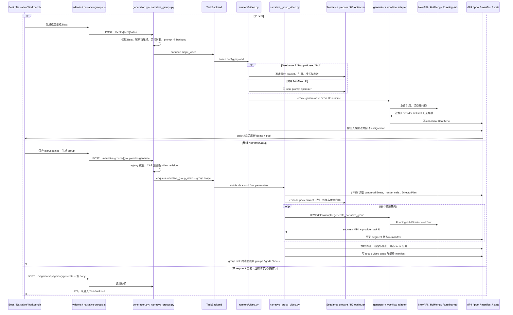

# Nuomi Drama Factory 视频生成管线

> **所属阶段**：核心生产管线 · 07 视频生成<br>
> **上游**：[声音与音频](06-audio.md)<br>
> **下游**：[合成与导出](08-compose-export.md)<br>
> **相关横向手册**：[共享系统地图](../system-map.md) · [功能反查](../development/trace-a-feature.md) · [新增 API 与长任务](../development/add-api-and-task.md) · [存储与项目文件](../development/storage-and-files.md) · [测试策略](../development/testing-strategy.md)<br>
> **代码核对基线**：`55504a0`<br>
> **返回**：[Nuomi Drama Factory 开发者 Cookbook](../README.md)

本页追踪 canonical 首帧、尾帧、Beat 文本与音频怎样进入单 Beat 或 NarrativeGroup 视频任务，以及生成结果怎样成为候选、当前视频或组合视频。这里的「单 segment」是 NarrativeGroup 的失败片段重试入口，不等同于单 Beat；成片合成、字幕与导出包由下一篇负责。

## 功能边界

| 能力 | 当前入口 | 任务 | 成功的含义 | 不负责什么 |
| --- | --- | --- | --- | --- |
| 单 Beat 生成或重生成 | Beat 工作台 `VideoPane` | `single_video`，按 episode + beat 标识 | provider 结果已写 canonical Beat MP4；视频池写入失败只记日志，不使任务失败 | 不更新 NarrativeGroup video stage，不自动重做成片 |
| 采用单 Beat 候选 | `VideoPane` 候选列表 | 同步 `video-pool-select` | pool 文件已复制为该 Beat 的 canonical MP4，assignment 已更新 | 不重新调用模型，不判断候选是否仍匹配当前提示词或首帧 |
| 整组导演视频 | Narrative Workbench「生成组合视频」 | `narrative_group_video`，scope 为 `group_<id>_video_r<revision>` | 各视频单元已生成；可用单元已本地拼接，manifest 与 group stage 已记录 | 不进入单 Beat 视频池；一个物理视频可以覆盖多个逻辑 Beat |
| 单 segment 重试 | 失败 segment 的「重试片段」 | 设计上仍进入 group video Runner，并用 `segment_id` 过滤 | 目标 segment 生成后应更新该 segment 与新 revision | 当前前后端请求契约不一致，现有按钮会先在请求校验处失败，不能视为可用恢复路径 |
| 视频方案与参数 | Narrative Workbench 的 Beat 边界编辑、组级清晰度 | 同步 PUT，随后生成时冻结 revision | 一或两个 Beat 的 unit 划分、workflow 与 overrides 已保存 | 只保存设置不会重生成既有视频 |

旧地址 `/_app/projects/$project/episodes/$episode/video` 只重定向到 Beat 工作台并设置 `sub=video`。单 Beat 的实际表单和候选采用在 `frontend/src/components/episode/beat-workbench/video-pane.tsx`；NarrativeGroup 视频在 `frontend/src/components/episode/narrative-workbench/`。

批量 `video_generation` Runner 仍然存在，会逐 Beat 调用与 `single_video` 相同的内部函数；当前本页重点入口是 Beat 工作台的单项任务和 Narrative Workbench 的组任务。不要把 `video_generation`、`single_video` 与 `narrative_group_video` 当成同一个 task scope。

## 核心原理

### 三类入口使用不同的状态单元

单 Beat API 从 SQLite 读取当前 Beat，在入队前解析首帧、下一 Beat 尾帧、提示词、音频时长和后端专用设置，并把快照放进 task payload。Runner 使用该快照生成 `videos/beats/epNNN/beat_NN.mp4`；任务终态后前端刷新 Beats 与视频池。

NarrativeGroup API 不接受客户端提交 frame path 或 Beat 正文。它先用 workflow registry 校验 model/mode/settings，按当前 video revision 与 plan revision 预留新 revision，再只把稳定标识和解析后的 workflow 参数入队。Runner 执行时重新读取 canonical Beats、materialized group、render stage 的 cell assets 与当前 DirectorPlan 投影，旧 revision 的结果不能覆盖新 revision。

单 segment API 不是独立的生成算法：它给同一 `_enqueue_group_video` 增加 `segment_id`，Runner 建完整 segments 后按 durable segment 顺序过滤一个目标。文件名追加 segment id 的哈希，避免直接复用整组输出名。

### 单 Beat backend 名称决定实际执行栈

单 Beat 页面从 `/video-backends` 读取能力，不在组件内维护完整列表。当前代码同时保留两种 MiniMax H3 标识，必须按字符串精确区分：

| backend | API / Runner 分支 | prompt 与质量路径 | 音轨行为 |
| --- | --- | --- | --- |
| `runninghub:minimax-h3` | API 的专用 `is_h3` 分支 → `generate_h3_video()` → H3 media pipeline | 单 Beat H3 prompt optimizer；连接类不可用时回退已有 draft；provider 后用 ffprobe 做候选质量检查 | 走 Director runtime，未在此分支主动剥离音轨 |
| `runninghub_minimax_h3` | 通用 generator 分支 → `RunningHubMiniMaxH3VideoGenerator` | 使用已有 prompt，经 legacy wrapper 调 RunningHub H3 | 下载后 `_strip_video_audio()`，写无声 MP4 |
| `newapi_*` / `huimeng_*` Seedance 系列 | `create_video_generator()` 解析模型；Seedance 2 先经过 `prepare_seedance2_generation_inputs()` | 合并并保存 `seedance2_config_json`，解析 `final_prompt`、素材引用、模式、清晰度、时长与返回尾帧 | 是否原生音频由模型与 `generate_audio` 配置决定；Seedance 1.5 有声只允许 dialogue Beat |
| HappyHorse / Grok channel | NewAPI generator，API 先构建受限图片引用与模型参数 | 复用 Seedance 资产面板的数据结构，但按各自 ratio、resolution、mode 与引用上限准备 | HappyHorse 可透传 `audio_setting`；Grok 分支不接收音频引用 |
| 其他 legacy backend | `create_video_generator()` 的 ComfyUI、Wan、Volcengine 等实现 | 使用 Beat 的 `video_prompt` / `keyframe_prompt` 和各实现自己的轮询、下载逻辑 | 由具体 generator 决定 |

`frontend/src/lib/queries/video.ts` 和 `SingleVideoRequest` 的兜底值仍是下划线标识，而项目媒体默认与 NarrativeGroup 使用冒号标识。正常 Beat 工作台会优先收到项目的 `video_backend`；修改默认值或迁移配置时仍须同时核对这两种历史标识，不能只改显示名称。

Higgsfield 当前不是运行时视频后端。仓库中的 Higgsfield 内容位于设计计划，用来描述角色状态表和生产方法；`create_video_generator()`、video workflow registry、API backend options 与 adapter registry 都没有 Higgsfield provider。它不能写进线上调用图，也不能作为 H3 不可用时的 fallback。

### 首帧、尾帧、参考素材与音频在 API 层准备

单 Beat 首帧由 `PathResolver.first_frame_for_video()` 解析，可按 `use_director_render` 选择来源；不存在时 API 不入队。Beat 的 `video_mode="keyframe"` 会尝试把下一 Beat 首帧作为尾帧，缺失时普通路径回退首帧模式，显式 H3 `fl2va` 则返回 400。冒号 H3 的 `auto` 在有尾帧时选 FL2VA，否则选 I2VA。

Seedance 2 会把项目角色、场景、道具、用户上传/裁剪素材、音频与 prompt 中的引用装配成 `ShotReference`；准备结果再次在 Runner 中解析，以得到最终 prompt、duration、mode、首尾帧和 references。HappyHorse 与 Grok 使用同一资产目录的图片子集，但按各自上限和参数转换，不代表它们具有 Seedance 2 的全部多模态语义。

基础时长先由 Beat 显式正时长、实际 MP3 时长、5 秒回退三者解析。之后各分支继续处理：H3 显式 `body.duration` 可覆盖基础值；Seedance 2 使用 prepare 结果；legacy/其他分支才把用户值提高到不小于 `ceil(audio_duration)`。NarrativeGroup 视频方案按 unit 保存 duration：单 Beat unit 取计划值或 Beat 时长，两 Beat unit 当前固定求两个 Beat 时长之和。

### H3 整组路径先计划 prompt，再逐单元生成

组级 plan 把连续 Beat 分成长度为一或二的 unit。singleton 使用自己的 render cell 首帧并生成 I2VA；pair 使用左 Beat render cell 为首帧、右 Beat render cell 为尾帧，合并动作、对白、speaker、tone 和时长形成 FL2VA。显式组级 `i2va` 会把保存的 pair 展开为 singleton；显式 `fl2va` 要求相应尾帧存在。

Runner 的 episode-pack optimizer 会把当前组放到同集已完成 render 的相邻组上下文中，结合 Director blocking、项目 style snapshot、frame hash 与文本模型生成类型化 DirectorPlan。每个计划先经过确定性的 H3 prompt quality gate；失败时只重写不合格 segment，预算耗尽则在调用视频 provider 前失败，并把 `quality_report` 写进 manifest。与单 Beat 不同，组级 optimizer 连接失败不会回退 raw prompt。

通过 prompt gate 后，当前 Runner 对每个 segment 分别调用 adapter，再用本地 FFmpeg 组合成功片段。单段失败被隔离：至少一个成功时 stage 可以成为 `partial_failure`；全部失败才整体抛错。完成后还会检查实际分辨率。只有分辨率不匹配时 runtime 允许先保留候选文件，再由 group Runner 将 stage 标成 `partial_failure`；其他 codec、时长、音频等质量错误会使 transport 路径失败。

组内任何 segment 采用 `external_tts` 时，Runner 尝试用 Demucs 分离原视频对白与 ambience。Demucs 未安装会记录 `unavailable` 并保留视频，但后续要求外部 TTS 的严格合成会因为缺少成功 ambience stem 而拒绝；全组 `h3_native` 不做 stem 分离。

### workflow resolver、adapter 与 provider profile 分层

NarrativeGroup registry 当前只注册 `runninghub:minimax-h3`，scene 固定为 `narrative_group`，参数只公开 `resolution=720p|1080p`。registry 负责可用性、scene、mode 与产品参数；`H3WorkflowAdapter` 把产品分辨率映射成 RunningHub Director 尺寸；runtime 再加载版本化 `minimax_h3.json` profile，把 timeline 语义绑定到实际 workflow node，并通过 provider 级并发协调器提交。

这层抽象允许将来增加 workflow definition 和 adapter，但「API 能接受 future registered model」的测试只证明扩展接口存在。当前 `_video_workflow_adapters()` 只有 `minimax-h3` adapter；新增 registry 项却不提供对应 adapter，Runner 仍会失败。

### 单 Beat 候选池与 NarrativeGroup manifest 不是同一种采用机制

每次单 Beat 生成先写 canonical MP4，再复制一份到 `pool/` 并把新 entry 设为当前 assignment。因此「生成成功」本身就是采用最新候选；用户切换旧候选时，`assign_video_to_beat()` 再把 pool 文件覆盖回 canonical。pool entry 记录 duration、video_mode、backend 和 prompt，但不记录首帧/尾帧哈希，也没有 stale gate。

NarrativeGroup 不写单 Beat pool。它保存 group/revision scoped 的物理视频和 manifest，manifest 把多个 timeline entry 映射到一个或多个 segment 输出，并记录最终 prompt 证据、provider task id、实际模式、尺寸与 stem 状态。合成阶段优先读取 completed NarrativeGroup manifest，只有未覆盖 Beat 才回退 canonical 单 Beat MP4。

### 现存实现缺口

- 前端 `useGenerateNarrativeGroupVideoSegment()` 对 segment 重试发送 `{}`，后端 `NarrativeGroupVideoRequest` 却要求 `revision` 与 `plan_revision`。当前按钮会得到 422，相关 Query 测试也没有覆盖这个请求 body。
- API 的 segment 入口仍以 task type `narrative_group_video` 入队；已注册的 `narrative_group_video_segment` 与 `video_segment_task_key()` 没接到该入口。前端也只跟踪当前 group 的 `narrative_group_video` scope，没有为 segment retry 调用 `start()`。
- `run_video_segment()` / `run_video_segments()` 定义了 TTS audio override 和并发隔离契约，但主 `_execute()` 没调用它；线上整组路径仍由 H3 生成音轨，外部 TTS 在后处理/合成阶段替换。不能把辅助函数的设计写成当前 provider 已接收外部音频。
- H3 media pipeline 的 `register_candidate` 在 runtime 中传入空回调；它会把任务与 attempt 写到 `runtime/media_h3/tasks.db`，但不会形成产品可选择的视频候选。可见候选仍只来自单 Beat `video_pool_index.json`。
- `NewApiVideoGenerator` 有 `video_request_usage` 与额度预留、确认、退款；H3 runtime 路径未调用这组 usage meter helper。调整 H3 计量时需要新增明确接点，不能假设共用 generator 基类便会自动计费。
- Higgsfield 没有 provider、profile、adapter 或 API option；当前只保留方法借鉴材料。

## 端到端调用链



## 关键代码索引

| 关注点 | 路径 | 关键符号 |
| --- | --- | --- |
| 旧视频路由重定向 | `frontend/src/routes/_app/projects.$project/episodes.$episode/video.lazy.tsx` | `VideoRedirect` |
| 单 Beat 表单、候选与任务刷新 | `frontend/src/components/episode/beat-workbench/video-pane.tsx` | `VideoPane`、`useTaskController`、`shouldDisableDialogueOnlyBackendForBeat` |
| 单 Beat Query 契约 | `frontend/src/lib/queries/video.ts` | `useRegenerateBeatVideo`、`useVideoBackends`、`useVideoPool`、`useVideoPoolSelect` |
| NarrativeGroup UI | `frontend/src/components/episode/narrative-workbench/narrative-group-workbench.tsx`、`group-video-stage.tsx`、`group-video-segment-list.tsx` | `runGroupVideo`、`retryVideoSegment`、`GroupVideoStage` |
| NarrativeGroup Query 契约 | `frontend/src/lib/queries/narrative-groups.ts` | `narrativeGroupVideoPayload`、`useGenerateNarrativeGroupVideo`、`useGenerateNarrativeGroupVideoSegment` |
| 单 Beat schema 与 API | `src/novelvideo/api/schemas.py`、`src/novelvideo/api/routes/generation.py` | `SingleVideoRequest`、`generate_single_video`、`_api_video_backend_options` |
| NarrativeGroup API | `src/novelvideo/api/routes/narrative_groups.py` | `NarrativeGroupVideoRequest`、`_enqueue_group_video`、`generate_video_group`、`generate_video_segment` |
| 单 Beat 与合成 Runner | `src/novelvideo/task_backend/runners/video.py` | `_run_single_video_async`、`run_video_generation`、`resolve_episode_composition_sources` |
| 组级 H3 Runner | `src/novelvideo/task_backend/runners/narrative_group_video.py` | `_build_segments`、`_optimize_missing_prompts`、`_execute`、`run_video_segment` |
| workflow 与 adapter | `src/novelvideo/media_capabilities/video/workflow_registry.py`、`adapters.py` | `build_video_workflow_registry`、`H3WorkflowAdapter` |
| H3 runtime、候选与质量 | `src/novelvideo/media_capabilities/video/runtime.py`、`pipeline.py`、`quality.py` | `generate_h3_director_video`、`H3VideoPipeline`、`validate_video` |
| H3 prompt 与 timeline | `src/novelvideo/media_capabilities/video/h3_episode_pack.py`、`h3_prompt_optimizer.py`、`h3_prompt_quality.py`、`h3_timeline.py` | episode pack、quality revisions、manifest |
| 通用 generator 工厂 | `src/novelvideo/generators/video_generator.py` | `create_video_generator`、`NewApiVideoGenerator`、`RunningHubMiniMaxH3VideoGenerator` |
| 单 Beat 视频池 | `src/novelvideo/generators/video_pool_indexer.py` | `add_video_to_pool`、`assign_video_to_beat` |

## 数据与产物

| 数据或产物 | 写入方 | 位置 | 读取方与语义 |
| --- | --- | --- | --- |
| Beat 视频配置 | 单 Beat API / Beat 更新 | SQLite Beat 的 prompt、mode、`seedance2_config_json` 等字段 | 页面恢复表单；API 与 Runner 准备 prompt、引用和模式 |
| canonical Beat 视频 | 单 Beat Runner / pool-select | `videos/beats/epNNN/beat_NN.mp4` | Beats API、普通合成 fallback；文件存在不证明最近一次任务成功 |
| 单 Beat 候选副本 | `add_video_to_pool` | `videos/beats/epNNN/pool/beat_NN_<timestamp>.mp4` | 候选列表与重新采用 |
| 视频池索引 | 视频池 helper | state 映射的 `video_pool_index.json`，首次读取可迁移旧 output-side index | entry 元数据与 `beat_assignments`；没有输入哈希或 stale 判断 |
| NarrativeGroup sidecar | API / group Runner | `.narrative_groups/epNNN.json` | video plan/settings、stage revision/status、segment 状态、video/manifest asset 与实际参数 |
| group/segment 视频 | group Runner | `videos/epNNN/narrative_groups/<group>_r<revision>[_segment_<hash>][_segment_NNN].mp4` | 本地组合、manifest 与最终成片源解析 |
| H3 Director manifest | group Runner | 与 group 输出同 stem 的 `.manifest.json` | prompt review、逻辑 Beat 时间线、音轨来源、合成与诊断 |
| H3 runtime artifact 与任务库 | H3 media pipeline | `runtime/media_h3/artifacts/`、`runtime/media_h3/tasks.db` | provider attempt、输入/实现快照、幂等恢复与质量证据 |
| H3 prompt cache | 单 Beat / group optimizer | state 下的 `h3_prompt_cache/`、`h3_episode_prompt_cache/` | frame/text/style/revision 对应的类型化 prompt 结果 |
| NewAPI 请求与额度记录 | `NewApiVideoGenerator` | `video_request_usage` 与 UsageMeter 后端 | accepted/completed/failed、额度预留/确认/退款；不覆盖 H3 runtime 路径 |
| stem 文件 | group Runner / Demucs | `videos/epNNN/narrative_groups/stems/` | `external_tts` Director 合成需要可用 ambience stem |

## 常见修改

### 修改 backend、provider 或 profile

1. **单 Beat 列表**：同步 `_api_video_backend_options()`、`VideoBackendOption` 与 `VideoPane` 的能力驱动控件；确认下划线/冒号 H3 是否迁移为同一标识，迁移前保留旧项目配置兼容。
2. **生成器**：普通模型更新 `create_video_generator()` 与对应 generator；NarrativeGroup 新模型需同时增加 `VideoWorkflowDefinition` 和真实 `VideoWorkflowAdapter`，只加 registry 项不足以执行。
3. **profile**：RunningHub node binding、output key 或 workflow revision 变化时更新版本化 profile、runtime loader 与 workflow tests；不能把远端 workflow id 写入前端 payload。
4. **可用性**：保持 provider enabled、credential、workflow id、profile invalid 的错误可区分，并验证 API 在入队前失败。
5. **计量**：NewAPI 修改要覆盖额度 quantity、resolution、确认与退款；H3 需要显式设计 usage meter 接点，并保留 `TaskStore` attempt 审计。

### 修改时长、清晰度、画幅或模式参数

1. 从后端 option/catalog 发布支持范围，前端按能力显示；服务端继续做最终校验，不能相信 UI 下拉框。
2. 单 Beat 同步 `SingleVideoRequest`、分支 prepare、Runner config 与 generator 参数名。特别核对音频时长下限、keyframe 缺尾帧回退和模型时长夹紧。
3. NarrativeGroup 同步 parameter definition、项目默认、group overrides、`resolve_workflow_parameters()`、H3 size setting、adapter 与 manifest 的 requested/actual 值。
4. 修改 unit 规则时同步 `update_video_plan()`、`_build_planned_segments()`、前端边界编辑和 plan revision CAS 测试。

### 修改提示词、参考图或音频准备

1. 单 Beat legacy prompt、Seedance 2 final prompt 和 H3 optimized prompt 是三套来源；修改字段时要核对 API 初始值、prepare 的二次解析、Runner payload 与候选池记录。
2. 参考图必须从项目内 canonical 资产解析。改变首帧来源时同步 `PathResolver`、`use_director_render`、Seedance asset status 和 H3 frame hash。
3. H3 group prompt 还依赖 episode 邻组、Director blocking、style snapshot 与 prompt/compiler profile version；改变任一输入都要检查 cache key 和 manifest review DTO。
4. 音频策略要区分 provider 原生音轨、独立 Beat MP3 和 Demucs ambience。若要让 provider 接收 external TTS，需把 `run_video_segment()` 的辅助契约真正接入 adapter/runtime，而不是只改合成标记。

### 修改质量判定

1. prompt gate 在 transport 前；视频 probe gate 在 provider 成功后。错误码、stage status、manifest entry status 和是否保留文件要分别定义。
2. H3 runtime 当前只放行「仅分辨率不匹配」的候选到 group Runner，再由后者记 `partial_failure`；改变规则时同步 `validate_video()`、runtime、Runner 和 prompt review 展示。
3. 单 Beat pool 没有 stale 或人工审核门禁。若增加首帧相似度、内容安全或人工采用，需要决定生成是否仍自动覆盖 canonical，并为旧 index 提供兼容字段。

### 修改候选采用与重试

1. 单 Beat 生成当前自动采用。若改为「只入池，用户选择后采用」，Runner 不应先覆盖 canonical，前端任务完成也不能假设 `video_url` 已变化。
2. `video-pool-select` 需要维持 project scope、entry 文件存在检查、原子 index 写入和 Beats cache patch；增加 stale gate 时必须提供强制采用的显式语义。
3. 修复 segment retry 时，前端需发送 current video revision、plan revision、settings revision、model/mode/aspect/参数，并用 API 返回的新 scope 启动 task controller；API 决定使用 `narrative_group_video_segment` 还是继续共用 group task type后，Runner 注册与任务 key 要一致。
4. partial failure 重试必须明确是重建整组最终物理视频，还是只修复 segment 并与已成功 segment 重组。当前每次 API 调用都会预留新的整组 video revision，不能静默覆盖旧 revision 的部分文件。

### 跨层影响检查

| 改动 | API / 前端 | resolver / adapter | 计量 | Runner / 数据 | 测试重点 |
| --- | --- | --- | --- | --- | --- |
| backend/profile | option、catalog、默认值、错误提示 | generator factory、workflow registry、profile binding | model id、resolution、quantity | payload 快照、actual provider/model | backend contract、catalog、workflow、transport |
| 参数 | schema、控件、project/group default | parameter resolver、size mapping | 价格维度 | manifest requested/actual、候选 metadata | 参数拒绝、CAS、尺寸探测 |
| prompt/引用 | prompt API、资产面板、review DTO | asset resolver、optimizer、adapter upload | 文本优化调用与视频调用分开 | cache key、hash、manifest evidence | 注入防护、cache invalidation、首尾帧 |
| 质量 | 状态与可操作错误 | quality gate | 失败是否退款 | 文件保留、stage status、candidate status | transport 未调用、partial failure、幂等复检 |
| 候选采用 | 候选 UI、select API | 不应重调 provider | 不新增模型调用 | canonical copy、assignment、stale | 跨 Beat 隔离、缺文件、cache patch |
| 重试 | revision body、scope、task controller | 是否复用 active attempt | 避免重复确认/退款 | 新 revision、segment 合并、旧结果隔离 | 422 契约、队列失败恢复、晚到结果 |

## 失败诊断

| 现象 | 优先检查 |
| --- | --- |
| 旧 `/video` 页面没有生成表单 | 这是重定向页；到 Beat 工作台 `sub=video`，组视频到 Narrative Workbench |
| 点击单 Beat 生成立即提示首帧不存在 | `PathResolver.first_frame_for_video()` 选到的 canonical render 是否存在，`use_director_render` 是否与实际来源一致 |
| H3 名称相同但结果有声/无声或 prompt 行为不同 | task payload 中 backend 是 `runninghub:minimax-h3` 还是 `runninghub_minimax_h3`；两者当前走不同 Runner 分支 |
| Seedance 1.5 有声拒绝生成 | Beat `audio_type` 必须精确为 `dialogue`；narration/silence 会在 API 入队前被拒绝 |
| Seedance 2 页面有素材但 provider 没收到 | `seedance2_config_json` 的 selection、引用 path 是否存在、prepare 后 references 与最终 prompt 中引用是否一致；不要只看上传列表 |
| 生成成功但视频池没有新条目 | task result 的 `video_path` 是否存在、Runner 日志中的「添加到视频池失败」；该错误是非致命的 |
| 采用旧候选后内容与当前 Beat 不匹配 | pool 没有 frame/prompt stale gate；核对 entry 的 backend/prompt/时间和实际画面后再采用 |
| group 返回 409 stale | video stage revision、plan revision 或 settings revision 已变化；刷新 group 后用当前值重提，不要复用旧 payload |
| group 在 provider 调用前失败 | manifest 是否为 `quality_rejected`，查看 prompt profile、quality report；也检查 optimizer 连接失败，组级路径不会回退 raw prompt |
| group 有 MP4 但 stage 是 partial failure | segment error 或实际分辨率 mismatch；读取 manifest entry status、provider/actual output，不能把文件存在当成 completed |
| external TTS 合成提示缺 ambience stem | manifest 的 `ambience_stem_status` 是否为 `succeeded`；Demucs `unavailable` 会保留视频，但不满足严格合成 |
| 点击「重试片段」得到 422 | 当前前端发送空 body，后端要求 revision 与 plan_revision；这是已知契约缺口，任务尚未入队 |
| 增加 future workflow 后 API 可提交、Runner 却失败 | registry definition 的 `adapter_key` 是否在 `_video_workflow_adapters()` 注册真实 adapter |
| 视频调用没有预期的额度记录 | 先区分 NewAPI generator 与 H3 media runtime；当前只有前者接入 `video_request_usage` 和 UsageMeter helper |
| Higgsfield 配置找不到 | 当前没有 Higgsfield runtime backend；相关计划不是线上 provider 配置 |

## 验证

先用稳定符号核对三类入口、两套 H3 标识、resolver/adapter、候选与计量边界：

```bash
rg -n 'VideoRedirect|useRegenerateBeatVideo|useVideoPoolSelect|single_video|runninghub_minimax_h3|runninghub:minimax-h3' \
  frontend/src/routes/_app/projects.\$project/episodes.\$episode/video.lazy.tsx \
  frontend/src/components/episode/beat-workbench/video-pane.tsx \
  frontend/src/lib/queries/video.ts \
  src/novelvideo/api/{schemas.py,routes/generation.py} \
  src/novelvideo/task_backend/runners/video.py

rg -n 'useGenerateNarrativeGroupVideo|useGenerateNarrativeGroupVideoSegment|plan_revision|settings_revision|segment_id|narrative_group_video_segment' \
  frontend/src/lib/queries/narrative-groups.ts \
  frontend/src/components/episode/narrative-workbench/narrative-group-workbench.tsx \
  src/novelvideo/api/routes/narrative_groups.py \
  src/novelvideo/task_backend/runners/narrative_group_video.py

rg -n 'build_video_workflow_registry|H3WorkflowAdapter|generate_h3_director_video|H3VideoPipeline|validate_video|create_video_generator' \
  src/novelvideo/media_capabilities/video/{workflow_registry,adapters,runtime,pipeline,quality}.py \
  src/novelvideo/generators/video_generator.py

rg -n 'add_video_to_pool|assign_video_to_beat|video_pool_index|reserve_current_model_call_credit|record_video_request' \
  src/novelvideo/generators/{video_generator,video_pool_indexer}.py \
  src/novelvideo/task_backend/runners/video.py

rg -ni 'higgsfield|higgs' \
  src/novelvideo frontend/src tests docs/plans/2026-08-30-higgsfield-production-workflow-integration-plan.md
```

后端提交门禁先聚焦当前稳定的单 Beat H3 分支、返回尾帧、候选池、组级 settings、workflow 参数与质量函数：

```bash
.venv/bin/pytest -q \
  tests/test_task_video_runner_h3.py \
  tests/test_task_video_runner_returned_last_frame.py \
  tests/test_video_pool_static_urls.py \
  tests/test_narrative_group_video_settings.py \
  tests/media_capabilities/video/test_parameters.py \
  tests/media_capabilities/video/test_quality.py \
  tests/media_capabilities/video/test_workflow_registry.py
```

前端聚焦 backend 能力、单 Beat 候选、整组 payload/plan 与 segment UI：

```bash
cd frontend
pnpm exec vitest run \
  src/__tests__/routes/video-backend-options-contract.test.ts \
  src/__tests__/lib/queries/video-backends.test.tsx \
  src/__tests__/lib/queries/narrative-groups.test.ts \
  src/__tests__/components/episode/beat-workbench/video-pane.test.tsx \
  src/__tests__/components/episode/narrative-workbench/group-video-stage.test.tsx \
  src/__tests__/components/episode/narrative-workbench/group-video-submit.test.ts
```

### 已知基线差异 / 复现

当前聚焦全链路集合不是绿色门禁。以下命令在本页核对时得到 **144 passed、15 failed**；失败来自实现与旧断言的既存差异，不能因本次只新增文档而改动业务代码或把结果报告为全绿：

```bash
.venv/bin/pytest -q \
  tests/test_task_video_runner_h3.py \
  tests/test_task_video_runner_returned_last_frame.py \
  tests/test_video_pool_static_urls.py \
  tests/test_api_narrative_groups.py \
  tests/test_task_narrative_group_video_runner.py \
  tests/test_narrative_group_video_settings.py \
  tests/media_capabilities/video/test_adapters.py \
  tests/media_capabilities/video/test_parameters.py \
  tests/media_capabilities/video/test_quality.py \
  tests/media_capabilities/video/test_workflow_registry.py
```

- `tests/test_api_narrative_groups.py` 有 2 项失败：当前 enqueue payload 多出空 `segment_id`；UNC 风格尾帧路径仍被序列化成媒体 URL。
- `tests/test_task_narrative_group_video_runner.py` 有 12 项失败：多项测试仍 patch 已移除的 `create_h3_prompt_optimizer`，而实现已切到 episode-pack optimizer；另有用例未提供当前 Runner 要求的可用 workflow 或 materialized segment 列表。
- `tests/media_capabilities/video/test_adapters.py` 有 1 项失败：future adapter 用例没有 materialized group，Runner 在定位 durable segment id 时触发 `StopIteration`。

这些差异同时说明 segment materialization、prompt optimizer 切换和安全路径序列化仍需要契约收敛。修改相关代码时应逐项恢复测试，而不是扩大异常捕获或删除断言。

提交前检查链接、空白错误、未完成标记、本机路径与改动范围；第二条命令应无输出，退出码 1 表示未命中：

```bash
git diff --check -- docs/cookbook/pipelines/07-video.md
rg -n 'T[O]DO|T[B]D|待[补]|占[位]|/(U[s]ers|h[o]me|private|tmp|var)/|[A-Za-z]:[\\][\\]' \
  docs/cookbook/pipelines/07-video.md
test -f docs/cookbook/pipelines/06-audio.md \
  && test -f docs/cookbook/pipelines/08-compose-export.md \
  && test -f docs/cookbook/system-map.md \
  && test -f docs/cookbook/development/trace-a-feature.md \
  && test -f docs/cookbook/development/add-api-and-task.md \
  && test -f docs/cookbook/development/storage-and-files.md \
  && test -f docs/cookbook/development/testing-strategy.md
git diff --name-only -- docs/cookbook/pipelines/07-video.md
```

修改 provider 参数或 codec 处理时，再增加一个真实生成冒烟：确认 provider task id、MP4 可被 ffprobe 读取、分辨率/时长/音轨符合分支契约，选择旧候选后 canonical 文件确实变化，并让下一阶段用同一 manifest 或 Beat MP4 完成合成。只写任意 bytes 的单元测试不能替代媒体探测。

## 继续追踪

- 上游音频、声音来源与 MP3 时长从[声音与音频](06-audio.md)继续追踪。
- 首帧、尾帧、NarrativeGroup render cell 与图片候选从[分镜与图像](05-storyboard.md)继续追踪。
- Director manifest、音轨替换、字幕、FFmpeg 和最终成片从[合成与导出](08-compose-export.md)继续追踪。
- 任务身份、scope、终态刷新与取消见[新增 API 与长任务](../development/add-api-and-task.md)；project/output/state/runtime 边界见[存储与项目文件](../development/storage-and-files.md)。
- 返回 [Cookbook 首页](../README.md)。
