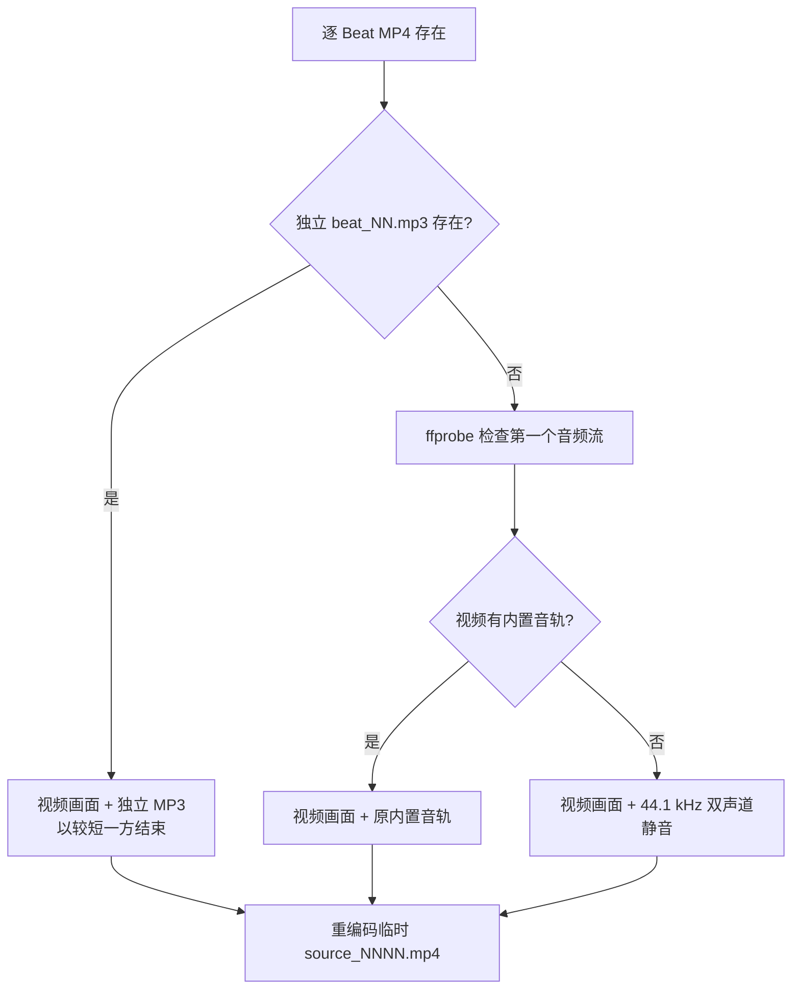
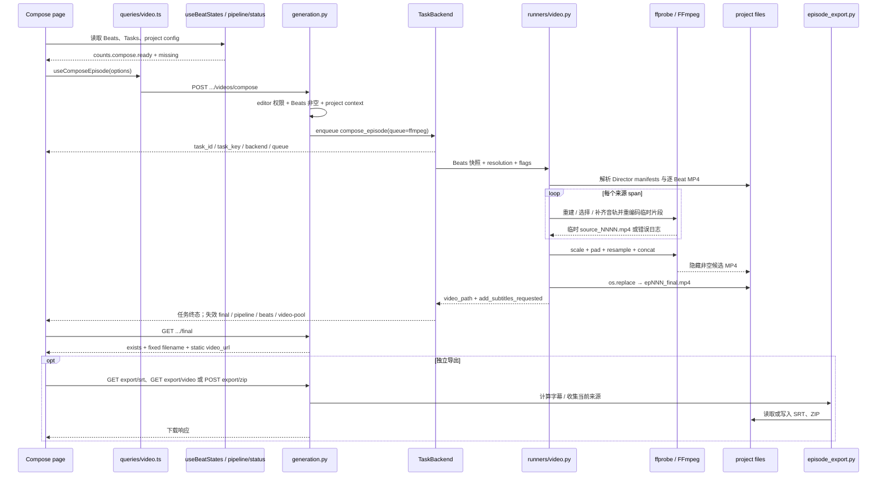

# Nuomi Drama Factory 合成与导出管线

> **所属阶段**：核心生产管线 · 08 合成与导出<br>
> **上游**：[视频生成](07-video.md)<br>
> **下游**：无；成片与导出包是核心生产管线的末端产物<br>
> **相关横向手册**：[共享系统地图](../system-map.md) · [功能反查](../development/trace-a-feature.md) · [新增 API 与长任务](../development/add-api-and-task.md) · [存储与项目文件](../development/storage-and-files.md) · [测试策略](../development/testing-strategy.md)<br>
> **代码核对基线**：`55504a0`<br>
> **返回**：[Nuomi Drama Factory 开发者 Cookbook](../README.md)

本页追踪 Compose 页怎样判断一集能否合成，`compose_episode` 怎样选择 Director 与逐 Beat 视频、重建音轨并用 FFmpeg 发布固定成片，以及 SRT、成片和 ZIP 三类导出怎样读取这些文件。这里有三套相邻但不相同的“就绪”判断：页面门禁、`pipeline/status` 的导航状态和后端 Runner 的真实校验。排错和修改时不能把其中一套当成另外两套。

## 功能边界

| 能力 | 当前入口 | 执行方式 | 成功的含义 | 不负责什么 |
| --- | --- | --- | --- | --- |
| 首次合成 / 重新合成 | Compose 页 → `useComposeEpisode()` | `POST .../videos/compose` 排入 `compose_episode`，队列类型为 `ffmpeg` | 至少一个来源片段成功，最终拼接生成非空候选，并原子替换固定成片 | 页面选中的“字幕”不会烧入视频；请求中的 BGM 也不会混入 |
| 查看已有成片 | Compose 页 → `useFinalVideo()` | `GET .../final` 同步检查固定文件 | 返回文件是否存在；存在时附静态播放 URL | 不校验 MP4 是否可解码、是否对应当前 Beat，也不返回生成历史 |
| 下载成片 | Compose 页“下载视频” | `GET .../export/video` 返回 `FileResponse` | 固定成片存在并作为 `video/mp4` 下载 | 不触发合成；文件缺失时返回 404 |
| 导出字幕 | Compose 页“导出 SRT” | `GET .../export/srt` 现场计算 SRT | Beats 存在，且至少一条字幕文本非空 | 不做语音识别，不把字幕烧入成片 |
| 导出素材包 | Compose 页“导出 ZIP” | `POST .../export/zip` 现场生成 SRT 和 ZIP | 可收集到至少一个音频、已解析视频、成片或 SRT | 不是历史快照；同名 ZIP 会覆盖，且使用 `ZIP_STORED` 不压缩 |

`src/novelvideo/generators/video_composer.py` 中还保留 `VideoComposer`、`MoviePyComposer`、片头片尾、Ken Burns 和 `add_subtitles()` 等通用工具，但当前 `/videos/compose` → `compose_episode` 路径没有创建或调用这些类。修改该文件不会自动改变 Compose 页的成片行为；当前活跃实现位于 `src/novelvideo/task_backend/runners/video.py`。

## 核心原理

### 三套门禁回答不同问题

| 检查位置 | 判定依据 | drama 音频 | Director 产物 | 后果 |
| --- | --- | --- | --- | --- |
| Compose 页 | `useBeatStates()` 从 Beats API 的 `audio_url` / `video_url` 逐 Beat 计算 | 不要求独立 MP3 | 取决于 Beats API 是否投影出 `video_url` | `counts.compose.ready` 控制按钮；缺项卡片只是一层前端提示 |
| `GET /pipeline/status` | 固定目录中每个真实 Beat 编号是否都有 `beat_NN.mp3` / `beat_NN.mp4`，且更早阶段都已完成 | 始终要求 MP3 | 只检查逐 Beat 固定 MP4，不读取 Director manifest | 决定全局导航的 `next_step`；只有音频、视频等顺序条件全真且成片缺失时才返回 `compose_episode` |
| Compose API / Runner | API 只要求 Store 中 Beats 非空；Runner 再解析实际可用的视频 span 和必要音轨 | 普通 span 可用独立 MP3、内置音轨或静音 | 完成态 manifest + 物理视频优先覆盖相应 Beat | 后端不会照抄页面逐 Beat 门禁；部分来源缺失时仍可能生成一部只含可用片段的成片 |

页面中的 narrated 项目要求每个 Beat 同时有音频和视频；`spine_template="drama"` 只要求视频，因为这类视频通常自带声音。草图、首帧和剧本文本不参与页面 Compose 门禁。

`pipeline/status` 更严格也更机械：它不区分 drama/narrated，并按固定逐 Beat 文件序列检查 TTS 和视频；它还要求身份、剧本、分镜、配色、全局优化、首帧等更早状态依次完成。该端点适合决定“下一步去哪里”，不等于 `compose_episode` 的前置校验。

后端 API 取得 editor 权限与项目上下文后，只检查 `beats` 非空，然后把 Beats 快照、`add_subtitles`、`add_bgm`、`resolution` 和输出目录放入任务。Runner 不再验证“每个 Beat 都有视频”，而是合成解析得到的来源；若部分逐 Beat MP4 缺失，它们不会进入来源列表。只有完全没有成功片段时才以“没有可用的视频片段”失败。

### Director span 优先，逐 Beat MP4 补空位

`resolve_episode_composition_sources()` 先读取 materialized NarrativeGroup。只有 video stage 为 `completed`、`manifest_asset` 存在、manifest 可读取且 `physical_video` 存在的组才成为 Director span。一个 span 保留多个逻辑 Beat 的 timeline entry，但物理视频只放入最终时间线一次，排序位置取其最早 Beat；manifest 覆盖的 Beat 不再重复加入旧逐 Beat MP4。

剩余 Beat 再按 `PathResolver.video(beat_num)` 查找 `videos/beats/epNNN/beat_NN.mp4`。存在的文件按 Beat 顺序加入，不存在的文件直接略过。最终来源按最早 Beat 排序，因此 Director 与旧逐 Beat 视频可以交错迁移。

Director span 还有一层合成时的严格音频检查：

1. 只含 `h3_native` entry 时，不要求 ambience stem；每段声音从物理视频的原音轨按 manifest 起止时间裁出。
2. 只要有任一 `external_tts` entry，manifest 就必须标记 `ambience_stem_status="succeeded"`，且 stem 文件存在，否则来源解析直接失败。
3. 每个 `external_tts` entry 还必须存在对应的 `audio/epNNN/beat_NN.mp3`；Runner 把该 MP3 截到 entry 的实际时长，与 ambience 的对应区间用 `amix=duration=first` 混合。
4. 各 entry 的音频片段按 manifest 顺序连接，再与 Director 物理视频配对。`h3_native` 与 `external_tts` 可以出现在同一个 span 中。

### 每个普通 Beat 的音轨按三级回退

逐 Beat MP4 进入临时片段时，音轨选择顺序固定：



独立 MP3 的优先级高于视频内置音轨，并使用 `-shortest`，所以视频与 MP3 时长不一致时会截到较短一方。没有 MP3 时才用 `ffprobe` 检查内置音轨；两者都没有则注入无限静音源，再由 `-shortest` 跟随视频结束。三条分支都把画面重编码为 H.264，把声音编码为 AAC 128 kbps，并输出 `yuv420p`。

单个来源的 FFmpeg 失败只写任务日志并继续。只要后面仍有成功临时片段，任务会拼出部分成片；排错时需要同时核对任务日志、来源数量和最终内容，不能只看任务终态。

### 最终拼接统一画幅，并原子发布

Runner 把 `resolution` 按 `宽x高` 拆成整数。解析失败时不会拒绝请求，而是回退 `720x1280`。当前页面只提供随项目方向变化的四个合法值：竖屏 `720x1280` / `1080x1920`，横屏 `1280x720` / `1920x1080`；选择后也会写回项目配置 `video_resolution`。

最终 FFmpeg 对每个临时片段执行：

- 按目标宽高等比缩放，黑边居中补齐；
- 设置方形像素并统一为 `yuv420p`；
- 音频重采样到 44.1 kHz；
- 用 filter graph 的 `concat` 连接所有视频与音频；
- 再编码为 H.264（`preset=fast`、`crf=23`）和 AAC 128 kbps。

当前任务没有接收或指定 FPS，FFmpeg 命令中也没有 `-r` / `fps` filter。`VideoComposer` 构造器中的 `fps` 与 `get_video_config()["fps"]` 属于未接入当前路由的另一套工具，不能用来调整 `compose_episode` 的最终帧率。

最终 FFmpeg 不直接写 `epNNN_final.mp4`，而是在同一目录创建隐藏候选 `.epNNN_final.<随机>.tmp.mp4`。只有 FFmpeg 返回成功、候选存在且非空，并再次通过取消检查后，才用 `os.replace()` 原子替换固定成片。成功重合成会覆盖旧成片并保留旧文件权限；新文件默认权限为 `0644`。失败、超时或取消会删除候选并保留旧成片。

这条路径没有成片 revision、候选采用或媒体归档。任务系统仍记录每次任务状态和日志，但 `GET /final`、播放和下载都只指向当前固定文件；临时来源片段随任务临时目录删除。

### 字幕和 BGM 参数当前不改变成片

页面把字幕开关写回项目配置，并在请求中发送 `add_subtitles`；BGM 开关已从页面移除，但请求仍明确发送 `add_bgm: false`。API 把两者放入任务 payload。

当前 Runner 只读取 `add_subtitles`，并把它原样回显为结果字段 `add_subtitles_requested`；没有生成 SRT、没有调用字幕滤镜，也没有把字幕烧进成片。`add_bgm` 在 Runner 中完全没有读取。`video_composer.py` 虽然实现了 `add_subtitles()`，活跃任务没有调用它。因此：

- 切换“添加字幕”会保存偏好并改变请求/结果元数据，但当前视频像素不变；
- 无论发送 `add_bgm=true` 还是 `false`，当前合成音轨都不加入 BGM；
- SRT 是独立导出物，与 Compose 页字幕开关无关。

### SRT、成片与 ZIP 是三条独立导出路径

SRT 每次请求都从 Store 读取 Beats，并调用 `build_srt_content()`：

- 没有 Director span 时，按 Beats 原顺序累计时间。存在 MP3 就用 `ffprobe` 取得实际时长；文件缺失或探测异常时回退 5 秒。字幕文本只取 `narration_segment`。
- 只要解析结果中有 Director span，整条时间轴改为混合 span 模式。Director entry 使用 manifest 的真实 `start_seconds` / `end_seconds`，无字幕的静音 entry 仍推进时间；文本先取 `entry.segment.dialogue`，为空才回退对应 Beat 的 `narration_segment`。夹在其中的旧逐 Beat span 仍按 MP3 或 5 秒累计。
- 空字幕不会产生序号，但时间仍推进。时间格式由 `format_srt_time()` 生成 `HH:MM:SS,mmm`。

`GET /export/srt` 直接返回内存中的文本，服务端下载名为 `epNNN.srt`。ZIP 路径会额外把同样内容写到 `videos/episodes/epNNN.srt`，然后收集：

| ZIP 内路径 | 内容 |
| --- | --- |
| `audio/beat_NN.mp3` | 当前 Beats 中实际存在的逐 Beat 音频 |
| `video/group_NNN_<源文件名>` | `resolve_episode_composition_sources()` 得到的每个 Director 或旧逐 Beat 物理视频 |
| `manifests/group_NNN_<manifest文件名>` | Director manifest（存在时） |
| `stems/group_NNN_<stem文件名>` | Director ambience / original audio stem（存在时） |
| `epNNN_final.mp4` | 固定成片（存在时） |
| `epNNN.srt` | 现场生成且非空的字幕（存在时） |

服务端 ZIP 文件名为 `<project_name>_第<episode>集.zip`，同名导出会覆盖上一次文件。前端使用 `<project>_ep<episode>.zip` 作为浏览器下载名；SRT 前端名同理为 `<project>_ep<episode>.srt`。视频接口响应名是 `epNNN_final.mp4`，前端下载名为 `<project>_epNNN_final.mp4`。

ZIP 与 SRT 都复用来源解析器的默认严格模式。因此 Director manifest 声明 `external_tts` 却缺 ambience stem 时，即使只想导字幕或打包，也可能在解析阶段失败。ZIP 不是简单遍历目录：未被当前 Beats / manifest 解析到的旧文件和临时候选不会进入包。

## 端到端调用链



Compose 页用 `useTaskController` 跟踪 episode 级 `compose_episode`。任务完成时会失效 pipeline status、video pool、Beats 和 final-video query；Runner 结果没有 `video_url`，页面通常依靠失效后的 `GET /final` 水合播放器。刷新页面时同一个 GET 也会发现磁盘上的既有成片。重新合成期间页面清空预览且暂停旧 URL 水合，新任务失败后固定旧文件仍可能再次被 GET 发现。

## 关键代码索引

| 关注点 | 路径 | 关键符号 |
| --- | --- | --- |
| Compose 页面、偏好、下载名与任务刷新 | `frontend/src/routes/_app/projects.$project/episodes.$episode/compose.lazy.tsx` | `ComposeTabContent`、`handleCompose`、`handleExport`、`handleDownloadVideo` |
| 页面逐 Beat 门禁 | `frontend/src/hooks/use-beat-states.ts`、`frontend/src/lib/derive-beat-states.ts` | `useBeatStates`、`computeCounts`、`deriveBeatStates` |
| 合成与 final query | `frontend/src/lib/queries/video.ts` | `useComposeEpisode`、`useFinalVideo` |
| 全局流水线导航状态 | `src/novelvideo/api/routes/pipeline.py` | `pipeline_status`、`_beat_file_series_complete`、`_STEP_MAP` |
| 请求 schema 与生成/导出 API | `src/novelvideo/api/schemas.py`、`src/novelvideo/api/routes/generation.py` | `VideoComposeRequest`、`compose_video`、`get_final_video`、`export_srt`、`export_final_video`、`export_zip` |
| 任务注册、来源解析与 FFmpeg 合成 | `src/novelvideo/task_backend/runners/video.py` | `VideoSpan`、`resolve_episode_composition_sources`、`run_compose_episode`、`_video_has_audio_stream` |
| 字幕与 ZIP | `src/novelvideo/export/episode_export.py` | `format_srt_time`、`build_srt_content`、`build_episode_srt_file`、`build_episode_zip_file` |
| 固定项目路径 | `src/novelvideo/utils/path_resolver.py` | `PathResolver.audio`、`video`、`final_video` |
| 未接入当前任务的通用合成器 | `src/novelvideo/generators/video_composer.py` | `VideoComposer`、`MoviePyComposer`、`add_subtitles`、`create_video_composer` |
| 任务名称展示 | `src/novelvideo/api/routes/tasks.py` | `TASK_TYPE_LABELS["compose_episode"]` |

## 数据与产物

| 数据或产物 | 写入方 | 位置 | 读取方与语义 |
| --- | --- | --- | --- |
| 逐 Beat 视频 | 视频生成 / 候选采用 | `videos/beats/epNNN/beat_NN.mp4` | 未被 Director span 覆盖时作为普通合成来源 |
| 逐 Beat 音频 | 音频生成 | `audio/epNNN/beat_NN.mp3` | 普通 Beat 优先音轨、Director `external_tts`、字幕时长与 ZIP |
| Director manifest | NarrativeGroup 视频生产 | manifest 的 materialized stage 路径 | 决定物理视频、逻辑 Beat 边界、音源类型与 stems |
| Director 物理视频 / stems | Director 视频生产 | manifest 内的 `physical_video`、`ambience_stem_path`、`original_audio_path` | Director 合成、混合字幕时间线和 ZIP |
| 最终成片 | `compose_episode` | `videos/episodes/epNNN_final.mp4` | `pipeline/status`、`GET /final`、播放、视频下载和 ZIP |
| 服务端 SRT 文件 | ZIP 导出 | `videos/episodes/epNNN.srt` | ZIP 根目录；单独 SRT 导出只生成响应文本，不保证写此文件 |
| ZIP | ZIP 导出 | `videos/episodes/<project_name>_第<episode>集.zip` | API `FileResponse`；下次同名导出原地覆盖 |
| Compose 偏好 | 项目更新 API | `project_config.json` 的 `video_resolution`、`add_subtitles` | 页面初始化与下一次 compose payload；字幕偏好当前不改变视频 |
| 任务状态与日志 | TaskBackend / Runner | state SQLite 的任务记录 | Task Center、取消、进度和逐来源 FFmpeg 错误 |

固定成片和 ZIP 都没有媒体 revision。成片通过同目录候选原子发布，ZIP 则直接以同名路径重写；不要把它们当成可回退历史。若业务需要历史版本，应先设计版本名、采用指针、清理策略和 GET/download 契约，不能只在文件名后追加时间戳。

## 常见修改

### 修改页面或后端合成门禁

1. **页面条件**：调整 `computeCounts()` 时明确 drama 与 narrated 是否仍不同，并覆盖 `audio_url` / `video_url` 的缺失组合。
2. **全局导航**：若 `pipeline/status` 也应识别 drama 或 Director span，要同步 `_beat_file_series_complete` 与阶段顺序；只改页面不会改变 `next_step`。
3. **API 预检**：若要求后端拒绝不完整剧集，应在入队前或 Runner 开始时用与来源解析一致的规则校验；不能依赖前端 disabled。
4. **部分成功**：决定单个来源 FFmpeg 失败是否继续。改成 fail-fast 时要保留旧成片，并更新任务日志和原子发布测试。
5. **Director 音频**：修改 `external_tts` 门禁时同步 compose、SRT、ZIP 的 strict/read-only 使用方式，避免导出与合成出现无意耦合。

### 修改分辨率或帧率

1. **页面选项**：同步 `Resolution` union、方向映射、显示标签和项目配置水合；当前 UI 只暴露 720p / 1080p 两档及横竖尺寸。
2. **请求契约**：`VideoComposeRequest.resolution` 当前是未校验字符串。若收紧为枚举或尺寸对象，要同步 `queries/video.ts` 与兼容配置值（例如旧 `1080p`）。
3. **Runner**：修改解析回退、最终 `scale/pad` filter 与像素格式；确认 Director 和普通来源都经过相同最终规范化。
4. **FPS**：需要新增 schema、页面/配置、payload 和 Runner 处理，并在来源规范化与最终 concat 中显式统一 FPS。只改 `video_composer.py` 或全局 `VIDEO_FPS` 不影响当前任务。
5. **验证**：用真实 `ffprobe` 核对宽、高、sample aspect ratio、pix_fmt、avg_frame_rate、音频采样率与可播放性。

### 让字幕真正进入成片

1. **先确定语义**：区分“导出独立 SRT”“内封字幕流”和“烧录到像素”；当前开关文案没有落实其中任何一种。
2. **共用时间线**：复用 `build_srt_content()` 的 Director / legacy 时序，不要另写一套按 Beat 固定时长的字幕逻辑。
3. **执行位置**：在最终候选上增加字幕 mux/filter，或把字幕纳入最终 filter graph；仍需在所有步骤成功后才 `os.replace()`。
4. **转义与字体**：若调用 `subtitles=` filter，覆盖路径中的引号、冒号、反斜杠和中文字体可用性。
5. **契约与结果**：让 `add_subtitles` 影响任务结果和 GET 可观测信息；此前只回显 `add_subtitles_requested`，不能据此宣称已烧录。

### 修改 ZIP 内容

1. **来源范围**：确认是打包当前采用来源、整个目录，还是所有历史候选；当前只打包 resolver 命中的来源。
2. **内部命名**：保留 `group_NNN_` 命名空间可避免多个 Director 组的 `manifest.json` / `original.wav` 冲突。若去掉前缀，需要另做去重。
3. **字幕副作用**：`build_episode_zip_file()` 会写服务端 SRT；若希望纯读导出，要改为内存写 ZIP 并覆盖相应测试。
4. **压缩与大文件**：当前 `ZIP_STORED` 且在请求生命周期内构建。改用压缩、流式响应或异步任务时要同步超时、磁盘空间和清理策略。
5. **权限与安全**：继续从已解析 `Path` 构造 arcname，避免把绝对路径或项目外文件名泄露进 ZIP。

### 修改最终命名或历史策略

1. **固定文件消费者**：同步 Runner、`PathResolver.final_video()`、`pipeline/status`、`GET /final`、视频导出、ZIP 和 Compose 页展示名。
2. **浏览器下载名**：服务端 `Content-Disposition` 与前端 `<a download>` 当前不同；修改时明确哪个是用户最终看到的名称。
3. **重合成语义**：若从覆盖改为 revision + adopt，需要增加当前指针或采用记录，并让 GET、下载、ZIP 和 pipeline status 只读取已采用版本。
4. **失败保留**：无论命名如何变化，都保留“候选非空 + 取消检查 + 原子发布”的顺序，避免失败重合成破坏可播放旧成片。
5. **清理**：历史版本、失败候选、ZIP 和 SRT 应分别定义保留周期；当前只有临时候选在 `finally` 中删除。

## 失败诊断

| 现象 | 先查什么 | 代码事实与处理 |
| --- | --- | --- |
| 页面合成按钮灰色 | `counts.compose.missing`、项目 `spine_template`、Beats API 的 `audio_url` / `video_url` | narrated 缺任一 Beat 音频或视频都会阻塞；drama 只看视频。先区分文件不存在与 API 未投影 URL |
| `pipeline/status` 一直不进入 compose | `episode_status` 中第一个 false、固定逐 Beat MP3/MP4 | 它按固定阶段顺序且始终要求音频，不识别页面的 drama 例外；Director-only 产物也可能不满足逐 Beat视频检查 |
| 绕过页面后 API 仍创建了“不完整”任务 | Store 是否至少有一个 Beat | API 只检查 Beats 非空；完整性由 Runner 的实际来源决定。需要强校验时应补后端规则 |
| 成片缺少几个 Beat，但任务 completed | 任务逐来源日志、缺失 MP4、失败 FFmpeg stderr | 来源缺失会略过，单片失败也会继续；只要至少一个片段成功就可能发布部分成片 |
| drama 没有 MP3 仍能合成 | Beat MP4 是否有音频流 | 普通 span 会用内置音轨；若也没有，就自动补静音。这是 Runner 行为，不是音频文件漏检 |
| Director 合成报 ambience stem 缺失 | manifest 的 dialogue source、stem status 与路径 | 任一 `external_tts` 使整个 span 要求成功的 ambience stem；补齐生产产物或修复 manifest |
| Director 报某 Beat requires TTS | 对应 `audio/epNNN/beat_NN.mp3` | `external_tts` entry 要求独立 MP3；`h3_native` 不读该文件 |
| 切换字幕后视频没有变化 | Runner 结果的 `add_subtitles_requested` 与实际 FFmpeg 命令 | 当前只传递/回显参数，没有字幕 filter；使用独立 SRT，或实现烧录流程 |
| 传 `add_bgm=true` 仍没有 BGM | `run_compose_episode` 是否读取该字段 | 当前完全未读取；页面固定发送 false。需要先设计 BGM 文件来源与混音规则 |
| 请求了非法分辨率却得到 720×1280 | payload 的 `resolution` | 拆分或整数转换失败会静默回退；若希望 4xx，应在 Pydantic schema 校验 |
| 重合成失败但旧视频仍可播放 | 任务错误、隐藏候选、固定文件 mtime | 原子发布有意保留旧成片；这不表示本次任务成功 |
| 重合成成功后找不到旧版本 | `videos/episodes` 与任务记录 | 固定文件被 `os.replace()` 覆盖，没有成片归档；任务历史不能还原媒体内容 |
| SRT 时间每 Beat 都是 5 秒 | MP3 是否存在、ffprobe 是否能解析、是否有 Director manifest | legacy 探测失败回退 5 秒；Director 时序来自 manifest，不从 MP3 推断 |
| 单独导 SRT 因 ambience 报错 | Director manifest 是否含 `external_tts` 且 stem 缺失 | SRT 当前调用严格来源解析，和合成共享 stem 门禁；这是实现耦合，不是字幕文本缺失 |
| ZIP 里视频名多了 `group_001_` | `build_episode_zip_file()` 的 arcname | 当前对 Director 和 legacy span 都加稳定组前缀，用来避免同名资源冲突 |
| GET `/final` 显示存在但视频损坏或过期 | 固定文件大小、ffprobe、Beat/来源更新时间 | GET 只做 `Path.exists()`；需要内容新鲜度或健康度时应新增元数据/探测，不能依赖 exists |

## 验证

先用稳定符号核对入口、三套门禁、任务参数和导出文件名：

```bash
rg -n 'useComposeEpisode|useFinalVideo|add_subtitles|add_bgm|outputFilename|export/(srt|video|zip)' \
  'frontend/src/routes/_app/projects.$project/episodes.$episode/compose.lazy.tsx' \
  frontend/src/lib/queries/video.ts

rg -n 'requireAudio|computeCounts|audio_url|video_url|pipeline_status|_beat_file_series_complete|next_step = "compose"' \
  frontend/src/hooks/use-beat-states.ts \
  frontend/src/lib/derive-beat-states.ts \
  src/novelvideo/api/routes/pipeline.py

rg -n 'VideoComposeRequest|compose_video|get_final_video|export_srt|export_final_video|export_zip|compose_episode' \
  src/novelvideo/api/schemas.py \
  src/novelvideo/api/routes/generation.py \
  src/novelvideo/task_backend/runners/video.py

rg -n 'resolve_episode_composition_sources|external_tts|ambience|anullsrc|scale=|concat=n=|mkstemp|os.replace|add_subtitles_requested' \
  src/novelvideo/task_backend/runners/video.py

rg -n 'build_srt_content|actual_duration_seconds|narration_segment|build_episode_zip_file|group_prefix|ZIP_STORED|final_video' \
  src/novelvideo/export/episode_export.py \
  src/novelvideo/utils/path_resolver.py
```

后端绿色提交门禁覆盖音轨回退、原子发布、取消检查、SRT 回退、成片下载，以及未接入当前路由的通用合成器结果契约：

```bash
.venv/bin/pytest -q \
  tests/test_compose_episode_audio_source.py \
  tests/test_compose_episode_atomic_publish.py \
  tests/test_video_composer_result_contract.py \
  tests/test_api_compose_export_contract.py::test_export_video_returns_final_video_file \
  tests/test_api_compose_export_contract.py::test_srt_export_falls_back_when_audio_duration_probe_fails \
  tests/test_task_runner_cancel_checkpoints.py::test_compose_episode_checks_cancel_after_final_ffmpeg_returns \
  tests/test_task_runner_cancel_checkpoints.py::test_compose_episode_passes_deadline_timeout_to_ffmpeg
```

前端契约检查页面使用正确方法和路径、持久化偏好并固定关闭 BGM：

```bash
cd frontend
npm test -- --run src/__tests__/routes/compose-export-contract.test.ts
```

### 已知基线差异 / 复现

当前基线的 Director 测试仍 monkeypatch `novelvideo.task_backend.runners.video.load_groups`，但 Runner 已导入并调用 `load_materialized_groups`。下面两个测试文件共 8 个节点会在 fixture 设置阶段以 `AttributeError: ... has no attribute 'load_groups'` 失败，尚未进入来源顺序、stem 或字幕断言：

```bash
.venv/bin/pytest -q \
  tests/test_compose_episode_h3_director.py \
  tests/test_episode_export_h3_director.py
```

此外，ZIP API 契约测试仍期望旧路径 `video/beat_01.mp4`，当前 `build_episode_zip_file()` 对 Director 和 legacy span 都写成 `video/group_NNN_<源文件名>`。下面节点当前预期 **FAIL**，实际 ZIP 成员包含 `video/group_001_beat_01.mp4`：

```bash
.venv/bin/pytest -q \
  tests/test_api_compose_export_contract.py::test_export_zip_contains_beat_media_final_video_and_srt
```

这里只记录测试目标与当前实现不一致的可复现边界，不据此替任何一方判定预期契约。修正前，不要把上述两个 Director 文件或整个 `test_api_compose_export_contract.py` 放进绿色门禁。

若修改真实 FFmpeg 参数，再做一轮媒体冒烟：准备至少一个带内置音轨的 Beat、一个带独立 MP3 的 Beat，以及一个混合 `h3_native` / `external_tts` 的 Director span。合成后用 `ffprobe` 核对目标尺寸、音视频流、帧率、采样率和总时长；随后分别下载 SRT、MP4、ZIP，并解包核对 manifest、stems、视频、音频、成片和字幕。单元测试中的任意字节占位文件不能替代这轮 codec 验证。

## 继续追踪

- Beat 视频、Director manifest、物理视频和 stems 的生成与采用从[视频生成](07-video.md)继续追踪。
- 独立 MP3、时长探测与 `external_tts` 来源从[声音与音频](06-audio.md)继续追踪。
- 项目目录、固定文件与 state/output 边界见[存储与项目文件](../development/storage-and-files.md)。
- `compose_episode` 的任务键、队列、进度、取消和超时见[新增 API 与长任务](../development/add-api-and-task.md)。
- 从路由、任务名或文件名反向定位时使用[功能反查](../development/trace-a-feature.md)；验证范围选择见[测试策略](../development/testing-strategy.md)。
- 核心生产管线在这里结束；返回 [Cookbook 首页](../README.md)选择其他专题。
