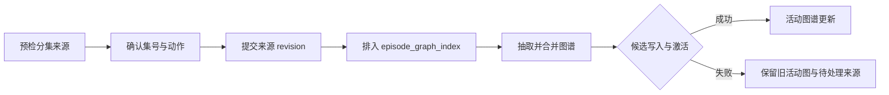

# 剧集规划

## 功能概览

剧集规划把已提交的分集来源抽取为实体、事件和关系，按固定分组并行处理，再合并为候选图谱并切换活动指针。规划产物供后续剧本和镜头生产读取。

## 适合谁看

适合编剧、策划、测试和研发理解「来源已提交」与「图谱已激活」的区别。

## 用户操作

1. 在导入页预检分集剧本，确认集号和拆分动作。
2. 提交分集来源，等待 `episode_import` 完成。
3. 查看图谱索引任务和图谱页面。
4. 图谱失败时修复来源或配置后按最新 revision 重试。

## 业务流程

1. 用户确认预检快照中的集号和冲突处理。
2. 系统写入 `episode_sources`、兼容原文和 outbox。
3. 系统按 revision 分组抽取并保存检查点。
4. 全部写入成功后激活候选；失败时旧活动图保持不变。

## 业务规则

- 预检不修改正式 `episode_sources`；提交必须校验快照和项目 revision。
- 连续集号按最多 5 集固定分组；重复集号或空洞会影响分组。
- 任务只处理 payload 指定的来源 revision；来源更新后旧任务应因 stale 失败。
- 抽取失败的组保留已完成组检查点，重试可复用匹配检查点。
- 候选图谱完全写入并通过激活步骤后，才删除对应 outbox。

## 状态与异常

`episode_import` 完成仅表示来源已提交，不表示图谱已激活。常见状态包括 outbox pending、图谱任务 queued/running、candidate 写入失败、embedding 失败和 pointer 恢复。`EPISODE_GRAPH_REVISION_STALE` 应重新提交最新 revision，不能手工修改任务 payload。

## 产品验收

- 预检能识别集号、缺号、重复项并要求用户确认。
- 来源提交后可查询 revision，且图谱任务可追踪。
- 任一组失败不会删除旧活动图；完整成功后活动指针和 outbox 状态一致。
- 重试能复用匹配检查点，并在 revision 变化时重新计算。

## 技术实现

调用链、分组、检查点、候选和原子激活见[剧集图谱管线](../pipelines/02-episode-graph.md)；任务注册、状态和取消见[新增 API 与长任务](../development/add-api-and-task.md)。

## 相关创作专题

- [项目与小说](01-project-and-novel.md)
- [剧本与分镜](04-screenplay-and-storyboard.md)
- [剧集图谱管线](../pipelines/02-episode-graph.md)
