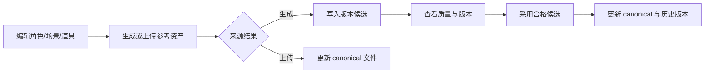

# 生产资产

## 功能概览

资产中心管理角色、身份、场景和道具。用户可编辑叙事实体、生成或上传参考图，并在版本组件中查看候选与当前采用版本。

## 适合谁看

适合美术、导演、编剧、测试和研发确认资产输入、候选采用与 canonical 文件的关系。

## 用户操作

1. 在角色、场景或道具页编辑描述和状态字段。
2. 角色视觉设定先选择提案并确认 `VisualBible`（需要时）。
3. 发起异步参考图生成，等待候选写入版本列表。
4. 检查候选质量后点击「采用」；上传入口则直接更新对应 canonical 文件。

## 业务流程

1. 用户编辑资产事实并发起生成或上传。
2. 生成 Runner 写不可变版本文件并登记 slot；上传入口直接备份和替换 canonical。
3. 用户查看候选，合格后采用。
4. 采用会把旧 current 标为历史，并更新 canonical。

## 业务规则

- 角色身份、场景状态和道具 reference 使用不同 slot；不能混用版本。
- 首个通过文件存在性检查的候选可成为 provisional current；已有 current 时后续结果保持 candidate。
- 采用时候选必须属于目标 slot、文件存在且没有 `technical_error`；有 soft issue 时需要填写 reason。
- local 道具只是分集投影，没有 global canonical reference；跨集复用前应提升为全局道具。
- `legacy_import` 可只读展示；只有 materialize 才会写入版本 sidecar。

## 状态与异常

生成任务可为 queued/running/completed/failed/cancelled；版本通常展示 candidate、provisional、adopted、superseded。当前没有正式 reject endpoint。缺少确认的 `VisualBible` 会阻止当前异步角色图生成；上传路径不经过候选采用层。

## 产品验收

- 角色、场景、道具卡片能分别编辑并展示当前参考资产。
- 异步生成完成后能看到候选、质量信息和任务结果。
- 采用合格候选后 canonical 可被下游读取，旧版本仍可查看。
- 非法路径、跨 slot 采用和缺文件操作会被拒绝。

## 技术实现

资产类型、slot、Runner、API 与文件路径见[生产资产管线](../pipelines/03-production-assets.md)；项目文件和原子写入边界见[存储与项目文件](../development/storage-and-files.md)。

## 相关创作专题

- [剧本与分镜](04-screenplay-and-storyboard.md)
- [声音与视频](05-audio-and-video.md)
- [生产资产管线](../pipelines/03-production-assets.md)
