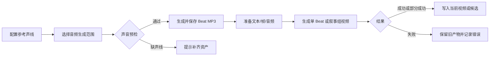

# 音频与视频

## 功能概览

音频阶段为 Beat 解析对白或旁白声线并生成 MP3；视频阶段使用 Beat 文本、首尾帧、参考图和音频生成单 Beat 或叙事组视频候选。

## 适合谁看

适合导演、声音和视频制作、测试及研发确认声线回退、生成范围、候选和部分失败语义。

## 用户操作

1. 在角色页上传或设计 default、年龄段或身份参考声线，必要时配置解说声线。
2. 在 Beat 工作台选择整集、选中 Beat 或单 Beat 生成音频。
3. 检查音频时长和失败明细，再生成单 Beat 或叙事组视频。
4. 对候选视频进行选择，或在失败时重试目标单元。

## 业务流程

1. 用户配置声线并选择目标 Beat。
2. 预检通过后任务按哈希判断跳过或重做，并写入 MP3 与记录。
3. 视频任务准备当前素材并生成单元。
4. 成功结果成为可供合成解析的来源；失败项可按范围重试。

## 业务规则

- 对白声线优先级为身份覆盖 → 年龄段 slot → 角色 default，再尝试兼容旧身份文件。
- drama 旁白可优先使用 Beat 上传参考；narrated 项目按项目类型和解说风格解析。
- `sync_changed` 比较声音和文本哈希；`redo_selected` 强制重做选中编号。
- 音频任务可跳过静音、空文本或不支持类型；单项失败可能汇总在 completed 结果中。
- NarrativeGroup 与单 Beat 视频采用不同 manifest/候选机制；当前 segment 重试请求契约存在 422 缺口。

## 状态与异常

缺声线在入队前返回 `voice_prereq_required`。余额不足等运行时错误可使任务 failed；普通单项音频失败记录在结果明细。视频组可为 `partial_failure`；质量门禁失败时不会调用 provider。取消是否立即终止第三方调用取决于检查点。

## 产品验收

- 缺声线不会创建无效任务，并给出可操作提示。
- 音频生成后 Beat 能读取 MP3 和真实时长；重做范围准确。
- 单 Beat 和叙事组能分别展示成功、候选和部分失败。
- 失败或取消不会删除可用旧视频，任务日志包含目标单元和错误。

## 技术实现

声线解析、IndexTTS2、视频 workflow、候选池和已知契约缺口见[声音与音频管线](../pipelines/06-audio.md)与[视频生成管线](../pipelines/07-video.md)；媒体目录见[存储与项目文件](../development/storage-and-files.md)。

## 相关创作专题

- [生产资产](03-production-assets.md)
- [剧本与分镜](04-screenplay-and-storyboard.md)
- [合成与导出](06-compose-and-export.md)
