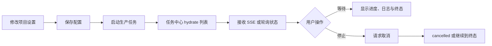

# 设置与任务

## 功能概览

设置页管理项目类型、脊柱模板、模型网关、解说声线和视频方向等项目配置；任务中心统一展示长任务状态、进度、日志、取消结果和重新挂载后的对账状态。

## 适合谁看

适合项目管理员、制片、测试和研发确认配置何时生效，以及任务状态为何可能与页面瞬时显示不同。

## 用户操作

1. 在项目设置中修改允许的配置项并保存。
2. 启动生产任务后打开任务中心查看任务键、队列、进度和日志。
3. 需要时点击停止，等待服务端返回 `cancelled`。
4. 刷新或切换页面后以任务中心和业务 Query 的重新拉取结果为准。

## 业务流程

1. 用户保存项目设置。
2. 生产页面提交任务，后端按项目作用域入队。
3. 任务中心先读取列表，再通过 SSE 增量更新；断流时回退轮询。
4. 用户等待或取消，最终以服务端状态和产物查询为准。

## 业务规则

- 配置保存与长任务启动是两件事；保存成功不代表生产任务已完成。
- 任务键由任务类型和项目、集、Beat、scope 等业务字段组成；活跃同键任务会去重。
- 任务状态真实成功值是 `completed`，不是 `succeeded`。
- 取消需要 editor 权限；排队任务可移出队列，运行中的模型或 FFmpeg 是否立即停止取决于取消检查点。
- SSE 是状态消费通道，不是唯一事实来源；重新挂载必须重新 hydrate。
- Inline 后端进程退出后，遗留的 submitting/queued/running 任务会被清扫为 failed，已完成产物不会被删除。

## 状态与异常

主要生命周期为 `submitting`、`queued`、`running`、`completed`、`failed`、`cancelled`。队列满、Runner 未注册、权限不足、配置缺失、SSE 断开和第三方调用超时分别有不同错误；不要只看页面 toast，应查看任务记录和业务结果。

## 产品验收

- 设置保存后重新打开项目仍保持配置，且不会凭空启动任务。
- 任务中心能列出当前项目任务并显示进度、日志、队列和终态。
- 刷新、路由切换或 SSE 断开后，状态能通过列表或轮询恢复。
- 点击停止后最终状态可验证为 `cancelled`，晚到的 completed 不覆盖它。

## 技术实现

项目配置、任务生命周期、SSE、取消和 Inline 重启清扫见[共享系统地图](../system-map.md)；配置与任务跨层变更见[新增 API 与长任务](../development/add-api-and-task.md)，排错与验证选择见[测试策略](../development/testing-strategy.md)。

## 相关创作专题

- [项目与小说](01-project-and-novel.md)
- [音频与视频](05-audio-and-video.md)
- [合成与导出](06-compose-and-export.md)
