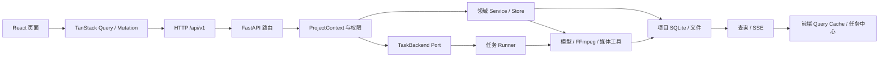

# Nuomi Drama Factory 共享系统地图

- **所属**：共享架构
- **上游**：[启动与本地开发](start-software.md)
- **下游**：[核心生产管线](README.md#核心生产管线)
- **代码基线**：`55504a0`
- **返回首页**：[Nuomi Drama Factory 开发者 Cookbook](README.md)
- **相关手册**：[功能反查](development/trace-a-feature.md) · [新增 API 与长任务](development/add-api-and-task.md) · [存储与项目文件](development/storage-and-files.md) · [测试策略](development/testing-strategy.md)

本页只说明八条生产管线共用的应用边界、任务生命周期和项目目录约定。某项业务怎样生成角色、分镜、音频或视频，回到对应的[生产管线专题](README.md#核心生产管线)继续追踪；产品介绍与部署步骤不在这里重复。

## 一条请求怎样穿过系统

这张图只画稳定层级。具体页面、路由、`task_type`、Runner 和产物路径由各管线专题记录，避免共享地图随着单个功能重命名而失效。

主链路可以按下面的顺序核对：

1. React 路由页或 Feature 组件调用 `frontend/src/lib/queries/` 中的 TanStack Query hook；hook 通过 `frontend/src/lib/api.ts` 的 `ky` 实例访问 `api/v1/...`。查询负责读缓存，mutation 提交变更或启动长任务。
2. `src/novelvideo/api/__init__.py` 创建带 `/api/v1` 前缀的 `api_router` 并挂入各业务路由；`src/novelvideo/api/app.py:create_app` 再把它挂到 FastAPI 应用。
3. 项目路由用 `src/novelvideo/project_context.py:resolve_project_context` 把登录用户、项目记录、有效角色、home node 和三类项目目录收束成一个 `ProjectContext`。需要本地文件或项目 SQLite 的代码还要经过 `require_project_home_node`。
4. 短操作通常进入领域 Service、Store 或 writer 并直接返回；长操作通过 `get_task_backend().enqueue_project_task(...)` 提交。两条路径都应从 `ProjectContext` 取得项目身份和目录，不能从前端传入的用户名或文件路径重新拼接边界。
5. TaskBackend 根据 `task_type` 找到 Runner。Runner 调模型、FFmpeg 或其他媒体工具，把结构化状态写入 SQLite，把可消费媒体和导出物写入项目文件目录。
6. 页面普通数据由 Query 再取；任务状态由 `GET /api/v1/projects/{project}/tasks` 首次 hydrate，再由 `/tasks/stream` 的 SSE 增量更新。断流时任务中心回退为轮询，恢复连接后重新 hydrate。

## API 路由怎样注册

`src/novelvideo/api/__init__.py` 是公共路由总表：

- `api_router = APIRouter(prefix="/api/v1")` 固定业务 API 前缀，各 `src/novelvideo/api/routes/*.py` 模块通过 `include_router` 注册。
- `auth.router` 最先注册。非 CE 运行时还会加载 `novelvideo.api_routes` entry point，使企业扩展可以向同一个 router 增加端点；随后再注册仓库内业务路由。
- verification 路由通过 `register_verification_routes()` 延迟加入，以避开循环导入；`create_app()` 在创建 FastAPI 应用时调用它。
- `src/novelvideo/api/app.py:create_app` 安装异常处理和中间件，注册 startup/shutdown，随后 `application.include_router(api_router)`。`/healthz`、受权限保护的项目静态文件和可选 SPA 挂载属于应用级路由，不在 `/api/v1` router 内。

新增接口时，先判断它属于已有业务 router 还是新的稳定资源，再按[新增 API 与长任务](development/add-api-and-task.md)补 schema、权限、任务和前端契约。不要直接在 `app.py` 堆业务端点。

## Ports & Adapters：运行形态与业务代码的分界

`src/novelvideo/ports/registry.py` 保存进程内 Port 注册表。应用 startup 调用 `ensure_bootstrap()`，它按运行配置选择 Adapter，而且采用失败即停止的策略：

| 条件 | Adapter 来源 | 行为 |
| --- | --- | --- |
| 配置 `ST_CONTROL_PLANE_DSN` | `novelvideo.ports_bootstrap` entry point | 加载企业实现，并检查 auth、项目、审计、计费、任务、取消和生命周期等必需 Port 是否齐全 |
| 明确配置 `ST_EDITION=ce` 且没有控制面 DSN | `src/novelvideo/ports/local/__init__.py` 的 `register_local_ports` | 注册本地认证、SQLite 项目表、允许本地项目访问、InlineTaskBackend、内存取消标记和本地生命周期实现 |
| 两者冲突或两者都未明确 | 无 | 拒绝启动，不隐式猜测 edition |

业务代码通过 `src/novelvideo/ports/__init__.py` 的 `get_project_registry()`、`get_project_access()`、`get_task_backend()` 等取接口，不直接依赖 CE 或企业 Adapter。修改跨部署都应成立的语义时改 Port 契约和各 Adapter；只修改 CE 的调度或存储方式时，入口是 `src/novelvideo/ports/local/`。

## CE 长任务：注册、排队与执行

CE 的 `src/novelvideo/ports/local/tasks.py:InlineTaskBackend` 与 API 在同一进程中运行：

1. `enqueue_project_task` 先要求当前节点是项目 home node，再调用 `TaskStateManager.reserve_task_for_project`。任务键由 `task_type + project_id + episode + beat_num + scope` 构成，同一业务键已有活跃任务时直接返回旧任务，避免重复投递。
2. 任务先以 `submitting` 原子写入项目 SQLite，再更新为 `queued`。`queue_kind` 选择 lane；每个 lane 有自己的并发数、等待队列和 `ThreadPoolExecutor`，队列满时状态写为 `failed` 并返回限流错误。
3. `src/novelvideo/task_backend/run_core.py:_ensure_builtin_runners_registered` 导入内置 Runner 模块。各模块在导入时调用 `src/novelvideo/task_backend/registry.py:register_project_task_runner`，建立 `task_type -> runner` 映射；找不到注册项会把任务标为 `failed`。
4. `run_project_task_core_sync` 在任务上下文中把状态改为 `running`，设置计费/模型运行上下文并调用 Runner。Runner 返回后先完成用量记录，再把结果和 `completed` 状态写入 SQLite；异常写 `failed`，`TaskCancelled` 写 `cancelled`。
5. 带 `text_task_role` 的注册项还会在入队时冻结 `agent_route_snapshot`，执行时校验并放入文本任务 runtime scope，避免排队期间的模型配置变化悄悄改变本次任务。

Inline 后端没有独立 broker 或常驻 worker；“已写入 SQLite”只保证任务状态可恢复读取，不表示队列本身可在 API 进程重启后续跑。

## 任务状态、取消和进程退出

文档讨论通用生命周期时可以说 queued / running / succeeded / failed / cancelled，但当前代码与前端协议中成功状态的真实值是 **`completed`，不是 `succeeded`**。实际状态如下：

| 阶段 | 代码状态 | 含义 |
| --- | --- | --- |
| 预留 | `submitting` | SQLite 中已占住业务任务键，尚未进入 lane |
| 排队 | `queued` | 已进入执行 lane 或等待队列 |
| 执行 | `running` | `run_project_task_core_sync` 已开始调用 Runner |
| 成功（succeeded） | `completed` | Runner 结果已写入 `result_json`，进度通常为 `1.0` |
| 失败 | `failed` | Runner、注册、超时或队列错误已写入 `error`/metadata |
| 取消 | `cancelled` | 取消请求已经对外生效；后续完成或失败写入会被忽略 |

`pending` 和 `starting` 仍保留在兼容类型中，但 CE 的项目任务主路径使用 `submitting -> queued -> running -> completed|failed|cancelled`。`TaskStateManager` 用 `expected_task_id` 防止旧 run 覆盖同一业务键上的新任务；终态默认保留一小时，任务中心也会裁掉一小时前的终态显示。

取消是有边界的：

- `DELETE /api/v1/projects/{project}/tasks/{task_type}/{episode}` 需要 editor 角色，并把 `beat_num`、`scope` 一同用于定位任务。
- CE Adapter 在 `InMemoryCancellationStore` 写入进程内取消标记，从 lane 中移除尚未开始的任务，立即把 SQLite 状态写成 `cancelled`，并调用 `kill_task_processes(task_id)` 终止通过任务子进程封装注册的 FFmpeg 等进程。
- 已运行的 Python/模型调用只有在 Runner 使用 `await_envelope_with_cancel_watch`、`raise_if_envelope_cancel_requested` 或等价检查点时才能及时停止。一个没有检查点的同步步骤可能继续运行；UI 已显示取消也不等于任意第三方请求已撤回。
- `run_project_task_core_sync` 会在开始前再查一次取消标记，并把 Runner 抛出的 `TaskCancelled` 归入 `cancelled`，不误报为 `failed`。

API 进程退出时，CE 的内存 lane、执行线程和取消标记一起消失。下一次打开对应项目的任务 SQLite 时，`TaskStateManager._sweep_interrupted_inline_tasks_once` 会把进程启动前遗留且 metadata 标为 `backend=inline` 的 `submitting`、`queued`、`running` 记录改为 `failed`，提示重新发起；已在退出前写好的 `completed`/`failed`/`cancelled` 结果在终态保留期内仍可读取，项目产物也不会被这次清扫删除。企业 Adapter 的 worker 生命周期不同，因此清扫明确排除非 inline 任务。

## 项目作用域与三类目录

`ProjectContext` 是新代码唯一的项目身份对象。它同时携带稳定 `project_id`、所有者、请求者 principals、有效角色、`home_node_id` 以及 `output_dir`、`state_dir`、`runtime_dir`。`resolve_project_context` 先经 ProjectRegistry 找项目，再由 ProjectAccess 计算角色；`require_project_home_node` 阻止 share-nothing 文件在非 home node 被访问。

全局根目录来自 `src/novelvideo/config.py`：`NOVELVIDEO_DATA_ROOT` 默认为当前目录，`NOVELVIDEO_OUTPUT_DIR`、`NOVELVIDEO_STATE_DIR`、`NOVELVIDEO_RUNTIME_DIR` 可以分别覆盖。CE 新项目通常由 `default_project_dirs(owner_username, project_name)` 形成以下作用域：

| 目录 | 默认项目路径 | 放什么 | 持久性与约束 |
| --- | --- | --- | --- |
| output | `output/<owner>/<project>/` | 可被页面或导出消费的图片、音频、视频和其他生产产物 | 属于项目数据；对外返回时应转换成受项目权限保护的静态 URL |
| state | `state/<owner>/<project>/` | `data.db`、`project_config.json`、知识/索引状态等 | `task_states` 也在 `data.db`；用于恢复查询和业务状态，不放临时媒体 |
| runtime | `runtime/<owner>/<project>/` | `logs/`、`staging/`、`temp_sketch_panels/` 等中间运行数据 | 可重建或短期使用；不要让最终页面只依赖这里的文件 |

CE 的全局项目注册表另在 `state/local/projects.db`，记录 `project_id` 到三类绝对目录和 home node 的映射。`ProjectPaths.from_context(ctx)` 会尊重注册表给出的目录；新代码应使用它或直接使用 `ctx.*_dir`，不要再次按用户名/项目名猜路径。更细的写入与迁移约定见[存储与项目文件](development/storage-and-files.md)。

## 前端怎样看到任务变化

`frontend/src/task-center/provider.tsx:TaskCenterProvider` 先用 TanStack Query 请求项目任务列表并 hydrate Zustand store，再建立 EventSource。服务端 `src/novelvideo/api/routes/tasks.py:stream_project_tasks` 轮询项目 SQLite 的当前快照，发送 `task_updated`、`deleted` 和 heartbeat；它不是 Runner 直接推送的消息总线。

`frontend/src/task-center/store.ts` 以 `task_key` 保存当前状态，而不是保存每次 run 的历史。SSE 更新同时写入任务中心和 TanStack Query cache；新完成的任务还会按 `task_type` invalidate 对应资产 Query。断线数次后切换到五秒一次的列表轮询，重连后再次 hydrate。由此，修改任务序列化字段、终态名称或 `task_key` 组成时，需要同时检查后端 tasks route、`frontend/src/task-center/types.ts`、provider、store 和相关 Query invalidation。

## 关键路径与符号索引

| 关注点 | 路径 | 先找的符号 |
| --- | --- | --- |
| FastAPI 应用装配 | `src/novelvideo/api/app.py` | `create_app`、`startup` |
| `/api/v1` 路由总表 | `src/novelvideo/api/__init__.py` | `api_router`、`register_verification_routes` |
| Port 注册与 edition 选择 | `src/novelvideo/ports/registry.py` | `ensure_bootstrap`、`register_port`、`get_port` |
| 任务 Port 契约 | `src/novelvideo/ports/tasks.py` | `TaskBackend`、`QueuedTask`、`cancel_key` |
| CE Port 装配 | `src/novelvideo/ports/local/__init__.py` | `register_local_ports` |
| CE Inline 调度与取消 | `src/novelvideo/ports/local/tasks.py` | `InlineTaskBackend`、`InMemoryCancellationStore` |
| Runner 注册表 | `src/novelvideo/task_backend/registry.py` | `register_project_task_runner`、`get_project_task_runner_registration` |
| Runner 公共执行核心 | `src/novelvideo/task_backend/run_core.py` | `run_project_task_core_sync`、`_ensure_builtin_runners_registered` |
| 协作取消与超时 | `src/novelvideo/task_backend/cancel.py` | `await_envelope_with_cancel_watch`、`raise_if_envelope_cancel_requested` |
| FFmpeg 等子进程边界 | `src/novelvideo/task_backend/subprocesses.py` | `run_project_subprocess`、`kill_task_processes` |
| 任务 SQLite | `src/novelvideo/task_state.py` | `TaskStateManager`、`reserve_task_for_project`、`_sweep_interrupted_inline_tasks_once` |
| 项目身份与权限 | `src/novelvideo/project_context.py` | `ProjectContext`、`resolve_project_context`、`require_project_home_node` |
| output/state/runtime 根目录 | `src/novelvideo/config.py` | `DATA_ROOT`、`OUTPUT_DIR`、`STATE_DIR`、`RUNTIME_DIR` |
| 项目路径封装 | `src/novelvideo/utils/project_paths.py` | `ProjectPaths` |
| 项目任务 API/SSE | `src/novelvideo/api/routes/tasks.py` | `list_project_tasks`、`stream_project_tasks`、`cancel_project_task_route` |
| 前端 HTTP 客户端 | `frontend/src/lib/api.ts` | `api` |
| 任务中心编排 | `frontend/src/task-center/provider.tsx` | `TaskCenterProvider` |
| 任务中心状态 | `frontend/src/task-center/store.ts` | `useTaskCenterStore` |

## 扩展能力入口

这些能力复用上面的 API、项目或任务设施，但不在此展开它们的业务流程。

| 能力 | 前端入口 | 后端或运行入口 |
| --- | --- | --- |
| Freezone | `frontend/src/routes/_app/projects.$project/freezone.lazy.tsx` | `src/novelvideo/api/routes/freezone.py`、`src/novelvideo/freezone/` |
| 导演世界 | `frontend/src/features/viewer-kit/three-d/ThreeDDirectorDialog.tsx` | `src/novelvideo/director_world/` |
| 聊天助手 | `frontend/src/features/superchat/superchat-panel.tsx` | `src/novelvideo/api/routes/chat.py`、`src/novelvideo/chat/` |
| 模型配置 | `frontend/src/components/settings/settings-dialog.tsx`、`frontend/src/lib/queries/model-gateway.ts` | `src/novelvideo/api/routes/model_gateway.py`、`src/novelvideo/config.py:get_pydantic_model` |
| Electron 桌面壳 | `desktop/main.cjs` | `desktop/runtime-paths.cjs`、`desktop/scripts/stage-runtime.cjs` |

## 修改哪一层

| 你要改变的行为 | 首选修改层 | 必须一起检查 |
| --- | --- | --- |
| 页面展示、交互、缓存刷新 | route / feature + `frontend/src/lib/queries/` | Query key、任务完成后的 invalidation、i18n |
| HTTP 输入输出或权限 | `src/novelvideo/api/routes/` + schema | `resolve_project_context` 角色、前端类型、契约测试 |
| 同步业务规则或 SQLite 读写 | 领域 Service / Store | 项目 home node、事务、上下游产物消费者 |
| 新增长任务类型 | TaskBackend 调用 + `src/novelvideo/task_backend/runners/` 注册 | payload、`task_key` 的 episode/beat/scope、状态与取消检查点 |
| CE 排队、并发或重启行为 | `src/novelvideo/ports/local/tasks.py`、`src/novelvideo/task_state.py` | lane 限额、幂等预留、终态 TTL、僵尸清扫 |
| 跨 CE/企业实现的能力 | `src/novelvideo/ports/` 契约 | local Adapter、entry point Adapter、startup 必需 Port |
| 模型选择或调用参数 | 模型配置/运行时层 | 入队时 route snapshot、用量计量、超时和错误清洗 |
| FFmpeg 命令或最终媒体 | 对应 Runner / 媒体 Service | `run_project_subprocess`、取消、output 路径、静态 URL |

不要从图中的中间层绕过项目边界：例如，前端不应提交可写绝对路径，Runner 不应自行建立无项目作用域的状态库，页面也不应把 SSE 当作唯一事实来源。

## 继续追踪

- 已知页面、API、任务名或文件名：从[功能反查](development/trace-a-feature.md)建立一条可搜索的调用链。
- 要增加端点或异步任务：按[新增 API 与长任务](development/add-api-and-task.md)检查跨层契约。
- 要改 SQLite、媒体目录或迁移：先读[存储与项目文件](development/storage-and-files.md)。
- 已定位具体生产阶段：进入[小说导入](pipelines/01-ingest.md)、[剧集图谱](pipelines/02-episode-graph.md)、[生产资产](pipelines/03-production-assets.md)、[剧本与语义](pipelines/04-screenplay.md)、[分镜与图像](pipelines/05-storyboard.md)、[声音与音频](pipelines/06-audio.md)、[视频生成](pipelines/07-video.md)或[合成与导出](pipelines/08-compose-export.md)。
- 准备验证改动：按[测试策略](development/testing-strategy.md)选择最小的领域、API、任务和前端测试组合。
