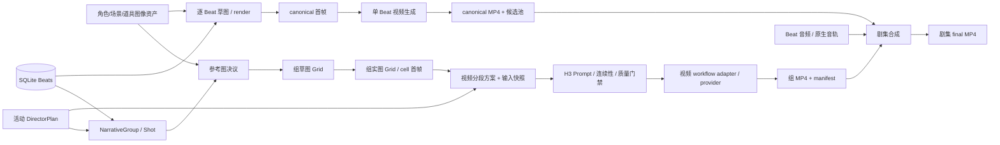

# 从图到视频：项目生产架构

> 核对范围：2026-09-22 的当前工作区实现。本文聚焦剧集生产工作台，从参考图、草图和实图首帧走到视频及成片；Freezone 独立画布任务不在此范围。当前工作区有未提交的业务代码，本文描述的是已核对的工作区行为，不以某个提交作为唯一基线。

## 先看两条生产路径

剧集仍保留逐 Beat 的兼容路径；激活 DirectorPlan 后，叙事组会投影导演 Shot，图像和视频以组内 Shot 为生产单元。两条路径都能提供成片素材，但版本、候选和采用方式不同。

这里的「图」有三层含义：角色、场景和道具参考图约束生成；草图约束构图；render cell 或 canonical frame 才是视频的首帧。参考图本身不等于首帧，Grid 整图也不直接交给视频模型。相关的阶段细节见 [分镜与图像管线](../cookbook/pipelines/05-storyboard.md) 和 [视频生成管线](../cookbook/pipelines/07-video.md)。

## 系统边界与状态归属

| 层 | 主要职责 | 持久状态 / 产物 |
| --- | --- | --- |
| 前端工作台 | 展示 Beat、导演组、参考图预览、图像阶段、视频方案与任务进度 | `beats.lazy.tsx` 挂载 Beat 和 NarrativeGroup 工作台；旧 `/video` 路由重定向到 `beats?sub=video` |
| API | 项目权限、输入和 revision 校验；解析引用、模式与参数；派发任务 | `generation.py` 负责逐 Beat 图像、视频、合成；`narrative_groups.py` 负责组级阶段 |
| 项目业务状态 | 保存 Beat、规划引用、资产版本、导演方案、组阶段与方案 | 项目 `state_dir/data.db`、`state_dir/production_workflow.json`、`output_dir/director_plans/`、`output_dir/.narrative_groups/epNNN.json` |
| TaskBackend / Runner | 执行异步图像、视频和 FFmpeg 任务；写阶段结果 | `narrative_group_grid`、`narrative_group_video`、`single_video`、`compose_episode` 等任务类型 |
| Provider 适配层 | 将产品模型、模式和参数映射到图像或视频供应商 | 组图像经 GRSAI 执行；组级 H3 经 workflow registry、adapter、runtime/profile 执行 |
| 媒体文件 | 可消费图像、片段、manifest 和成片 | `grids/`、`sketches/`、`frames/`、`videos/`；读取前仍须检查文件与当前状态是否一致 |

`ProjectContext` 是项目 ID、权限与 `output_dir`／`state_dir`／`runtime_dir` 的来源；不能用项目名推算这些路径。SQLite 和 JSON 记录的是结构化状态，PNG、MP4 等媒体保存在文件系统。详细目录边界见 [存储与项目文件](../cookbook/development/storage-and-files.md)。

## 主路径：DirectorPlan → 组图像 → 组视频

### 1. 确定生产单元和参考图

`load_effective_groups()` 在有活动 DirectorPlan 时把方案投影为 NarrativeGroup：来源 span 留在 `beat_ids`／`source_span_ids`，实际图像和视频单元是 `shot_ids`。没有活动方案时才使用 SQLite Beat 分组。`generation_beats_for_group()` 根据这一选择构造同一组的图像与视频输入；因此不能把语义 Beat、SQLite Beat 和 Director Shot 当成同一个 ID 空间。

组图像生成前，`GET .../{group_id}/{stage_name}/references` 只读预览已规划的角色、场景、道具引用及其资产版本。确认后，API 将所选 binding、临时上传、活动导演方案 revision、项目／剧集／组范围和文件 hash 冻结为决议快照，再入队。Runner 会重新验证文件仍在允许的项目目录、hash 未变化、范围与当前任务吻合。缺少必需 binding、资产版本或引用已过期会在预览或提交阶段报错；不应把这类错误理解为图像模型故障。

相关实现：[组 API](../../src/novelvideo/api/routes/narrative_groups.py)、[规划引用服务](../../src/novelvideo/narrative_groups/planned_binding_service.py)、[资产版本 Store](../../src/novelvideo/production_workflow/store.py)、[组投影](../../src/novelvideo/narrative_groups/service.py)。

### 2. 生成草图与实图首帧

组内分别维护 `sketch`、`render`、`video` stage。图像 API 为草图或实图推进 revision，派发 `narrative_group_grid`；仅重切已有 Grid 则派发 `narrative_group_split`。render 默认要求本组当前草图已完成且整图存在；用户明确选择无草图约束时才可跳过。

图像 Runner 对一组生成一张 Grid，再按 `cell_to_beat` 切成 cell，清理画幅并写入 canonical `sketches/epNNN/beat_NN.png` 或 `frames/epNNN/beat_NN.png`。stage 同时保存 Grid、cell、实际 provider/model、尺寸和清理信息。`record_stage_result(expected_revision=...)` 只接收当前 revision 的结果，旧任务晚到不会覆盖新版本。小布局的切分可直接写 canonical 文件；较大布局还会经过图片池，所以「cell 已生成」不能一概推断为「图片池存在候选」。

相关实现：[图像入队](../../src/novelvideo/api/routes/narrative_groups.py)、[Grid 生成与切分 Runner](../../src/novelvideo/task_backend/runners/narrative_group.py)、[组状态模型](../../src/novelvideo/narrative_groups/models.py)。

### 3. 把首帧变成受控的视频请求

组视频方案把有序生产单元分成 1 或 2 个 Shot 的 unit。单单元通常取自身 render cell 为首帧（I2VA）；相邻双单元可取左 cell 为首帧、右 cell 为尾帧（FL2VA）。API 校验 workflow、模式、参数、视频方案 revision、设置 revision 和可用帧；H3 组生成还要求活动导演方案中的 blocking／lighting 生产指令。随后 `reserve_video_revision()` 原子预留新 revision，并将首尾帧及适用的引用冻结为输入快照后派发 `narrative_group_video`。入队失败会尝试恢复预留状态。

组 Runner 再读取当前的 materialized group、canonical Beats、render cell 和 DirectorPlan，按请求 revision 检查是否过期；它不会信任客户端提交的媒体路径。H3 路径把 Shot 的画面、动作、对白、场景空间、摄影机、灯光和资产证据转成时间线与提示词，经连续性／Prompt 质量门禁后才调用 adapter。adapter 将产品参数映射到 RunningHub H3 runtime 和版本化 workflow profile。当前 registry 也描述 H3 Ref workflow，但将其标为 `hybrid_input_unverified`、不可用；不能把它写成已经开放的线上能力。

相关实现：[视频入队](../../src/novelvideo/api/routes/narrative_groups.py)、[组视频 Runner](../../src/novelvideo/task_backend/runners/narrative_group_video.py)、[视频方案与 revision](../../src/novelvideo/narrative_groups/service.py)、[workflow registry](../../src/novelvideo/media_capabilities/video/workflow_registry.py)、[adapter](../../src/novelvideo/media_capabilities/video/adapters.py)、[H3 runtime](../../src/novelvideo/media_capabilities/video/runtime.py)。

### 4. 视频结果与质量证据

Runner 按分段调用视频 workflow；多段成功结果可由本地 FFmpeg 组合成组视频。它保存每段 provider task ID、Prompt／连续性证据、实际输出、音轨来源和质量结果到 `.manifest.json`，并把 MP4 与 manifest 路径写回当前 video stage。分段失败、尺寸不符或生成后的视觉复核不通过时，文件可能仍保留，但 stage 可以是 `partial_failure`；**MP4 文件存在不等于可作为已完成视频参与合成**。

视频物理文件位于 `videos/epNNN/narrative_groups/`，组 stage 及其 revision 则在 `.narrative_groups/epNNN.json`。H3 runtime 还在项目 runtime 中保存执行 artifact／task 记录；这些记录用于排查 provider attempt，不等同于前端可选择的单 Beat 视频池。

## 兼容路径：逐 Beat 首帧 → 单 Beat 视频

逐 Beat 草图与 render 使用 `sketch_generation`、`sketch_regen`、`selected_regen` 等任务和剧集图片池。用户采用 render 候选后，canonical `frames/epNNN/beat_NN.png` 是单 Beat 视频通常读取的首帧；也可按设置使用导演 render 来源。`POST .../beats/{beat_num}/video` 在入队前读取 Beat、校验首帧，准备尾帧、Prompt、音频时长和后端特定引用。`single_video` Runner 按 backend 走 H3 runtime、Seedance 等生成器或其他 legacy 实现。

单 Beat 视频写到 `videos/beats/epNNN/beat_NN.mp4`，再复制候选到 `pool/` 并更新视频池索引。生成成功即采用最新 canonical MP4；用户选旧候选时再复制回 canonical。它不使用 NarrativeGroup 的 stage revision 或 H3 Director manifest，也不能以单 Beat pool assignment 推断组视频是否完成。

相关实现：[逐 Beat API](../../src/novelvideo/api/routes/generation.py)、[单 Beat Runner](../../src/novelvideo/task_backend/runners/video.py)、[视频候选池](../../src/novelvideo/generators/video_pool_indexer.py)、[媒体路径解析](../../src/novelvideo/utils/path_resolver.py)。

## 剧集合成如何选择视频

`compose_episode` 从当前完成态的组视频 manifest 解析 Director span：一个物理 MP4 可以覆盖多个逻辑 Beat，但只进入最终时间线一次。未被组视频覆盖的 Beat 才查 canonical 单 Beat MP4，避免重复拼入同一段。当前 Runner 还校验源覆盖范围：有 SQLite Beats 时，缺任一预期 Beat 视频会失败；无 legacy Beats 的 Director-only 项目则要求活动导演方案的所有组视频均完成、未过期，且入队时的来源快照未变化。

音轨按来源处理：Director manifest 的 `h3_native` 使用原视频音轨；`external_tts` 要求可用 ambience stem 和对应 Beat MP3。普通单 Beat 片段优先用独立 MP3，其次用视频内音轨，最后补静音。FFmpeg 统一画幅、编码并发布 `videos/episodes/epNNN_final.mp4`。成片只表示当前可用来源的合成结果；上游图像或视频后来变更时，需要重新检查来源和重新合成。

相关实现：[合成 API](../../src/novelvideo/api/routes/generation.py)、[来源解析与合成 Runner](../../src/novelvideo/task_backend/runners/video.py)、[合成与导出专题](../cookbook/pipelines/08-compose-export.md)。

## 排查时先核对哪一层

| 现象 | 优先核对 |
| --- | --- |
| 参考图预览返回 409 | 活动 DirectorPlan 的必需引用是否已规划；binding、资产 slot/version 和当前方案 revision 是否一致 |
| 图像任务完成但视频说首帧不可用 | 当前 render stage 的 `cell_assets` 与磁盘文件是否一致；视频方案选择的首／尾帧是否存在且在项目内 |
| 生成了新 Grid，页面仍显示旧图 | stage revision、canonical 文件、图片池候选和前端任务结束后的查询刷新分别检查 |
| 组视频请求 409／422 | video、plan、settings、reference revision；workflow/mode；blocking／lighting；首尾帧快照 |
| 有 MP4 却不能合成 | video stage 是否 `completed` 且未 stale；manifest 的 `physical_video`、质量状态、音轨和 stem 是否满足要求 |
| 合成缺片段 | manifest 覆盖的逻辑 Beat、未覆盖 Beat 的 canonical MP4，以及 Director-only 全组完成条件 |

任务状态、stage 状态、磁盘文件和前端缓存各回答不同问题。诊断时用 `project_id + episode + group_id/beat_num + revision + task_id` 对齐同一次生产，不要只看某个 `completed` 文案。任务模型和前端刷新约定见 [新增 API 与长任务](../cookbook/development/add-api-and-task.md)。
