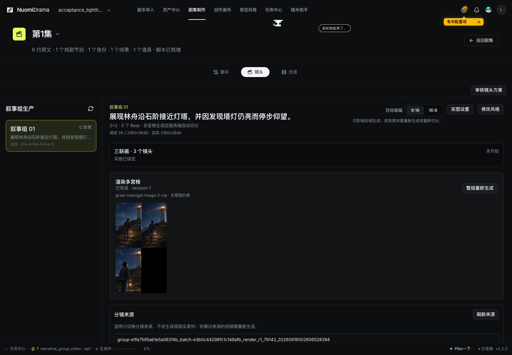
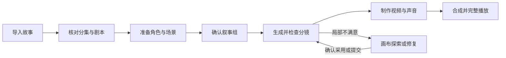
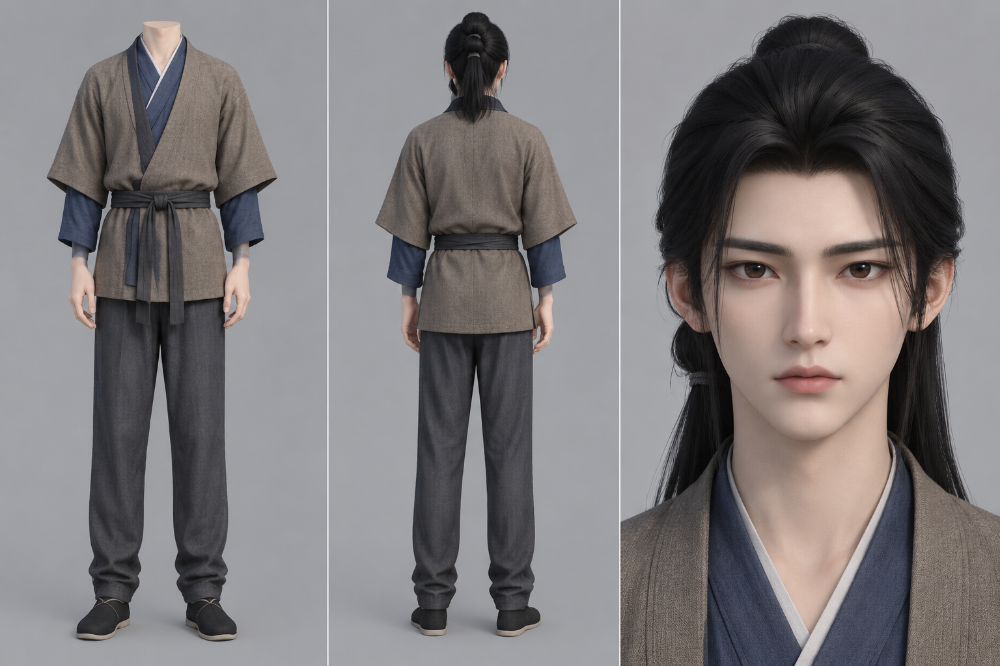
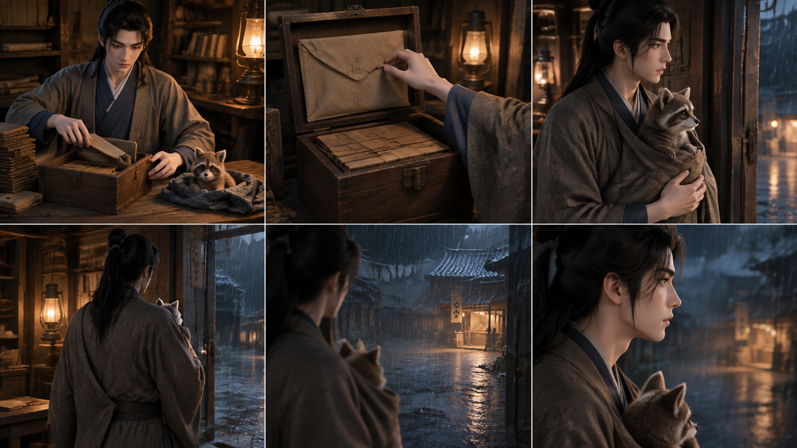

# Nuomi 漫剧 · 产品与创作手册

**把故事、角色、镜头和声音放进同一个制作项目。**

Nuomi 漫剧（Nuomi Drama Factory）是一款本地运行的 AI 漫剧与短剧创作工作台。从一段小说或剧本出发，你可以整理分集故事、建立角色和场景资产、设计连续镜头、生成图像与视频，最后合成为一集作品。需要试造型、调画面或单独制作一个片段时，也可以进入自由画布，用素材节点组织自己的创作过程。

它适合独立创作者完成第一集样片，也适合在系列创作中持续复用人物、场景与视觉设定。每次生成得到的候选、当前采用的素材和最终成片承担不同作用：你可以继续尝试新方案，同时保留已经能够使用的版本。

**在线手册地址：** [Nuomi Drama 使用手册](https://my.feishu.cn/docx/O4z0d5gd1oaHVCx6CzCcFdmGnSp)  
**本版：** 2026-09-26 · 本地图文版，尚未同步在线文档。图中素材为本地项目已有产物，工作台图为留存的真实界面；具体布局以当前版本为准。

*图 1｜真实分镜工作台。上方连接「脚本—镜头—合成」，左侧切换叙事组，右侧检查画幅、分镜图和素材来源。图中是灯塔示例项目，不是下文《山海拾遗》案例。*

## 阅读导航

| 你现在想做什么 | 从这里开始 |
| --- | --- |
| 了解产品能解决什么问题 | [一、核心特点](#一核心特点) |
| 找到每个功能入口 | [二、认识工作台](#二认识工作台) |
| 完成第一集样片 | [三、第一集的制作路线](#三第一集的制作路线) |
| 让人物与场景在多集里保持连贯 | [四、角色与场景资产](#四角色与场景资产) |
| 把文字变成连续镜头 | [五、从剧本到叙事组分镜](#五从剧本到叙事组分镜) |
| 自由试图、修图、组织参考和视频 | [六、自由画布](#六自由画布) |
| 为画面加动作和声音 | [七、视频与声音](#七视频与声音) |
| 输出作品、管理进度与费用 | [八、合成与交付](#八合成与交付)、[九、任务与成本](#九任务与成本) |
| 配置环境或解决失败 | [十、开始前的配置](#十开始前的配置)、[十一、常见问题](#十一常见问题) |

## 一、核心特点

### 1. 以故事组织制作，原文、角色和镜头能够对应起来

系列漫剧的第一道难题，是把长篇文字拆成可制作的内容。Nuomi 将项目、剧集、场景、剧情节拍与资产关联起来。导入后，你可以检查结构化结果，修改人物、对白与情节，再推进镜头规划。

例如，“步知遥把简册收进木匣，抱起朏朏，听见雨声后望向门外”包含多个动作和注意力变化。制作时需要明确谁在动作、道具在哪里、画面何时从室内转向门外，才能把文字转成清楚的视觉表达。

**带来的价值：** 返工时能够定位到具体剧情单元；人物或道具缺失时，可以回到关联关系检查。

### 2. 人物选角依据剧情，外貌、服装和身份可以分别管理

角色创作支持从原文依据出发，比较造型方案、生成候选，并在确认后定角。基础形象和具体身份阶段有各自的记录；一位角色跨越年龄或更换服装时，可以为相应阶段准备不同参考。

选角时需区分原文明示的事实和设计发挥。例如原文写了“年轻”，并不等于确定了一个精确年龄；“经历坎坷”也不能自动变成脸上的伤疤。对候选的辅助检查关注事实符合度、设计落实度和人物辨识度，最终采用由创作者决定。

**带来的价值：** 角色设计有依据，新候选不会仅因生成完成就取代当前头像；系列制作可以复用已确认的形象。

### 3. 以叙事组推进分镜和视频，兼顾前后镜头的关系

Nuomi 把连续讲述故事动作的镜头组织为叙事组。你可以在组内检查剧情目标、参考素材、多格分镜与视频结果，再按顺序完成整集。

**带来的价值：** 同时查看动作前后、构图变化与场景衔接；一组不合适时，优先修正该组，保留其他可用结果。

### 4. 分集制作与自由画布互相补充

分集制作适合按故事顺序推进；自由画布适合探索构图、组织图像和视频参考、尝试创作能力，以及比较不同候选。支持的结果可以通过提交入口关联回项目资产或具体制作位置。

**带来的价值：** 自由探索的成果有机会进入正式制作；提交前可明确目标位置与影响范围。能否提交、可以提交到哪里，以当前节点和提交面板为准。

### 5. 图像、视频和声音共同服务于同一段表演

分镜图确定人物和构图，视频表达动作与镜头运动，角色声线承载对白。Nuomi 提供这些阶段的配置与任务入口，允许按实际选择的模型能力组织输入。

**带来的价值：** 制作时可以分别定位“画面不对”“动作不对”或“声音不对”，避免每次都重做全部内容。

### 6. 进度、候选与成本可查看

任务中心提供任务状态和错误信息；资产与视频制作保留相应的版本或候选。项目成本把已确认费用、估算与待核算分开呈现。

**带来的价值：** 能判断应该等待、修正输入还是重试，也能知道已知费用与缺失计价信息。待核算不代表免费，项目成本也不等于供应商已经结算的账单。

## 二、认识工作台

打开项目后，先按工作目标选择入口。

| 工作区 | 在这里完成什么 | 离开时应当得到什么 |
| --- | --- | --- |
| 剧本导入 | 导入故事，检查分集、结构化内容和关系信息 | 可以继续制作的故事结构 |
| 资产中心 | 整理角色、身份、场景、道具和声线 | 当前采用的参考资产 |
| 剧集制作 · 脚本 | 核对剧情节拍、对白和资产引用 | 可用于镜头规划的剧本 |
| 剧集制作 · 镜头 | 审核方案，检查叙事组，生成图像与视频 | 按故事顺序可用的视频片段 |
| 剧集制作 · 合成 | 检查来源并生成成片 | 可播放、可下载的作品 |
| 创作画布 | 组织素材节点，生成、修复与比较候选 | 自由创作结果或待提交素材 |
| 视觉风格 | 选择并检查项目的视觉方向 | 相对稳定的色彩、材质与画风要求 |
| 任务中心 | 查看进度、失败信息与任务结果 | 明确下一步动作 |

图 1 可以作为分集制作的界面地图：先在左侧选组，再读右侧的故事目标，然后检查画幅和生成结果。图像出现仅代表已有图像产物，是否完成视频、是否能够整集合成还要查看对应阶段。

### 五个常用概念

| 概念 | 如何理解 | 示例 |
| --- | --- | --- |
| 项目 | 一部作品的内容与素材集合 | 《山海拾遗》 |
| 剧集 | 项目中的一次分集交付 | 第 1 集 |
| 剧情节拍（Beat） | 一次动作、信息或情绪推进 | 收简册、抱起朏朏、望向门外 |
| 叙事组 | 为连续制作而组织的故事与镜头单元 | 收拾木匣到临门观察的一组镜头 |
| 候选与采用版本 | 候选供比较，采用版本供后续使用 | 新角色图生成后先检查，再确认定角 |

## 三、第一集的制作路线

建议先选择一段角色较少、场景明确、动作连续的内容完成样片，再扩展到更长剧集。目标是验证自己的故事、素材和模型组合能否完成一次制作。

*流程图 1｜推荐制作路线。每个箭头都意味着前一阶段的内容已经检查，生成完成后仍需确认是否适合进入下一阶段。*

| 步骤 | 具体操作 | 继续前检查 |
| --- | --- | --- |
| 1. 建立项目 | 创建项目并导入小说或剧本 | 文本完整，选对项目 |
| 2. 校对内容 | 检查剧集划分、场景、人物、对白 | 没有重名误合并和对白错配 |
| 3. 确认视觉方向 | 选择画风，明确横屏或竖屏目标 | 参考风格之间没有明显冲突 |
| 4. 整理资产 | 准备角色身份、场景和关键道具 | 素材存在，采用与关联正确 |
| 5. 检查镜头 | 进入镜头页，逐组读剧情目标 | 动作、顺序和场景切换合理 |
| 6. 生成分镜 | 比较组内的连续画面 | 人物、服装、道具与构图可用 |
| 7. 制作视频 | 按模型要求准备参考、首帧及声音 | 输入齐全，视频能够正常播放 |
| 8. 合成交付 | 合成后完整播放，再导出 | 无漏段，声音和画面符合预期 |

首次制作可以采用这样的检查方法：只要某一步无法回答“下一步将使用哪一份素材”，就先明确当前版本与关联，再继续生成。

## 四、角色与场景资产

### 4.1 角色：先定人，再定具体身份和服装

**入口：资产中心 → 角色 → 视觉设定。**

1. 选择基础形象或需要制作的身份阶段。
2. 发起剧情选角，核对原文依据和出处；资料不足或有冲突时先处理提示。
3. 比较造型方案，选择更符合角色与作品风格的一套。
4. 生成候选，与当前头像比较；必要时单独重试检查。
5. 确认定角。存在提示时，逐项判断并按要求填写采用原因。
6. 为实际出镜的身份、服装准备参考，并检查剧集引用。

*图 2｜《山海拾遗》已有身份设定素材。正背面提供服装、发型和轮廓信息，面部特写补充人物辨识特征。这是参考资产示例，不是选角页面截图，也不代表该图片已通过新版选角流程的全部检查。*

**怎样看这张图：** 左侧检查衣领、层次、腰带和裤装，中间检查背面发型与轮廓，右侧检查五官。下游镜头中人物发生转身时，这些信息比单张正脸照更有帮助。

**什么时候需要另建身份阶段？** 当同一个角色在剧情中出现明确的年龄、身份或造型变化时，使用对应阶段的参考；不要为了生成一套新衣服误建成另一个人物。

**候选、检查与定角的关系：**

*流程图 2｜生成候选与替换当前形象是两步。检查失败可以重试检查，不必因此重新画图。*

### 4.2 场景：为不同镜头建立共同的空间依据

场景参考需要交代稳定的空间关系：门窗位于哪里、人物可以从哪里进出、主要道具如何摆放、光源来自哪个方向。场景主图适合确定主要视觉；全景参考则帮助观察更大范围的环境。

*图 3｜《山海拾遗》“水镇堤道与高仓”的全景参考。河道、堤岸、建筑与阶梯可以作为多角度镜头的共同空间依据。图为展开的全景素材，不是可交互的三维模型。*

使用全景时，先确认地平线、空间布局和接缝，再用它辅助取景。全景可查看并不意味着所有视角都已适合制作；人物遮挡、物件比例和局部细节仍需检查。

### 4.3 道具：优先管理推动剧情的物件

当一个物件被反复拿起、交接或特写时，值得作为关键道具管理。例如木匣、简册、信物需要明确材质、颜色、形状和比例。普通背景杂物不必全部转成独立资产。

制作前确认三件事：当前剧集关联了正确道具；道具参考能看清主要特征；人物与道具的相对大小合理。若视频中的道具变形，先检查分镜是否已经画错，再判断是否要重做视频。

### 4.4 让系列作品保持统一的做法

- 在批量生成前确认主要人物与常用场景。
- 把固定特征和当前状态分开描述，例如固定发型与本集淋雨状态。
- 尽量让同一场戏沿用一致的光线、服装和空间关系。
- 修改资产后检查受影响的镜头；旧视频不会随着参考图更新而自动改变。

## 五、从剧本到叙事组分镜

### 5.1 先把剧情写成可观察的动作

在剧本页，核对每个剧情节拍的动作、对白、旁白与角色引用。抽象情绪可以保留，但最好补上可见表现。

| 写法 | 制作时缺少什么 | 更可执行的表达示例 |
| --- | --- | --- |
| 他很不安 | 观众怎样看出不安 | 合上木匣后停顿，抬眼望向门外 |
| 外面气氛紧张 | 空间和视觉线索 | 雨夜巷道空无一人，远处灯笼摇晃 |
| 两人交谈 | 谁说话、谁反应 | 明确说话者、对白内容，以及另一人的视线或动作 |

这些是手册中的表达示例，并非要求系统逐字使用的提示词模板。真正用于制作时，以剧本事实为准。

### 5.2 用组内镜头建立动作顺序

*图 4｜《山海拾遗》项目已有六格分镜。按从左到右、从上到下观察：手部动作与木匣细节、人物抱起朏朏、门口背影、雨巷方向和人物反应，共同构成一段连续表达。此阅读顺序用于讲解本张图，实际生产顺序以镜头方案为准。*

这张分镜适合用来理解三个层次：

1. **动作信息：** 木匣和手部特写让观众看清人物正在做什么。
2. **空间变化：** 从室内转向门口，再看向雨巷，观众能够理解人物关注的方向。
3. **情绪信息：** 人物侧脸与停顿给故事留下反应空间。

检查时不要只判断单格是否好看。还要看上一格的道具在下一格是否仍然存在、抱持方式是否合理、门的位置是否一致、人物视线是否接得上。

### 5.3 操作顺序

**入口：剧集制作 → 选择剧集 → 镜头。**

1. 选择左侧叙事组，阅读故事目标。
2. 检查角色、场景、关键道具与参考来源。
3. 确认画幅与图像设置。画幅改变后，已有素材可能需要重新生成或重新切分。
4. 发起图像生成，查看当前任务状态。
5. 放大检查人物、手部、道具、文字杂质与连续性。
6. 采用可用结果，再进入视频阶段。需要修复时定位到具体组或支持的画布能力。

### 5.4 哪一层出错，就先修哪一层

| 问题 | 优先检查 |
| --- | --- |
| 漏了关键剧情 | 原文、剧本和组内故事目标 |
| 用错人物或服装 | 角色身份和资产绑定 |
| 构图无法表达动作 | 分镜描述、画幅与构图 |
| 分镜正确，视频动作错误 | 视频提示和所选模型能力 |
| 前后片段接不上 | 组间人物位置、动作终点和时间顺序 |

## 六、自由画布

自由画布把创作素材组织为可连接的节点。你可以先放入已有图片，再加入图像生成、分镜、视频或创作能力节点，观察输入如何影响输出。它适合不按固定顺序推进的探索，例如先尝试一个场景，再确定角色构图。

### 6.1 节点承担什么工作

| 节点或能力类别 | 典型用途 | 使用时重点关注 |
| --- | --- | --- |
| 素材上传与文字说明 | 放入图片、视频或创作要求 | 素材内容清晰，文字目标明确 |
| 图像生成与编辑 | 试画面、修局部、生成候选 | 主参考与辅助参考各自的作用 |
| 分镜生成与切分 | 整理多格画面并继续制作 | 切分结果与原镜头顺序 |
| 视频与音频 | 组织动态素材和声音输入 | 输入模式、时长、顺序与模型支持 |
| 剧本与剧情上下文 | 为创作提供故事要求 | 是否对应当前项目与制作位置 |
| 全景与三维相关节点 | 观察空间并辅助取景 | 可用素材及当前功能支持范围 |
| 创作能力节点 | 场景主图、全景、道具参考、人物多视图、画面修复等 | 必填输入及输出是否支持提交 |

**并非每种模型都支持表中全部输入组合。** 先选择目标节点和模型，再按面板实际显示的要求连接素材。

### 6.2 示例：探索一张更合适的场景图

*流程图 3｜自由画布的使用逻辑示意，不是软件截图。连线表示素材与创作要求之间的关系，是否能够提交由当前能力和目标位置决定。*

1. 进入创作画布，从添加入口放入参考素材及需要的节点。
2. 连接参考图片，明确希望保留和希望改变的内容。
3. 生成并比较候选，不满意时修改当前节点的要求。
4. 满意后检查结果是否支持提交。
5. 在提交面板核对目标类型、目标位置与影响预览，再确认。

**补充要求示例：** “保留河道、石阶和高仓位置；改为雨后清晨；人物不入画；不要改变建筑轮廓。”这类描述明确了保留项和变更项，比只写“更有氛围”更容易判断结果。

### 6.3 自由探索的结果怎样回到项目

提交结果时，重点看提交到哪里，例如具体场景、角色身份或剧集中的制作位置。错误的目标可能让下游使用不相关的图片，因此应查看影响预览。

角色头像若启用了剧情选角保护，普通画布推送不能绕过定角流程替换头像；其他资产也以当前提交条件为准。画布中能看到一张图，不等于它已经成为项目的正式参考。

### 6.4 历史素材与快捷入口

快捷栏提供添加节点、历史素材、快捷键说明和产品手册。需要复用先前产物时，先找历史素材，避免为了取回已有图片重新生成。画布较大时，为节点使用明确名称，并按角色、场景或目标片段组织，便于继续修改。

## 七、视频与声音

### 7.1 先确定输入方式，再选择模型和参数

| 输入方式 | 适合的制作目标 | 需要注意 |
| --- | --- | --- |
| 文本生成视频 | 以文字描述进行独立探索 | 人物和构图约束依赖模型能力 |
| 图片生成视频 | 让一张已确认画面产生动作 | 首帧应当适合动作起点 |
| 首尾帧 | 明确动作开始与结束状态 | 两帧之间应有可实现的过渡 |
| 参考素材模式 | 结合人物、场景或其他参考 | 数量、顺序、类型受所选模型限制 |

这些方式在不同入口和模型中的可用性不同。H3 与 H3 Ref 为独立能力；H3 Ref 需要全局参考和首帧，使用首尾帧模式时还需要尾帧。不能只改一个名称就假定两种模式的输入要求相同。

### 7.2 写清动作、镜头和连续性

视频要求最好分别交代主体动作、镜头运动、环境变化，以及需要保持的内容。

> 示例：人物将简册放入木匣后合上盖子，随后抱起身边的小兽，转头望向门外。镜头先保持中景，再缓慢靠近人物侧脸。保持衣服颜色、桌面木匣与室内灯光一致。

当动作太多而时长不足时，先调整镜头方案或拆分故事单元。不要只靠提高生成次数解决动作无法完整表达的问题。

*图 5｜项目留存的视频抽帧对照：朏朏由低头探看转为抬头朝向人物，可用于观察动作与外观是否连续。右下为空白排版区域。这是另一段视频的帧样例，不宣称是图 4 六格分镜直接生成的结果；静态抽帧也不能替代播放检查。*

检查视频时，先正常速度播放，再查看可疑位置。抽帧有助于发现形象和空间跳变，但无法完整展示动作节奏、口型和声音同步。

### 7.3 为角色准备声音

在角色声音相关入口准备默认声线，必要时配置年龄段或身份声线。当前解析优先考虑具体身份，再考虑年龄段和角色默认声线；解说使用相应的旁白配置。

1. 先试听短句，确认音色是否适合角色。
2. 检查对白内容、说话者和情绪要求。
3. 按当前页面支持的范围生成声音。
4. 试听实际结果，检查停顿、读音、时长与情绪。
5. 再检查合成时对白与环境声的关系。

部分视频模型可以生成原生声音，也有使用独立配音的流程。应按实际选择的模式检查音轨，避免重复叠加相同对白。只改声音时，先判断是否只需重新生成声音和合成。

## 八、合成与交付

**入口：剧集制作 → 选择剧集 → 合成。**

合成前先核对可用视频来源及顺序。能够启动合成不等于整集所有剧情已经齐全，仍需检查是否有缺失片段。

1. 确认目标剧集、视频来源和画幅。
2. 检查需要的片段与声音已生成且可播放。
3. 选择合适的输出分辨率并启动合成。
4. 任务完成后，从头到尾播放成片。
5. 根据需要导出视频、SRT 字幕或素材包。

| 交付内容 | 用途 | 交付前检查 |
| --- | --- | --- |
| 视频文件 | 播放、分享或继续剪辑 | 画面完整、时长正确、音轨正常 |
| SRT 字幕 | 交给剪辑工具或播放端使用 | 台词、时间轴与视频一致 |
| ZIP 素材包 | 收集当前制作素材 | 文件齐全；不把它当作完整项目备份 |

**字幕与配乐：** 合成入口中出现参数，并不能据此认定字幕已经烧入或 BGM 已经混入视频。现有合成实现记录字幕请求信息；交付时需检查实际视频，必要时将 SRT 和配乐带入剪辑工具完成后期。

**建议完整检查五件事：** 故事有没有漏段、人物和服装有没有突变、镜头衔接是否突兀、对白有没有截断、结尾是否完整。旧成片仍可播放时，还应确认自己下载的是本次需要的版本。

## 九、任务与成本

### 9.1 读懂任务状态

| 状态或现象 | 表示什么 | 下一步 |
| --- | --- | --- |
| 排队 | 等待资源或执行位置 | 查看并发和已有任务，避免重复提交 |
| 执行中 | 正在生成或处理 | 查看进度与任务详情 |
| 完成 | 当前任务流程结束 | 打开结果，检查是否可用及是否部分失败 |
| 失败 | 某个环节没有完成 | 根据错误修正输入或配置，再重试对应范围 |
| 取消 | 应用已收到或处理取消请求 | 查看最终状态；远端是否停止取决于服务与检查点 |

遇到部分失败，应查看具体单元，而不是只看总状态。图像、视频、声音各自的成功条件不同，保留能用的结果，再处理失败部分。

### 9.2 读懂成本金额

| 标签 | 意义 | 不应如何理解 |
| --- | --- | --- |
| 已确认 | 有单次扣费依据 | 不能把全部历史调用都视为已覆盖 |
| 估算 | 依据用量与价格规则计算 | 不等于供应商最终账单 |
| 待核算 | 缺少价格、用量或汇率等信息 | 不等于零费用 |
| 订阅覆盖 | 调用时有明确订阅配置 | 不代表绝无额外扣费 |
| 待确认提交 | 请求意图存在，提交结果尚不确定 | 不宜直接再次生成 |

使用成本页时，先看分类和状态，再看总额。需要补齐计价时，由有权限的用户配置规则、生成补算预览、核对影响记录，然后应用。新增价格规则不会自动把所有历史费用改成新价格。

### 9.3 怎样减少无效重做

- 在生成视频前确认分镜；视频通常比修改文字和参考更昂贵。
- 检查候选失败时，先重试检查，不要直接重画。
- 模型已经接受请求但本地结果不明确时，先查任务详情。
- 只修改受影响的组，并在重新合成后检查衔接。

## 十、开始前的配置

本地默认 Web 地址为 `http://127.0.0.1:5173`，实际以部署配置为准。安装、启动命令与数据目录说明见[项目使用说明](../README.md)。

| 配置 | 用途 | 最小验证方法 |
| --- | --- | --- |
| 文本任务服务或支持的 Agent 路由 | 剧本解析与规划 | 用短文本完成一次目标任务 |
| 图像服务 | 角色、场景和分镜 | 生成一张可读取的图片 |
| 视频服务 | 动态片段 | 生成并播放一个短片段 |
| 语音服务 | 音色与对白 | 试听一段实际音频 |
| FFmpeg / FFprobe | 音视频处理和合成 | 确认本机可用并完成一次合成 |
| 数据目录 | 保存项目和媒体 | 重启后仍能打开同一项目 |

项目在本地运行，但使用外部模型时，相关文本与参考素材会提交给所选服务商，并可能计费。普通远程模型调用不要求本机具备生成用 GPU；可选本地模型的依赖另行确认。

## 十一、常见问题

### 生成了图片，为什么后续仍说缺少参考？

检查图片属于哪个角色、身份或场景，是否是当前采用版本，以及当前剧集是否正确关联。画布中的自由结果也可能尚未提交到正式目标。

### 人物每个镜头长得不一样，应该从哪里改？

先检查是否混用了头像、身份和服装参考，再看分镜中是否已经发生变化。分镜正确而视频变化明显时，调整视频参考和动作要求。参考资产能提供约束，但不保证模型每次输出都一致。

### 选角辅助检查失败，是否需要重新生成图片？

不一定。候选生成与检查是独立步骤，先查看失败原因；如果只是检查任务失败，可以针对已有候选重试检查。过期、归属不符或文件缺失等问题则要先处理来源。

### 修改了剧本，已有素材会自动重做吗？

不能这样假定。检查受影响的剧本、叙事组与素材，按范围重新生成；旧结果不应被误认为对应最新文本。

### 画布里满意的图，怎样供剧集使用？

查看节点是否提供提交能力，并核对目标类型、位置和影响预览。提交成功后回到项目确认当前素材。受选角保护的头像需通过对应定角流程。

### 任务完成了，为什么还没有完整成片？

完成可能只对应一次图像、声音或组视频任务。继续检查剩余叙事组，再进入合成。合成结果也应人工核对是否包含完整故事。

### 为什么成本显示待核算？

当前记录不足以确定金额，例如缺少价格规则或用量信息。它不表示没有成本。先补充依据，再使用补算预览。

### 怎样保留整个项目？

等任务结束并停止服务后，备份完整的数据目录和所需配置。导出视频或 ZIP 素材包不等于备份全部编辑状态、版本与数据库；模型凭据也需要单独管理。

## 图文资料说明

本手册的产品描述依据当前项目文档与实现整理；示例表达用于教学，不自动代表原剧本事实。5 张图片均为已有真实素材或留存截图，3 张流程图为说明图，未使用虚构的软件界面。

参考飞书手册目前需要登录，当前工具未能读取正文，因此本版没有声称复刻其章节或截图。在线地址已确定，本地内容尚未同步。图片来源与功能依据见[图文来源记录](manual-assets/SOURCES.md)。
