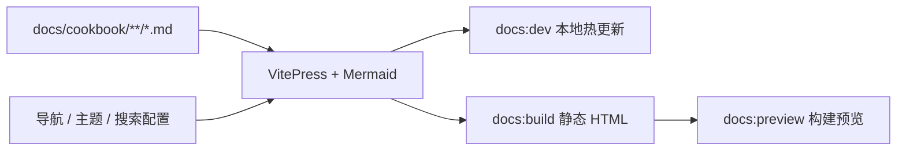

# 开发者 Cookbook HTML 文档站设计

## 背景

`docs/cookbook/` 已按开发者的修改目标组织了系统地图、维护手册和八条生产管线。Markdown 适合代码审查与版本管理，但直接阅读时缺少稳定的侧边栏、全文搜索、章节目录和页面间导航。部分页面还包含 Mermaid 与折叠验证矩阵，仅依赖编辑器预览会让不同开发者获得不同的阅读效果。

本设计为 Cookbook 增加独立的 HTML 阅读入口。现有 Markdown 继续作为唯一内容源，不复制正文，也不把开发文档耦合进业务前端。

## 目标与非目标

### 目标

- 使用 VitePress 把 `docs/cookbook/**/*.md` 渲染为本地文档站和静态 HTML。
- 提供中文顶部导航、分组侧边栏、页面内目录、上一篇/下一篇和本地全文搜索。
- 渲染现有 Mermaid 图、GitHub 风格表格、代码块和原生 `<details>`。
- 在仓库根目录提供统一的开发、构建和预览命令。
- 构建时检查内部链接，避免 HTML 入口出现不可达页面。
- 保持 Markdown 路径及现有相对链接稳定。

### 非目标

- 不配置域名、线上托管或 CI 发布。
- 不在 Nuomi Drama Factory 业务前端增加开发文档路由。
- 不复制或生成第二套 Markdown。
- 不提交构建后的静态文件。
- 不在本阶段重写 Cookbook 正文或拆分现有流程图。

## 方案比较与决策

### 方案 A：独立 VitePress 文档站

VitePress 直接读取 `docs/cookbook/`，文档配置与依赖也放在该目录。它提供静态构建、侧边栏、锚点、本地搜索和响应式布局；Mermaid 通过文档站插件接入。

### 方案 B：嵌入业务前端

在 React 应用新增文档路由并复用现有 `react-markdown`。入口集中，但文档阅读器会与产品构建、发行包和前端路由耦合，还需要自行补齐目录、搜索与 Mermaid。

### 方案 C：导出单文件 HTML

通过脚本合并 Markdown 并生成一个离线 HTML。分发简单，但页面较长，搜索、跨页导航、资源处理和增量构建都需要额外维护。

采用方案 A。文档站拥有独立依赖和构建边界，业务前端不需要感知它；同时保留 Markdown 的审查体验与 Git 历史。

## 目录与职责

```text
docs/cookbook/
├── .vitepress/
│   ├── config.mts          # 站点元数据、导航、侧边栏、搜索和 Mermaid 配置
│   └── theme/
│       ├── index.ts        # 扩展 VitePress 默认主题
│       └── custom.css      # 中文排版、内容宽度和首页入口样式
├── package.json            # 文档站独立依赖及 dev/build/preview 脚本
├── README.md               # 站点首页，仍是现有 Cookbook 首页
├── start-software.md
├── system-map.md
├── development/*.md
└── pipelines/*.md
```

仓库根 `package.json` 只提供命令转发：

```json
{
  "scripts": {
    "docs:dev": "pnpm --dir docs/cookbook dev",
    "docs:build": "pnpm --dir docs/cookbook build",
    "docs:preview": "pnpm --dir docs/cookbook preview"
  }
}
```

文档站依赖不加入 `frontend/package.json`，避免业务前端安装和构建受到文档工具影响。静态输出写入 `docs/cookbook/.vitepress/dist/`，该目录加入仓库忽略规则。

## 信息架构

顶部导航包含：

- Cookbook 首页
- 系统地图
- 启动与调试
- 中文文档

侧边栏按阅读目的分为三组：

1. 入门：首页、启动软件、系统地图。
2. 开发维护：功能反查、API 与长任务、存储与项目文件、测试策略。
3. 生产管线：小说导入、剧集图谱、生产资产、剧本与语义、分镜与图像、声音与音频、视频生成、合成与导出。

页面启用右侧标题目录、编辑友好的标题永久链接和上一篇/下一篇。首页现有「我要修改什么」深链接保持不变，VitePress 将 `.md` 链接转换为站内 HTML 路由并保留章节锚点。

## 渲染与主题

VitePress 默认主题负责响应式布局、代码高亮、深色模式和可访问性基础。自定义样式只调整以下部分：

- 使用适合中英文混排的系统字体栈。
- 扩大桌面端正文宽度，避免代码索引与四列表格过度换行。
- 提高 H2/H3、表格表头和行内代码的视觉区分度。
- 让首页「我要修改什么」表格在窄屏下可横向滚动。
- 保留默认主题变量和组件结构，减少升级时的覆盖面。

Mermaid 代码围栏在客户端渲染为 SVG，并跟随浅色/深色主题。渲染失败时保留可定位的错误信息；源 Markdown 不因图表渲染而改变。原生 `<details>` 继续由浏览器处理。

## 命令与数据流



- `pnpm docs:dev` 启动本地开发服务器，Markdown 或配置变更后热更新。
- `pnpm docs:build` 执行生产构建并生成搜索索引与静态资源。
- `pnpm docs:preview` 只预览最近一次生产构建；没有构建产物时应先提示运行 build。

站点基础路径默认是 `/`，便于本地预览和任意静态服务器部署。本阶段不为尚未确定的线上子路径增加环境变量或发布配置。

## 错误处理

- 内部 Markdown 链接失效时，生产构建失败并输出来源页面和目标路径。
- 导航配置指向不存在的页面时，配置测试先失败，避免问题延迟到浏览器点击阶段。
- Mermaid 语法问题由构建或页面渲染暴露；验收至少打开系统地图和一条包含 Mermaid 的生产管线。
- 文档依赖安装失败不影响业务前端依赖；两者使用独立 `package.json`。
- 生成目录不纳入版本控制，避免不同 Node 环境产生无关差异。

## 测试与验收

实现遵循配置级红绿验证：先增加一个检查目标文件、导航路由和根脚本的测试，让它因配置尚不存在而失败；再添加最小文档站配置使其通过。

最终验收包含：

1. 配置测试确认顶部导航、三组侧边栏和全部 15 个 Markdown 页面可达。
2. 现有 Markdown 相对链接、标题锚点和 `<details>` 配对检查通过。
3. `pnpm docs:build` 退出码为 0，输出首页、系统地图和八条生产管线的 HTML。
4. 构建产物包含本地搜索索引及 Mermaid 客户端资源。
5. `pnpm docs:preview` 可打开首页；抽查首页深链接、侧边栏、系统地图 Mermaid、深色模式和移动端菜单。
6. `git status` 不出现 `.vitepress/dist/` 构建产物。

## 变更边界

预计修改或新增：

- `docs/cookbook/.vitepress/config.mts`
- `docs/cookbook/.vitepress/theme/index.ts`
- `docs/cookbook/.vitepress/theme/custom.css`
- `docs/cookbook/package.json`
- 文档站配置测试文件
- 根 `package.json`
- `.gitignore`
- `docs/cookbook/README.md` 中的 HTML 入口使用说明

现有业务源码、前端路由、后端 API 和 Cookbook 各管线正文不在本次变更范围内。
