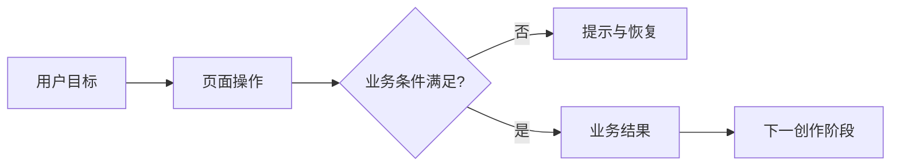
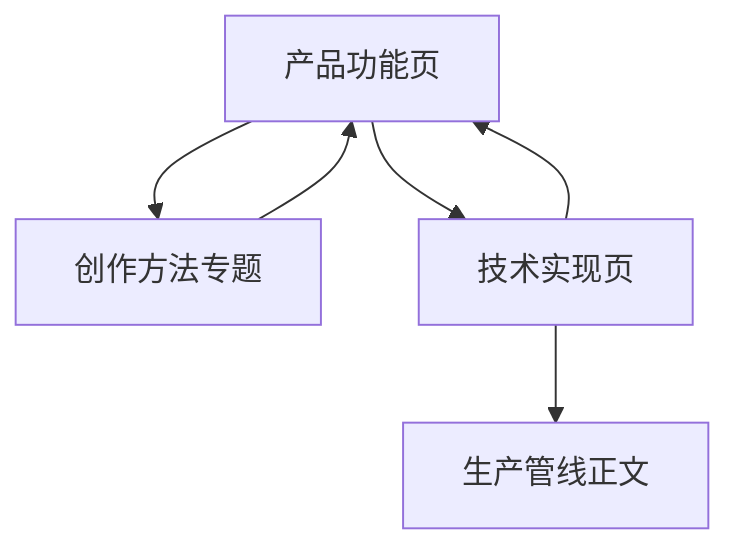

# Cookbook 三线 Wiki 改版设计

## 背景

当前 `docs/cookbook/` 已覆盖系统地图、开发维护手册和八条生产管线，并可通过 VitePress 生成 HTML。现有页面从代码与运行机制切入，适合已经知道模块名称的研发人员；最终用户、产品和测试仍需要先理解功能目标、操作路径与业务规则。长表格、代码索引和技术细节也占据了页面前部，降低了连续阅读效率。

本次改版把 Cookbook 组织为「产品功能、创作方法、技术实现」三条主线。三类内容共享术语与交叉链接，但分别回答「软件能做什么」「怎样创作得更好」「系统怎样工作和修改」。

## 目标与非目标

### 目标

- 为最终用户、产品、测试和研发提供同一 HTML Wiki 入口。
- 首页支持按创作旅程、用户目标、读者角色和技术模块定位内容。
- 增加产品功能文档，说明用户目标、操作步骤、业务状态、规则、异常和验收点。
- 增加完整首版创作方法文档，覆盖创作哲学、创作管线、专项方法、质量门禁与复盘模板。
- 每个核心功能专题同时提供业务流程图和技术实现流程图。
- 把代码索引、字段表和验证命令放到页面后半段或折叠区，降低首屏信息密度。
- 保留 VitePress、本地搜索、Mermaid、静态构建和 Markdown 内容源。

### 非目标

- 不修改业务前端、后端 API、任务系统或媒体生成行为。
- 不把创作经验写成不区分题材和前提的绝对规则。
- 不在本阶段引入 CMS、数据库、登录、评论或在线编辑。
- 不部署线上站点；继续提供本地构建与预览入口。
- 不复制现有技术管线正文；通过重组导航、摘要和交叉链接复用已有内容。

## 信息架构

顶部导航调整为：

1. 首页
2. 产品功能
3. 创作方法
4. 技术实现
5. 搜索

侧边栏按三条主线分组：

```text
首页
├── 开始创作
├── 按用户目标查找
├── 按角色查找
└── 三线知识地图

产品功能
├── 项目与小说
├── 剧集规划
├── 角色、场景与道具
├── 剧本与分镜
├── 声音与视频
├── 合成与导出
└── 设置、模型与任务中心

创作方法
├── 漫剧创作哲学
├── 从小说到成片的创作管线
├── 剧集拆分与节奏
├── 角色塑造与一致性
├── 分镜与镜头语言
├── 视听连续性
├── 阶段质量门禁
└── 案例复盘模板

技术实现
├── 系统架构
├── 功能反查
├── API 与长任务
├── 状态与项目文件
├── 八条生产管线
└── 测试与故障定位
```

产品与创作页面是新增内容；技术实现沿用 `system-map.md`、`development/` 和 `pipelines/`，只调整入口、导航和页面前部的阅读层级。

## 页面模型

### 产品功能页

每个产品功能页使用固定顺序：

1. 功能概览：用户要完成什么，完成后得到什么。
2. 使用入口：从哪个页面进入，按什么顺序操作。
3. 业务流程：使用 Mermaid 展示用户动作、系统状态和结果。
4. 业务规则：前置条件、状态变化、失败分支和下游影响。
5. 产品验收：正常路径、边界条件、错误提示和恢复方式。
6. 技术实现：链接到对应技术管线，并提供一张页面到数据落点的摘要图。

页面首屏不出现大段文件路径或函数表。研发读者可通过「直接看技术实现」锚点跳到后半段。

### 创作方法页

每个创作专题使用固定顺序：

1. 核心观点与适用场景。
2. 可观察的质量判断标准。
3. 推荐工作流及每一步的产出。
4. 正例、反例与常见失败模式。
5. 软件中的操作入口和相关产品能力。
6. 阶段检查清单和延伸专题。

创作经验要区分通用原则、题材相关选择和个案经验。尚无仓库证据支持的观点使用建议语气，不把偏好描述为系统保证。

### 技术实现页

现有技术页面保留细节，但统一增加页面摘要：

- 这项能力解决什么业务问题。
- 上游输入与下游产物。
- 业务流程入口与对应产品页。
- 技术调用链摘要。

长代码索引、字段矩阵、验证命令和已知实现差异继续保留在后半段；适合折叠的补充说明使用 `<details>`。

## 业务流程与技术流程

同一功能使用两类图，避免把用户操作与内部调用混在一张图中。



业务图只出现用户、页面功能、业务状态和作品产出。每个节点下方配一段文字步骤，保证 Mermaid 未渲染时仍可理解。


技术图使用真实模块类型和任务边界；具体文件与符号进入紧随其后的代码索引，不把整段源码放入图中。

## 首版内容范围

### 七个产品功能域

- 项目与小说：创建项目、导入内容、来源与格式边界。
- 剧集规划：拆集、剧集图谱、关系与进度恢复。
- 角色、场景与道具：资产生成、候选、采用与一致性。
- 剧本与分镜：Beat 编辑、语义、草图、分镜与画面确认。
- 声音与视频：声音选择、生成范围、视频方案与候选。
- 合成与导出：前置门禁、字幕、成片和素材包。
- 设置、模型与任务中心：模型渠道、长任务、进度、取消和错误。

### 八个创作专题

- 漫剧创作哲学
- 从小说到成片的创作管线
- 剧集拆分与节奏
- 角色塑造与一致性
- 分镜与镜头语言
- 视听连续性
- 阶段质量门禁
- 案例复盘模板

首版专题以可执行的判断标准和检查清单为主，不追求百科式覆盖。案例复盘提供可复制模板，不虚构成功案例或生产数据。

## 首页与视觉层级

首页第一屏先回答「你现在想完成什么」，提供四个入口：第一次创作、了解产品功能、学习创作方法、修改技术实现。第二屏展示从小说到成片的创作旅程；第三屏展示三线知识地图；代码层入口放在其后。

页面样式增加：

- 面向入口的卡片网格和角色标签。
- 业务流程、技术流程两种视觉容器及标题说明。
- 「功能概览」「业务规则」「技术实现」「验收清单」等稳定章节标识。
- 适合扫读的步骤条、提示块和检查清单。
- 桌面端三栏阅读，移动端折叠侧边栏并保持单栏正文。

继续使用 VitePress 默认主题变量，不建立独立品牌色体系。颜色只用于区分内容类型和状态，不作为唯一信息编码。

## 内容关系与维护规则



- 一个事实只在最合适的页面详细维护，其他页面使用摘要和链接。
- 产品页负责用户可见行为与业务规则；技术页负责实现与数据契约；创作页负责作品质量方法。
- 功能行为变化时，检查产品页、对应技术页及产品验收项。
- 创作建议变化时，更新创作专题和所链接的操作入口，不复制技术参数表。
- 新页面必须声明适合读者、所属主线、相关上游/下游和维护责任。

## 错误处理与降级

- Mermaid 图下必须保留等价文字步骤，图表失败不阻断阅读。
- 内部链接由 VitePress 构建检查；本地服务 URL继续使用 `localhostLinks` 例外。
- 产品页找不到确定实现证据时，只描述已验证的用户行为，不推断未实现能力。
- 创作专题缺少可验证案例时使用模板或原则说明，不生成虚构案例。
- 首页和侧边栏在移动端退化为线性导航，核心入口不依赖悬停。

## 测试与验收

自动化检查覆盖：

1. 顶部导航包含首页、产品功能、创作方法和技术实现。
2. 七个产品功能页、八个创作专题及现有技术页面全部生成 HTML。
3. 每个产品功能页包含业务流程、业务规则、产品验收和技术实现章节。
4. 每个创作专题包含适用场景、判断标准、工作流和检查清单。
5. 构建产物包含 Mermaid 与本地搜索资源，不出现本地 `README` 链接。
6. VitePress 构建通过，内部链接无错误。
7. 抽查首页、一个产品页、一个创作专题和一个技术管线，确认内容层级、移动端宽度和图表容器可读。

## 实现边界

预计新增或修改：

- `docs/cookbook/index.md`
- `docs/cookbook/product/*.md`
- `docs/cookbook/creation/*.md`
- `docs/cookbook/.vitepress/config.mts`
- `docs/cookbook/.vitepress/theme/custom.css`
- `docs/cookbook/system-map.md`
- `docs/cookbook/development/*.md`
- `docs/cookbook/pipelines/*.md` 的页面摘要与交叉链接
- `tests/cookbook_site.test.mjs`

不修改 `frontend/`、`src/novelvideo/`、数据库 schema、任务注册或部署配置。
