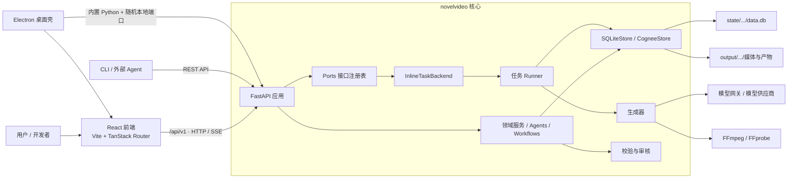
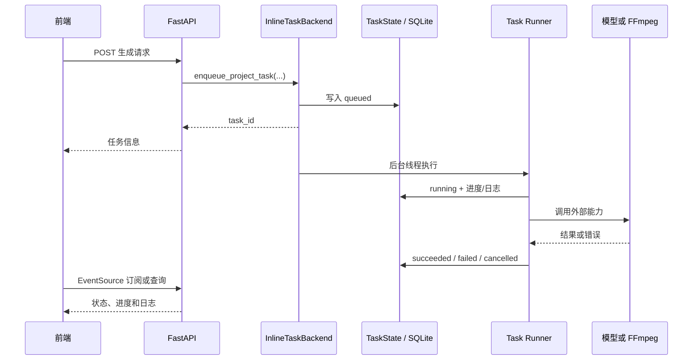

# DramaClaw 技术设计

> 本文面向首次接手 DramaClaw 的开发者，帮助你理解系统边界、跑起开发环境、定位代码、调试任务并扩展功能。产品说明见[功能总览](concepts/features.md)，部署说明见[自托管手册](guides/self-hosting.md)。

## 1. 项目定位与边界

DramaClaw CE 是单机运行的 AI 漫剧生产系统。它把小说导入、内容拆解、角色与场景资产规划、剧本与分镜、图像/音频/视频生成、质量校验和成片导出组织为可恢复的项目工作流。

社区版的主要约束是：

- 单机、单本地用户，默认免登录。
- 一个 FastAPI 进程提供 REST API、任务调度和可选的前端静态资源服务。
- 结构化数据使用项目级 SQLite，媒体和中间产物使用本地文件系统。
- 长任务在进程内后台线程执行，不要求 Redis、Celery 或 PostgreSQL。
- 文本、图像、视频和音频模型通过统一模型网关接入。
- 核心代码依赖端口接口，不直接依赖企业版实现。

## 2. 总体架构



### 2.1 运行形态

| 形态 | 前端 | 后端 | 数据位置 | 用途 |
|---|---|---|---|---|
| 本地开发 | Vite `:5173` | Uvicorn `:8780` | 仓库下 `state/`、`output/`、`runtime/` | 改代码和调试 |
| Docker | Web/Nginx `:8080` | API `:8780` | Docker 卷或挂载目录 | 自托管 |
| Windows 桌面版 | Electron BrowserWindow | 内置 Python + 随机回环端口 | Electron `userData/data` | 离线安装包 |

桌面版“完整离线”表示 Python 运行时、依赖、前端静态资源及 FFmpeg/FFprobe 随安装包分发；调用云模型时仍需要网络和模型凭据。

## 3. 技术栈

| 层 | 技术 |
|---|---|
| 后端 | Python `>=3.11,<3.13`、FastAPI、Uvicorn、Pydantic/Pydantic AI、Typer |
| 数据 | SQLite、aiosqlite、本地文件系统、Cognee 故事上下文 |
| 媒体 | FFmpeg/FFprobe、Pillow 及模型供应商 API |
| 前端 | React 19、TypeScript、Vite、TanStack Router/Query、Zustand |
| 画布/3D | XYFlow、Konva、PlayCanvas |
| 测试 | pytest、Vitest、Testing Library、MSW |
| 桌面 | Electron、electron-builder、NSIS |

## 4. 代码目录

| 路径 | 职责 |
|---|---|
| `src/novelvideo/api/` | FastAPI 应用、中间件、依赖和 `/api/v1` 路由 |
| `src/novelvideo/agents/` | 内容、角色、资产、分镜等智能体 |
| `src/novelvideo/workflows/` | 可组合的创作工作流 |
| `src/novelvideo/services/` | 跨路由复用的领域服务 |
| `src/novelvideo/generators/` | 图像、音频、视频和合成逻辑 |
| `src/novelvideo/task_backend/` | 任务注册、执行、取消、限流和 runners |
| `src/novelvideo/ports/` | 运行环境端口协议、注册表和 CE 本地适配器 |
| `src/novelvideo/storage/`、`sqlite_store.py` | 数据存取和本地持久化 |
| `src/novelvideo/cognee/` | 小说知识图谱与故事上下文 |
| `src/novelvideo/verification/` | 一致性、连续性、画面和剧集校验 |
| `src/novelvideo/freezone/` | 自由创作画布后端能力 |
| `src/novelvideo/director_world/` | 导演世界、3DGS 和场景空间能力 |
| `frontend/src/routes/` | 页面路由 |
| `frontend/src/features/` | 按业务能力组织的前端模块 |
| `frontend/src/stores/` | Zustand 客户端状态 |
| `frontend/src/task-center/` | 任务订阅、派生和任务中心 |
| `desktop/` | Electron 启动、路径和运行时组装 |
| `tests/`、`frontend/src/__tests__/` | 后端和前端测试 |

新功能应先判断属于 API 编排、领域服务、后台任务还是生成器，避免把耗时业务逻辑直接写进路由。

## 5. 后端入口和请求生命周期

`pyproject.toml` 将 `novelvideo` 映射到 `novelvideo.cli:app`。开发入口是：

```text
novelvideo api -> uvicorn -> novelvideo.api.app:app
```

API 统一注册在 `src/novelvideo/api/__init__.py`，前缀为 `/api/v1`。应用启动时完成端口适配器初始化、运行环境检查和生命周期回调；关闭时释放相关资源。

设置 `DRAMACLAW_FRONTEND_DIST` 后，后端会在 API 路由之后挂载 SPA 静态目录，并把前端路由回退到 `index.html`。桌面版使用此模式，只启动一个本地服务。

## 6. Ports & Adapters

核心代码通过 `src/novelvideo/ports/` 中的协议访问认证、项目注册、任务、取消、计量、生命周期、审计和报价等能力。`ports/registry.py` 根据运行模式完成注册。

CE 必须显式设置 `ST_EDITION=ce`，本地适配器位于 `ports/local/`：

| 端口 | CE 实现 |
|---|---|
| Auth / ProjectAccess | 本地单用户、owner-everywhere |
| ProjectRegistry | 本地项目索引 |
| TaskBackend | `InlineTaskBackend` |
| CancellationStore | 进程内取消状态 |
| UsageMeter / Lifecycle | no-op 或本地实现 |
| AuditSink | 本地审计记录 |
| CreditQuote | 本地零成本报价 |

业务代码应调用 `get_task_backend()` 等端口访问器，不应直接导入特定部署环境的适配器。

## 7. 异步任务系统

生成图片、音频、视频和内容分析都可能是长任务，因此 API 通常只负责校验、创建任务记录并入队。



新增长任务时应：

1. 定义稳定的任务类型和载荷。
2. 在 `task_backend/runners/` 实现并注册 runner。
3. 通过 `TaskBackend` 入队，不直接创建线程。
4. 在耗时步骤间检查取消状态，子进程使用统一封装。
5. 记录可理解的阶段、进度和错误。

CE 的任务只在当前应用进程执行。退出应用会终止运行中的任务；持久化状态可用于诊断或恢复，但不是分布式队列。

## 8. 数据与文件布局

路径从 `NOVELVIDEO_DATA_ROOT` 派生，也可分别覆盖：

```text
<data-root>/
├─ state/
│  ├─ local/settings.db
│  └─ <user>/<project>/data.db
├─ output/
│  └─ <user>/<project>/
│     ├─ assets/
│     ├─ grids/、sketches/、frames/
│     ├─ audio/、videos/
│     └─ verify_reports/
└─ runtime/
   └─ <user>/<project>/...
```

- `state` 保存数据库和长期配置状态。
- `output` 保存用户可见素材、生成物和中间产物。
- `runtime` 保存日志、临时文件和 staging 数据。
- `ProjectContext` 是项目作用域的权威对象，包含 owner、项目 ID 和三类目录。
- API 应先解析项目上下文和权限，再打开 Store 或文件。
- 用户传入路径解析后必须仍位于项目目录内。

不要假定 SQLite 与媒体文件位于同一目录，也不要用当前工作目录拼项目路径。

## 9. 模型接入

模型配置由网页“设置 → 模型配置”写入 `state/local/settings.db`。业务使用逻辑模型名，网关将其映射到实际供应商模型，因此切换渠道通常无需改业务代码。

接入新模型时应在媒体能力或模型配置中描述能力，在 generator/adapter 层适配协议，把供应商异常转换为统一错误，并为参数归一化、错误映射和任务结果编写测试。详见[配置模型供应商](getting-started/configuring-models.md)。

## 10. 前端架构

前端入口是 `frontend/src/main.tsx`。TanStack Router 根据 `frontend/src/routes/` 生成路由树；完整业务能力放在 `features/`；`stores/` 保存跨组件状态。

- API 使用相对路径 `/api/v1/...`。
- Vite 把 `/api/v1` 和 `/static` 代理到 `VITE_API_URL`，默认 `http://127.0.0.1:8780`。
- 长任务统一接入 `task-center/`，页面不应各自实现轮询和错误解释。
- API 类型变化要同步更新 `frontend/src/types/`、客户端调用和契约测试。

## 11. Windows CMD 开发启动

### 11.1 后端

在仓库根目录新开 CMD：

```bat
cd /d E:\Cache\Obsidian\RuiAgent\01_Active\02_Projects\副业项目\AI漫剧\dramaclaw
set "PYTHONUTF8=1"
set "ST_EDITION=ce"
set "ST_COOKIE_SECURE=0"
set "ST_CONTROL_PLANE_DSN="
uv sync
uv run novelvideo api --host 127.0.0.1 --port 8780 --reload
```

若 `.venv` 在导入 `site` 时出现 GBK/`.pth` 解码错误，应重建虚拟环境，不要继续向损坏环境安装。也可使用单独的 `venv`：

```bat
set "PYTHONUTF8=1"
py -3.11 -m venv venv
call venv\Scripts\activate.bat
python -m pip install -U pip
python -m pip install -e .
set "ST_EDITION=ce"
set "ST_COOKIE_SECURE=0"
novelvideo api --host 127.0.0.1 --port 8780 --reload
```

验证：

```bat
curl http://127.0.0.1:8780/api/v1/config
```

### 11.2 前端

另开 CMD：

```bat
cd /d E:\Cache\Obsidian\RuiAgent\01_Active\02_Projects\副业项目\AI漫剧\dramaclaw\frontend
pnpm install
set "VITE_API_URL=http://127.0.0.1:8780"
pnpm dev
```

打开 `http://127.0.0.1:5173`。若 `corepack enable` 因 Node 安装目录无写权限报 `EPERM`，无需启用全局 shim；使用已安装的 `pnpm`，或执行 `corepack pnpm install`、`corepack pnpm dev`。

`set` 只影响当前 CMD。`setx ST_EDITION ce` 和 `setx ST_COOKIE_SECURE 0` 会写入当前用户环境变量，但只对新开的 CMD 生效；优先使用启动脚本或 `.env`，避免污染其他项目。

## 12. 测试与质量检查

```bat
rem 后端
uv run pytest
uv run ruff check src tests

rem 前端
cd frontend
pnpm test
pnpm build:ce

rem 桌面组装逻辑（回到仓库根目录）
cd ..
pnpm desktop:test
```

修改 API 时至少运行对应路由测试和 `tests/contract/` 中相关契约测试；修改任务系统时重点运行 `tests/media_capabilities/`、`tests/ports/` 和任务后端测试。

## 13. Windows 桌面应用

构建流水线：

```text
前端 build:ce
  + CPython 3.11
  + venv/Lib/site-packages
  + src/novelvideo
  + FFmpeg / FFprobe
          ↓
desktop-runtime/
          ↓ electron-builder
DramaClaw Setup <version>.exe
```

`desktop/main.cjs` 启动时检查资源、申请随机 `127.0.0.1` 端口、设置 CE 和数据目录、启动内置 Uvicorn、轮询 `/api/v1/config`，后端就绪后显示窗口。后端日志写入 Electron 用户数据目录的 `logs/backend.log`。

当前未签名的 x64 NSIS 打包命令：

```bat
cd /d E:\Cache\Obsidian\RuiAgent\01_Active\02_Projects\副业项目\AI漫剧\dramaclaw
set "PYTHONUTF8=1"
uv python install 3.11
uv sync --python 3.11
py -3.11 -m venv venv
call venv\Scripts\activate.bat
python -m pip install -U pip
python -m pip install .
call deactivate
corepack pnpm install
corepack pnpm desktop:build
```

构建脚本要求 uv 的 Python 位于 `.python/cpython-3.11*`、依赖位于 `venv/Lib/site-packages`、前端输出位于 `frontend/dist`，并且 Node 依赖中存在 FFmpeg/FFprobe 包。安装包输出到 `dist-desktop/`。当前 `signAndEditExecutable=false`，Windows SmartScreen 可能提示未知发布者。

## 14. 安全与可靠性

- 本机 HTTP 开发使用 `ST_COOKIE_SECURE=0`；HTTPS 部署应恢复安全 Cookie。
- 密钥和模型 token 不得写入源码、日志或 Git。
- 静态媒体和项目路由必须经过项目上下文及路径边界检查。
- 后台任务必须有失败状态和可读错误；可取消任务要检查取消信号。
- 外部进程使用统一封装，以便超时、取消和清理。
- SQLite Store 使用后应关闭；优先使用已有 FastAPI dependency 作用域。
- 桌面版只监听 `127.0.0.1`，不要无认证改为 `0.0.0.0`。

遥测默认关闭，见[遥测说明](guides/telemetry.md)。

## 15. 常见扩展方式

### 新增 API

在 `api/routes/` 增加聚焦路由，使用 Pydantic schema，通过 dependency 解析用户和 `ProjectContext`，在 `api/__init__.py` 注册，并添加 API 与契约测试。

### 新增后台任务

定义任务类型和载荷，实现并注册 runner，通过 `get_task_backend().enqueue_project_task(...)` 入队，补充进度、取消、失败和并发限制测试。

### 新增模型或供应商

扩展能力与配置 schema，在 generator/adapter 层适配协议，使用统一错误模型和用量记录。真实供应商测试必须可显式选择，不能成为默认测试前置。

### 新增页面或画布节点

页面放入 `routes/`，完整业务能力放入 `features/`，跨页面状态放入 `stores/`，异步任务统一接入 `task-center/`，并添加 Vitest 测试。

## 16. 已知边界

- inline 任务后端不适合多实例或跨机器调度。
- 桌面包会因 Python 科学计算与 AI 依赖显著增大。
- `world` 可选特性包含 GPU 和额外工具链，不属于默认桌面运行时。
- 云模型、对象存储 relay 和部分外部能力仍依赖网络。
- 当前桌面安装包未签名，只构建 Windows x64 NSIS。
- 项目保留部分历史兼容路径，重构前应搜索调用方与契约测试。

## 17. 新开发者接手清单

- [ ] 阅读本文、[架构概览](concepts/architecture.md)和[环境变量参考](reference/environment-variables.md)。
- [ ] 在 Windows CMD 中分别跑起后端和前端。
- [ ] 确认 `/api/v1/config` 返回 200，前端可创建并打开项目。
- [ ] 配置模型渠道并执行一次最小生成任务。
- [ ] 找到任务状态、进度、日志和取消入口。
- [ ] 查看项目的 `state`、`output`、`runtime` 三类目录。
- [ ] 跑通后端、前端和桌面基础测试。
- [ ] 修改前先定位对应 API、服务、runner、Store 和前端调用链。
- [ ] 提交前确认密钥、媒体、数据库和构建产物未进入版本控制。

## 18. 相关文档

- [架构概览](concepts/architecture.md)
- [安装指南](getting-started/installation.md)
- [配置模型供应商](getting-started/configuring-models.md)
- [环境变量参考](reference/environment-variables.md)
- [FFmpeg 指南](guides/ffmpeg.md)
- [排错指南](guides/troubleshooting.md)
- [自托管手册](guides/self-hosting.md)
